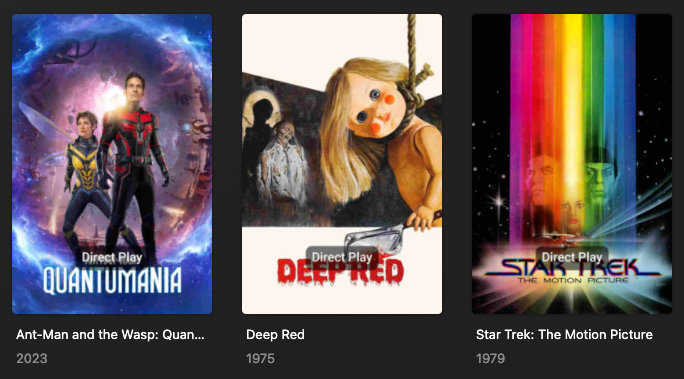

# Overlay Files

Overlay Files holds information on how Kometa should create Overlays. There are a large number of builders available to build Overlays, 

## Overview

This example is an Overlay file with a basic overlay which is saved in a file called `MyOverlays.yml` within the location mapped as `config` in my setup.

This specific example will target items in my library with a 4K resolution and will add an overlay with text that says "Direct Play" located at the bottom of the poster in the center.

???+ tip "Example Overlay"

    Click the :fontawesome-solid-circle-plus: icon to learn more

    ```yaml
    overlays: #(1)!
      directplay:
        overlay:
          name: text(Direct Play) #(2)!
          horizontal_offset: 0
          horizontal_align: center
          vertical_offset: 150
          vertical_align: bottom
          font_size: 63
          font_color: "#FFFFFF"
          back_color: "#00000099"
          back_radius: 30
          back_padding: 30
        plex_search: #(3)!
          all:
            resolution: 4K
    ```

    1.  This must appear once and **only once** in any Overlay file
    2.  This tells Kometa to use text as the overlay rather than an image
    3.  This is the criteria that Kometa will use to define what should receive the overlay

    Here is an example of how the Overlay will look

    

For the purpose of this example, we are going to save the File as `MyOverlays.yml` within the location mapped as `config` in our setup.

I then call "MyOverlays.yml" in my [Configuration File](../config/overview.md) within the `Overlay_files` section

???+ example "config.yml Example Overlay File Addition"

    Click the :fontawesome-solid-circle-plus: icon to learn more

    ```yaml
    libraries:
      Movies:  #(1)!
        remove_overlays: false
        overlay_files:
          - file: config/MyOverlays.yml #(2)!
    ```

    1.  This must match the name of a library in your Plex server
    2.  `config` refers to the location that you mapped to `config` when following the Kometa Installation Guides.

Whenever I execute Kometa and the Movies library is run, MyOverlays.yml will run and my "Direct Play" overlay will appear on all items with a 4K resolution.

## File Attributes

Overlay Files can utilize the following top-level attributes

| Attribute                                               | Description                                                                                                            |
|:--------------------------------------------------------|:-----------------------------------------------------------------------------------------------------------------------|
| [`templates`](templates.md)                             | contains definitions of templates that can be leveraged by multiple Overlays                                           |
| [`external_templates`](templates.md#external-templates) | contains [file blocks](../config/files.md) that point to external templates that can be leveraged by multiple overlays |
| [`overlays`](#overlay-attributes)                       | contains definitions of Overlays you wish to add to one or more libraries                                              |

* Example Files can be found in the [Kometa Community Configs Repository](https://github.com/Kometa-Team/Community-Configs)

## Overlay Understandings

???+ danger "Important Notes"

    When using overlays, there is some knowledge that you should be aware of at all times. This is outlined below.

    Failure to understand all of these points may cause issues when utilizing Overlays.

All overlay coordinates assume 1000 x 1500 for Posters and 1920 x 1080 for Backgrounds and Title Cards.

All overlays should be in a format that is supports transparency should it be required (i.e. PNG)

If an overlay is not 1000 x 1500 or 1920 x 1080 in size, you will need to use positional attributes to specify where on the base poster the Overlay should be. This is exampled in [Overview](#overview) 

Although Overlays are modular in that you can pick and choose what you would like to apply, each overlay you want to apply **must** be executed in the same Kometa run and should not be scheduled, this will result in overlays that are not scheduled to run being deleted.

  * For example, you cannot schedule a "4K Resolution" overlay to only apply on a Monday and a "Direct Play" overlay to only apply on a Tuesday. This will not work, both overlays must be scheduled to run at the same time.

Kometa and Plex **will not** remove old Overlaid images from the Plex file structure or database when new updates are available. On large libraries, this can often result in Image Bloat.

  * We recommend you read more about this and the solution on the [ImageMaid](../kometa/scripts/imagemaid.md) page.

There is an attribute called `reapply_overlays` which, when set to true, will force overlays to reapply even when it is not necessary to do so [overlays only update when something has changed, this bypasses that behaviour]. This will increase how long Kometa takes to run and will also result in Image Bloat.

  * Ensure `reapply_overlays` is set to `false` if you see it in your Configuration File. If it has previously been set to true we recommend using [ImageMaid](../kometa/scripts/imagemaid.md) to get rid of the bloat.

To remove all overlays from your library, add the [`remove_overlays` library attribute](../config/libraries.md#remove-overlays) set to `true`.**

  * See the above note on Kometa not removing the overlaid images, this is still true here.


???+ danger "Important Notice"

    Once you have applied overlays to your posters in Plex, it is highly recommended that you never change artwork on a thing directly in Plex again. Kometa uses labels on the items in Plex to decide if an overlay has been applied, so if you change artwork behind Kometa's back things can become confused and items can end up with double-overlaid posters.  It's recommended to set new artwork using the asset directory, which will ensure that this doesn't happen. 

    **To change a single overlay original image either remove the `Overlay` shared label and update the Image in Plex or replace the image in the assets folder and then Kometa will overlay the new image**

## Overlay Attributes

Overlay Files can utilize the following top-level attributes

| Attribute                                               | Description                                                                                                            |
|:--------------------------------------------------------|:-----------------------------------------------------------------------------------------------------------------------|
| [`templates`](templates.md)                             | contains definitions of templates that can be leveraged by multiple overlays                                           |
| [`external_templates`](templates.md#external-templates) | contains [file blocks](../config/files.md) that point to external templates that can be leveraged by multiple overlays |
| [`queues`](#overlay-queues)                             | contains the positional attributes of queues                                                                           |
| [`overlays`](#overlay-attributes)                       | contains definitions of overlays you wish to add                                                                       |

* `overlays` is required in order to run the Overlay File.
* Example Overlay Files can be found in the [Kometa Community Configs Repository](https://github.com/Kometa-Team/Community-Configs)

There are multiple types of attributes that can be utilized within an overlay:

* [Builders](builders/overview.md)
* [Filters](filters.md)
* [Settings](settings.md)

## Example Files

Below is a common Overlay File which will create an Overlay for all items which have a 4K resolution.

To get you started, Kometa includes three files for Overlays - 4K, Dolby and HDR.

```yaml
overlays:
  4K:
    plex_search:
      all:
        resolution: 4K
```


I can then layer another Overlay for items which have HDR.

Kometa will apply Overlays in the order they are defined in the file, so my HDR overlay appears on top of my 4K overlay in this scenario.

```yaml
overlays:
  4K:
    plex_search:
      all:
        resolution: 4K
  HDR:
    plex_search:
      all:
        hdr: true
```


## Advanced Overlay Attributes

The below attributes are also available for Overlay files, to give more granular control over how they function.


| Attribute                  | Description                                                                                                                                                                                                                                                                         |                  Required                  |
|:---------------------------|:------------------------------------------------------------------------------------------------------------------------------------------------------------------------------------------------------------------------------------------------------------------------------------|:------------------------------------------:|
| `name`                     | Name of the overlay.                                                                                                                                                                                                                                                                | :fontawesome-solid-circle-check:{ .green } |
| `file`                     | Local location of the Overlay Image.                                                                                                                                                                                                                                                |  :fontawesome-solid-circle-xmark:{ .red }  |
| `url`                      | URL of Overlay Image Online.                                                                                                                                                                                                                                                        |  :fontawesome-solid-circle-xmark:{ .red }  |
| `git`                      | Location in the [Configs Repo](https://github.com/Kometa-Team/Community-Configs) of the Overlay Image.                                                                                                                                                                              |  :fontawesome-solid-circle-xmark:{ .red }  |
| `repo`                     | Location in the [Custom Repo](../config/settings.md) of the Overlay Image.                                                                                                                                                                                                          |  :fontawesome-solid-circle-xmark:{ .red }  |
| [`group`](#overlay-groups) | Name of the Grouping for this overlay. Only one overlay with the highest weight per group will be applied.<br>**`weight` is required when using `group`**<br>**Values:** group name                                                                                                 |  :fontawesome-solid-circle-xmark:{ .red }  |
| [`queue`](#overlay-queues) | Name of the Queue for this overlay. Define `queue` positions using the `queues` attribute at the top level of an Overlay File. Overlay with the highest weight is applied to the first position and so on.<br>**`weight` is required when using `queue`**<br>**Values:** queue name |  :fontawesome-solid-circle-xmark:{ .red }  |
| `weight`                   | Weight of this overlay in its group or queue.<br>**`group` or `queue` is required when using `weight`**<br>**Values:** Integer 0 or greater                                                                                                                                         |  :fontawesome-solid-circle-xmark:{ .red }  |
| `horizontal_offset`        | Horizontal Offset of this overlay. Can be a %.<br>**`vertical_offset` is required when using `horizontal_offset`**<br>**Value:** Integer 0 or greater or 0%-100%                                                                                                                    |  :fontawesome-solid-circle-xmark:{ .red }  |
| `horizontal_align`         | Horizontal Alignment of the overlay.<br>**Values:** `left`, `center`, `right`                                                                                                                                                                                                       |  :fontawesome-solid-circle-xmark:{ .red }  |
| `vertical_offset`          | Vertical Offset of this overlay. Can be a %.<br>**`horizontal_offset` is required when using `vertical_offset`**<br>**Value:** Integer 0 or greater or 0%-100%                                                                                                                      |  :fontawesome-solid-circle-xmark:{ .red }  |
| `vertical_align`           | Vertical Alignment of the overlay.<br>**Values:** `top`, `center`, `bottom`                                                                                                                                                                                                         |  :fontawesome-solid-circle-xmark:{ .red }  |
| `font`                     | System Font Filename or path to font file for the Text Overlay.<br>**Value:** System Font Filename or path to font file                                                                                                                                                             |  :fontawesome-solid-circle-xmark:{ .red }  |
| `font_style`               | Font style for Variable Fonts. Only needed when using a Variable Font.<br>**Value:** Variable Font Style                                                                                                                                                                            |  :fontawesome-solid-circle-xmark:{ .red }  |
| `font_size`                | Font Size for the Text Overlay.<br>**Value:** Integer greater than 0                                                                                                                                                                                                                |  :fontawesome-solid-circle-xmark:{ .red }  |
| `font_color`               | Font Color for the Text Overlay.<br>**Value:** Color Hex Code in format `#RGB`, `#RGBA`, `#RRGGBB` or `#RRGGBBAA`.                                                                                                                                                                  |  :fontawesome-solid-circle-xmark:{ .red }  |
| `stroke_width`             | Font Stroke Width for the Text Overlay.<br>**Value:** Integer greater than 0                                                                                                                                                                                                        |  :fontawesome-solid-circle-xmark:{ .red }  |
| `stroke_color`             | Font Stroke Color for the Text Overlay.<br>**Value:** Color Hex Code in format `#RGB`, `#RGBA`, `#RRGGBB` or `#RRGGBBAA`.                                                                                                                                                           |  :fontawesome-solid-circle-xmark:{ .red }  |
| `back_color`               | Backdrop Color for the Text Overlay.<br>**Value:** Color Hex Code in format `#RGB`, `#RGBA`, `#RRGGBB` or `#RRGGBBAA`.                                                                                                                                                              |  :fontawesome-solid-circle-xmark:{ .red }  |
| `back_width`               | Backdrop Width for the Text Overlay. If `back_width` is not specified the Backdrop Sizes to the text<br>**`back_height` is required when using `back_width`**<br>**Value:** Integer greater than 0                                                                                  |  :fontawesome-solid-circle-xmark:{ .red }  |
| `back_height`              | Backdrop Height for the Text Overlay. If `back_height` is not specified the Backdrop Sizes to the text<br>**`back_width` is required when using `back_height`**<br>**Value:** Integer greater than 0                                                                                |  :fontawesome-solid-circle-xmark:{ .red }  |
| `back_align`               | Alignment for the Text Overlay inside the backdrop. If `back_align` is not specified the Backdrop Centers the text<br>**`back_width` and `back_height` are required when using `back_align`**<br>**Values:** `left`, `right`, `center`, `top`, `bottom`                             |  :fontawesome-solid-circle-xmark:{ .red }  |
| `back_padding`             | Backdrop Padding for the Text Overlay.<br>**Value:** Integer greater than 0                                                                                                                                                                                                         |  :fontawesome-solid-circle-xmark:{ .red }  |
| `back_radius`              | Backdrop Radius for the Text Overlay.<br>**Value:** Integer greater than 0                                                                                                                                                                                                          |  :fontawesome-solid-circle-xmark:{ .red }  |
| `back_line_color`          | Backdrop Line Color for the Text Overlay.<br>**Value:** Color Hex Code in format `#RGB`, `#RGBA`, `#RRGGBB` or `#RRGGBBAA`.                                                                                                                                                         |  :fontawesome-solid-circle-xmark:{ .red }  |
| `back_line_width`          | Backdrop Line Width for the Text Overlay.<br>**Value:** Integer greater than 0                                                                                                                                                                                                      |  :fontawesome-solid-circle-xmark:{ .red }  |
| `addon_offset`             | Text Addon Image Offset from the text.<br>**`addon_offset` Only works with text overlays**<br>**Value:** Integer 0 or greater                                                                                                                                                       |  :fontawesome-solid-circle-xmark:{ .red }  |
| `addon_position`           | Text Addon Image Alignment in relation to the text.<br>**`addon_position` Only works with text overlays**<br>**Values:** `left`, `right`, `top`, `bottom`                                                                                                                           |  :fontawesome-solid-circle-xmark:{ .red }  |

* If `url`, `git`, and `repo` are all not defined then Kometa will look in your `config/overlays` folder for a `.png` file named the same as the `name` attribute.


### Positional Image Overlays

Positional overlays can be of any size and use `horizontal_offset`, `horizontal_align`, `vertical_offset`, and `vertical_align` to position the overlay on the image. 

???+ tip

    This overlay example uses one of the [Kometa Default Overlay](../defaults/overlays.md) images, which isn't necessary but is used just for this example.

```yaml
overlays:
  IMDB-Top-250:
    imdb_chart: top_movies
    overlay:
      name: IMDB-Top-250
      default: ribbon/yellow/imdb.png
      horizontal_offset: 0
      horizontal_align: right
      vertical_offset: 0
      vertical_align: bottom
```


### Blurring Overlay

There is a special overlay named `blur` that when given as the overlay name will instead of finding the image will just blur the image instead.

You can control the level of the blur by providing a number with the attribute like so `blur(##)`.

```yaml
overlays:
  blur:
    overlay:
      name: blur(50)
    builder_level: episode
    plex_search:
      all:
        resolution: 4K
```


### Backdrop Overlay

There is a special overlay named `backdrop` that when given as the overlay name will instead of finding the image will just apply the background instead.

You can set the size of the backdrop with `back_width` and `back_height`. By Default, they will extend the length of the Image.

```yaml
overlays:
  backdrop:
    overlay:
      name: backdrop
      back_color: "#00000099"
      back_height: 100
      vertical_align: top
    plex_all: true
```

This example could be useful if you want to have a black banner, and then use a [Text Overlay](#text-overlay) to add text on top.


### Text Overlay

You can add text as an overlay using the special `text()` overlay name. Anything inside the parentheses will be added as an overlay onto the image. Ex `text(4K)` adds `4K` to the image.

You can control the font, font size and font color using the `font`, `font_size`, and `font_color` overlay attributes.

You can control the backdrop of the text using the various `back_*` attributes.

The `horizontal_offset` and `vertical_offset` overlay attributes are required when using Text Overlays.

Kometa includes multiple fonts in the [`fonts` folder](https://github.com/Kometa-Team/Kometa/tree/master/fonts) which can be called using `fonts/fontname.ttf`

```yaml
overlays:
  backdrop:
    overlay:
      name: backdrop
      back_color: "#00000099"
      back_height: 100
      vertical_align: top
    plex_all: true
  mytext:
    overlay:
      name: text(This Movie Is Awesome)
      horizontal_offset: 0
      horizontal_align: center
      vertical_offset: 30
      vertical_align: top
      font_size: 63
      font_color: "#FFFFFF"
    plex_all: true
```

Note that we have built up on our backdrop overlay that we created in our previous example


#### Special Text Variables

You can use the item's metadata to determine the text by adding Special Text Variables to your text Overlay.

Each Special Text Variables has multiple modifiers that can be used to format the text. The variables are defined like this `<<name$>>` where `name` is the Special Text Variable and the modifier is `$`.

##### Special Rating Text

| Variable                      | Description                             | Item Types                                  |
|:------------------------------|:----------------------------------------|:--------------------------------------------|
| `audience_rating`             | Plex Audience Rating                    | `Movies`, `Shows`, or `Episodes`            |
| `critic_rating`               | Plex Critic Rating                      | `Movies`, `Shows`, or `Episodes`            |
| `user_rating`                 | Plex User Rating                        | `Movies`, `Shows`, `Seasons`, or `Episodes` |
| `tmdb_rating`                 | TMDb Rating                             | `Movies`, `Shows`, `Seasons`, or `Episodes` |
| `imdb_rating`                 | IMDb Rating                             | `Movies`, `Shows`, or `Episodes`            |
| `trakt_user_rating`           | Trakt User Rating                       | `Movies` or `Shows`                         |
| `omdb_rating`                 | OMDb Rating                             | `Movies` or `Shows`                         |
| `mdb_rating`                  | MDBList Rating                          | `Movies` or `Shows`                         |
| `mdb_average_rating`          | MDBList Average Rating                  | `Movies` or `Shows`                         |
| `mdb_imdb_rating`             | MDBList IMDb Rating                     | `Movies` or `Shows`                         |
| `mdb_metacritic_rating`       | MDBList Metacritic Rating               | `Movies` or `Shows`                         |
| `mdb_metacriticuser_rating`   | MDBList Metacritic User Rating          | `Movies` or `Shows`                         |
| `mdb_trakt_rating`            | MDBList Trakt Rating                    | `Movies` or `Shows`                         |
| `mdb_tomatoes_rating`         | MDBList Rotten Tomatoes Rating          | `Movies` or `Shows`                         |
| `mdb_tomatoesaudience_rating` | MDBList Rotten Tomatoes Audience Rating | `Movies` or `Shows`                         |
| `mdb_tmdb_rating`             | MDBList TMDb Rating                     | `Movies` or `Shows`                         |
| `mdb_letterboxd_rating`       | MDBList Letterboxd Rating               | `Movies` or `Shows`                         |
| `mdb_myanimelist_rating`      | MDBList MyAnimeList Rating              | `Movies` or `Shows`                         |
| `anidb_rating`                | AniDB Rating                            | `Movies` or `Shows`                         |
| `anidb_average_rating`        | AniDB Average Rating                    | `Movies` or `Shows`                         |
| `anidb_score_rating`          | AniDB Score Rating                      | `Movies` or `Shows`                         |
| `mal_rating`                  | MyAnimeList Rating                      | `Movies` or `Shows`                         |


??? tip "Special Rating Text Modifiers"

    | Modifier | Description                                        | Example                                    |
    |:--------:|:---------------------------------------------------|:-------------------------------------------|
    |  `None`  | Rating on a 10 point scale                         | `8.7`, `9.0`                               |
    |   `%`    | Rating out of 100                                  | `87`, `90`                                 |
    |   `#`    | Rating on a 10 point scale removing `.0` as needed | `8.7`, `9`                                 |
    |   `/`    | Rating on a 5 point scale                          | `8.6` shows as `4.3`, `9.0` shows as `4.5` |

???+ tip "Note on `mdb` sources"

     MDBList is not a live reflection of third-party sites such as CommonSense and Trakt. The data on MDBList is often days, weeks and months out of date as it is only periodically refreshed. As such, the data that Kometa applies using `mdb_` operations applies may not be the same as you see if you visit those third-party sources directly.

##### Special String Text

| Variable         | Description                | Item Types                                  |
|:-----------------|:---------------------------|:--------------------------------------------|
| `title`          | Item's Title               | `Movies`, `Shows`, `Seasons`, or `Episodes` |
| `show_title`     | Item's Parent Show Title   | `Seasons` or `Episodes`                     |
| `season_title`   | Item's Parent Season Title | `Episodes`                                  |
| `original_title` | Item's Original Title      | `Movies` or `Shows`                         |
| `edition`        | Item's Edition             | `Movies`                                    |
| `content_rating` | Item's Content Rating      | `Movies`, `Shows`, or `Episodes`            |

??? tip "Special String Text Modifiers"

    | Modifier | Description                            |
    |:--------:|:---------------------------------------|
    |  `None`  | Exact Text                             |
    |   `U`    | Text with the first letter Capitalized |
    |   `L`    | Text with the first letter Lowercase   |
    |   `P`    | Text with most words Capitalized       |

##### Special Number Text

| Variable         | Description                    | Item Types              |
|:-----------------|:-------------------------------|:------------------------|
| `episode_count`  | Number of Episodes             | `Shows` or `Seasons`    |
| `season_number`  | Season Number                  | `Seasons` or `Episodes` |
| `episode_number` | Episode Number                 | `Episodes`              |
| `versions`       | Number of Versions of the Item | `Movies` or `Episodes`  |

??? tip "Special Number Text Modifiers"

    | Modifier | Description               | Example |
    |:--------:|:--------------------------|:-------:|
    |  `None`  | Exact Number              |   `1`   |
    |   `W`    | Number as Words           |  `One`  |
    |   `WU`   | Number as Uppercase Words |  `ONE`  |
    |   `WL`   | Number as Lowercase Words |  `one`  |
    |   `0`    | Number with 10s Padding   |  `01`   |
    |   `00`   | Number with 100s Padding  |  `001`  |

##### Other Special Text

| Special Text Variables & Mods                                                                                                                                                                                                                               | Item Types                                  |
|:------------------------------------------------------------------------------------------------------------------------------------------------------------------------------------------------------------------------------------------------------------|:--------------------------------------------|
| `<<runtime>>`: Complete Runtime of the Item in minutes (`150`)<br>`<<runtimeH>>`: Hours in runtime of the Item (`2`)<br>`<<runtimeM>>`: Minutes remaining in the hour in the runtime of the Item (`30`)<br>**Show and Season use average Episode Runtime.** | `Movies`, `Shows`, `Seasons`, or `Episodes` |
| `<<total_runtime>>`: Complete combined Runtime of all Episodes/Tracks of the Item in minutes (`150`)<br>`<<runtimeH>>`: Hours in total runtime of the Item (`2`)<br>`<<runtimeM>>`: Minutes remaining in the hour in the runtime of the Item (`30`)         | `Shows`, `Seasons`, `Artists`, or `Albums`  |
| `<<bitrate>>`: Bitrate of the first media file for an item.<br>`<<bitrateH>>`: Bitrate of the media file with the highest bitrate<br>`<<bitrateL>>`: Bitrate of the media file with the lowest bitrate                                                      | `Movies` or `Episodes`                      |
| `<<originally_available>>`: Original Available Date of the Item<br>`<<originally_available[FORMAT]>>`: Original Available Date of the Item in the given format. [Format Options](https://strftime.org/)                                                     | `Movies`, `Shows`, or `Episodes`            |

```yaml
overlays:
  backdrop:
    overlay:
      name: backdrop
      back_color: "#00000099"
      back_height: 100
      vertical_align: top
    plex_all: true
  mytext:
    overlay:
      name: text(Critic Rating is <<critic_rating>>)
      horizontal_offset: 0
      horizontal_align: center
      vertical_offset: 20
      vertical_align: top
      font_size: 63
      font_color: "#FFFFFF"
    plex_all: true
```

Note that we have once again built up on our backdrop overlay that we created in one of our previous examples


#### Special Text Modifiers

Some Special Text attributes (such as ratings) have modifiers which control how they are output. This is detailed in the above table.

Using the above example for the Critic Rating overlay, I now want to display the rating as "out of 5 stars" instead of "out of 10", so I will use the `/` modifier on my `<<critic_rating>>` attribute

```yaml
overlays:
  backdrop:
    overlay:
      name: backdrop
      back_color: "#00000099"
      back_height: 100
      vertical_align: top
    plex_all: true
  mytext:
    overlay:
      name: text(Rated <<critic_rating/>> out of 5!)
      horizontal_offset: 0
      horizontal_align: center
      vertical_offset: 20
      vertical_align: top
      font_size: 63
      font_color: "#FFFFFF"
    plex_all: true
```


I want to add `S##E##` to all my episode images.
```yaml
overlays:
  backdrop:
    builder_level: episode
    overlay:
      name: backdrop
      back_color: "#00000099"
      back_height: 100
      vertical_align: top
    plex_all: true
  season_episode_info:
    builder_level: episode
    overlay:
      name: text(This is S<<season_number0>>E<<episode_number0>>)
      horizontal_offset: 0
      horizontal_align: center
      vertical_offset: 20
      vertical_align: top
      font_size: 63
      font_color: "#FFFFFF"
    plex_all: true
```


##### Common Special Text Uses

These are some commonly-used examples of Special Text overlays:

| Special Text                                                      | Example Output     |
|:------------------------------------------------------------------|--------------------|
| `name: text(S<<season_number0>>E<<episode_number0>>)`             | S01E01             |
| `name: text(Season <<season_number>> Episode <<episode_number>>)` | Season 1 Episode 1 |
| `name: text(Season <<season_number>>)`                            | Season 1           |
| `name: text(Episode <<episode_number>>)`                          | Episode 1          |
| `name: "text(Runtime: <<runtime>>m)"`                             | Runtime: 90m       |
| `name: "text(Runtime: <<runtimeH>>h <<runtimeM>>m)"`              | Runtime: 1h 30m    |

#### Text Addon Images

You can add an image to accompany the text by specifying the image location using `file`, `url`, `git`, or `repo`.

Use `addon_offset` to control the space between the text and the image.

Use `addon_position` to control which side of the text the image will be located on. 

???+ tip

    This overlay example uses one of the [Kometa Default Overlay](../defaults/overlays.md) images, which isn't necessary but is used just for this example.

```yaml
overlays:
  rating_with_logo:
    overlay:
      name: text(audience_rating)
      default: rating/IMDb.png
      horizontal_offset: 15
      horizontal_align: left
      vertical_offset: 15
      vertical_align: top
      font: fonts/Inter-Medium.ttf
      font_size: 63
      font_color: "#FFFFFF"
      back_color: "#00000099"
      back_radius: 30
      back_width: 300
      back_height: 105
      addon_position: left
      addon_offset: 25
    plex_all: true
```


### Overlay Groups

Overlay groups are defined by the name given to the `group` attribute. Only one overlay with the highest weight per group will be applied.

This is an example where the Multi-Audio overlay will be applied over the Dual-Audio overlay for every item found by both. 

```yaml
overlays:
  Dual-Audio:
    overlay:
      name: Dual-Audio
      default: images/Dual-Audio
      group: audio_language
      weight: 10
      horizontal_offset: 0
      horizontal_align: center
      vertical_offset: 15
      vertical_align: bottom
    plex_all: true
    filters:
      audio_language.count_gt: 1
  Multi-Audio:
    overlay:
      name: Multi-Audio
      default: images/Multi-Audio
      group: audio_language
      weight: 20
      horizontal_offset: 0
      horizontal_align: center
      vertical_offset: 15
      vertical_align: bottom
    plex_all: true
    filters:
      audio_language.count_gt: 2
```

### Overlay Queues

Overlay queues are defined by the name given to the `queue` attribute. The overlay with the highest weight is put into the first queue position, then the second highest is placed in the second queue position and so on. 

You can define the queue positions by using the `queues` attribute at the top level of an Overlay File. You can define as many positions as you want. 

```yaml
queues:
  custom_queue_name:
    - horizontal_offset: 300        # This is the first position
      horizontal_align: center
      vertical_offset: 1375
      vertical_align: top
    - horizontal_offset: 300        # This is the second position
      horizontal_align: center
      vertical_offset: 1250
      vertical_align: top
      
overlays:
  IMDb:
    imdb_chart: popular_movies
    overlay:
      name: text(IMDb Popular)
      queue: custom_queue_name
      weight: 20
      font: fonts/Inter-Medium.ttf
      font_size: 65
      font_color: "#FFFFFF"
      back_color: "#00000099"
      back_radius: 30
      back_width: 380
      back_height: 105
  TMDb:
    tmdb_popular: 100
    overlay:
      name: text(TMDb Popular)
      queue: custom_queue_name
      weight: 10
      font: fonts/Inter-Medium.ttf
      font_size: 65
      font_color: "#FFFFFF"
      back_color: "#00000099"
      back_radius: 30
      back_width: 400
      back_height: 105
```

## Suppress Overlays

You can add `suppress_overlays` to an overlay definition and give it a list or comma separated string of overlay names you want suppressed from this item if this overlay is attached to the item.

So in this example if the `4K-HDR` overlay matches an item then the `4K` and `HDR` overlays will also match. The `suppress_overlays` attribute on `4K-HDR` will stop the overlays specified (`4K` and `HDR`) from also being applied. 

```yaml
overlays:
  4K:
    plex_search:
      all:
        resolution: 4K
  HDR:
    plex_search:
      all:
        hdr: true
  4K-HDR:
    suppress_overlays:
      - 4K
      - HDR
    plex_search:
      all:
        resolution: 4K
        hdr: true
```

## Examples

### Example Overlay File

```yaml
overlays:
  4K:
    overlay:
      name: 4K    # This will look for a local overlays/4K.png in your config folder
    plex_search:
      all:
        resolution: 4K
  HDR:
    overlay:
      name: HDR
      default: HDR
    plex_search:
      all:
        hdr: true
  Dolby:
    overlay:
      name: Dolby
      url: https://somewebsite.com/dolby_overlay.png
    plex_all: true
    filters:
      has_dolby_vision: true
```

### Example Folder Structure

```
config
├── config.yml
├── Movies.yml
├── TV Shows.yml
├── Overlays.yml
├── overlays
│   ├── 4K.png
│   ├── Dolby.png
│   ├── HDR.png
```
