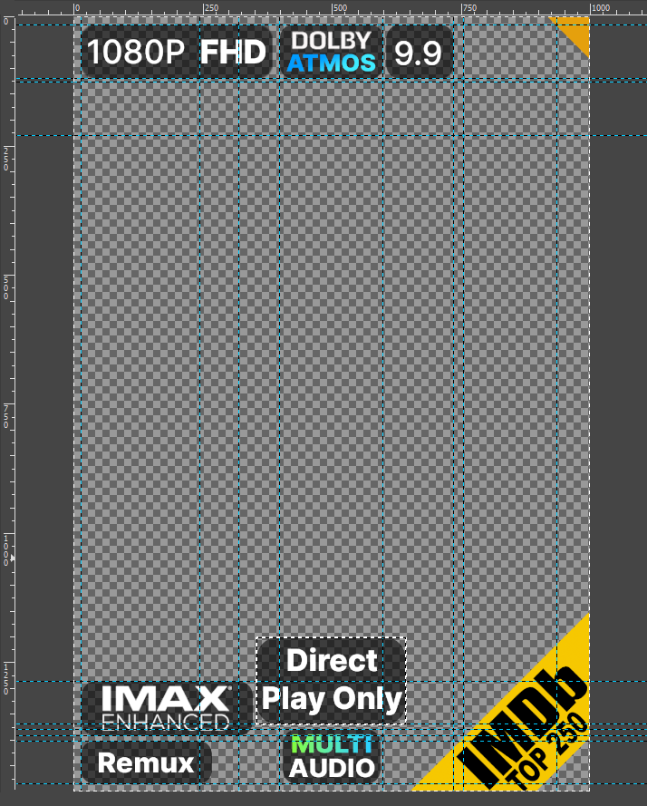
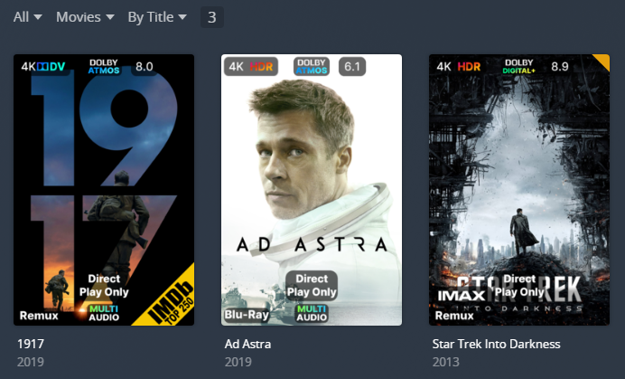
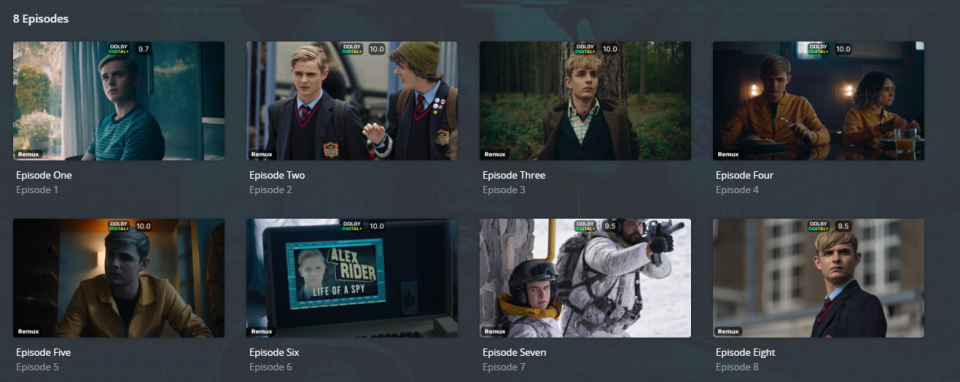
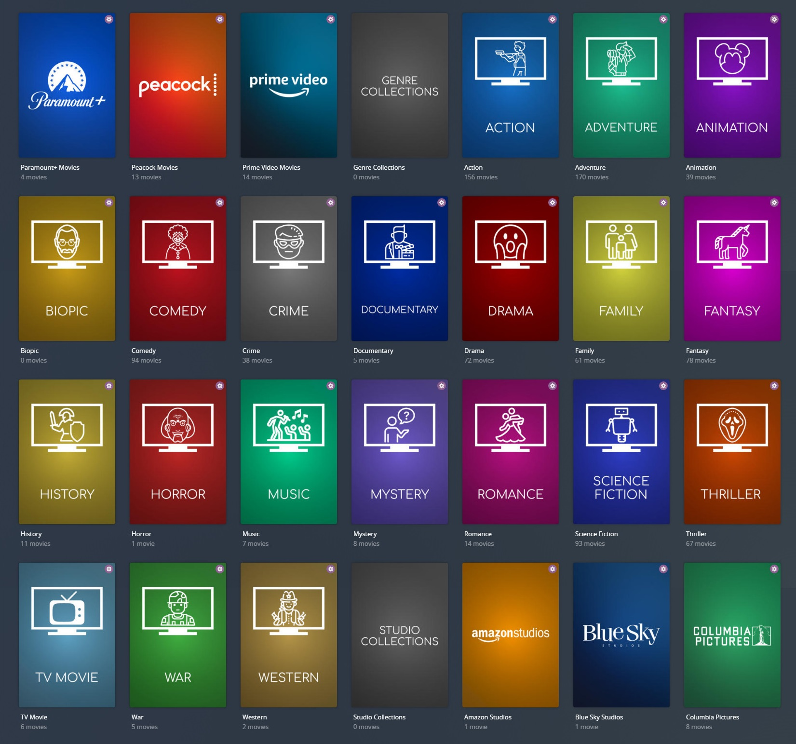

# Default Metadata & Overlays Files

There is a default set of Metadata and Overlay Files located in the [PMM Folder](https://github.com/meisnate12/Plex-Meta-Manager-Configs/tree/master/PMM) in the [Plex Meta Manager Configs](https://github.com/meisnate12/Plex-Meta-Manager-Configs) Repository.

The intention of this directory is to offer easy to use and slightly customizable (using [`template_variables`](../../config/paths.md#template-variables)) Metadata and Overlay Files for a general user who wants nice collections but doesn't want to learn all of Plex Meta Manager.

All posters defined in the Metadata Files are stored in the [Plex Meta Manager Images](https://github.com/meisnate12/Plex-Meta-Manager-Images) Repository and all Overlay images are in the [Configs](https://github.com/meisnate12/Plex-Meta-Manager-Configs) Repository at [PMM/overlays/images](https://github.com/meisnate12/Plex-Meta-Manager-Configs/tree/master/PMM/overlays/images), which allows for changes to be made in one central location that will deploy to all users of this setup when they next run PMM.

Credits to Bullmoose20 and Yozora for helping drive this entire Default Set of Configs through the concept, design and implementation.

Special thanks to Magic815 for the overlay image inspiration and base template.

## Configurations

To run a file in git you can simply add it to your `metadata_path` (For Metadata Files) or `overlay_path` (For Overlay Files) using `git` like so:

```yaml
libraries:
  Movies:
    metadata_path:
    - git: PMM/actor
    - git: PMM/genre
    overlay_path:
    - remove_overlays: false
    - git: PMM/overlays/imdb_top_250
    - git: PMM/overlays/ratings
```

## Overlays

The default set of overlays are a combination of Positional Overlays and Text Overlays.

<details>
  <summary>Click to expand to see all the different spots on an image the default overlays will be.</summary>

   

</details>

### Example Poster Overlays




### Example Episode Overlays



## Separators

By default, most metadata files use separators to denote different sections of collection like actor collections vs studio collections.

<details>
  <summary>Click to expand to see an example of Separators.</summary>

   

</details>

* Can  be turned off by [customizing your config](#customizing-configs)

## Collection Section Order

Almost every default metadata file has a `collection_section` attribute. These attributes determine the order of the various sections and can be set by [customizing your config](#customizing-configs).

## Customizing Configs

Configs can be customized using the `template_variables` attribute when calling the file. These `template_variables` will be given to every template call in the file which allows them to affect how that file runs.

```yaml
libraries:
  TV Shows:
    overlay_path:
    - git: PMM/overlays/ratings
      template_variables:
        overlay_level: episode
```

Each file has a comment block at the top showing the available `template_variables` for each file. For example the [`PMM/genre`](https://github.com/meisnate12/Plex-Meta-Manager-Configs/blob/master/PMM/genre.yml) has this:

```yaml
#############################################################
#                 Dynamic Genre Collections                 #
#         Created by Yozora, Bullmoose20, & Sohjiro         #
#############################################################
#  Call this from your config.yml (Movie or Show)           #
#  If nothing is specified these are the defaults           #
#                                                           #
#    metadata_path:                                         #
#      - git: PMM/genre                                     #
#        template_variables:                                #
#          # Turn the separator collection on/off           #
#          use_separator: true                              #
#          # Sets how the collection is sorted              #
#          sort_by: release.desc                            #
#          # Sets the collection mode of the collection     #
#          collection_mode:                                 #
#          # Sets the value at the start of the sort title  #
#          collection_section: "06"                         #
#############################################################
```
 
Each of these when passed will change how the collection runs slightly. 
* `use_separator` Turn the separator collection on/off
* `sort_by` Sets how the collection is sorted
* `collection_mode` Sets the collection mode of the collection 
* `collection_section` Sets the value at the start of the sort title

**In addition to the defined `template_variables` each file in the PMM Folder has access to the `radarr_add_missing` and `sonarr_add_missing` template variables and for dynamic collections most attributes can be passed as template variables**

For example if you want yearly oscar collections that go back 10 years instead of 5 all of which gets sent to radarr use the `data` and `radarr_add_missing` template variables.

```yaml
libraries:
  Movies:
    metadata_path:
    - git: PMM/award/oscars
      template_variables:
        radarr_add_missing: true
        data:
          starting: current_year-10
          ending: current_year
```

## Errors

If there are collections being made that have configuration errors or missing posters please either bring it up in our Discord or raise an Issue on the [Configs Repo](https://github.com/meisnate12/Plex-Meta-Manager-Configs/issues/new/choose). 

## Example Configuration File

<details>
  <summary>Click to expand sample config.yml file:</summary>

```yaml
libraries:
  Movies:
    metadata_path:
    - git: PMM/award/bafta
    - git: PMM/award/cannes
    - git: PMM/award/choice
    - git: PMM/award/golden
    - git: PMM/award/oscars
    - git: PMM/award/other
    - git: PMM/award/spirit
    - git: PMM/award/sundance
    - git: PMM/chart/anilist
    - git: PMM/chart/basic
    - git: PMM/chart/imdb
    - git: PMM/chart/myanimelist
    - git: PMM/chart/other
    - git: PMM/chart/tautulli
    - git: PMM/chart/tmdb
    - git: PMM/chart/trakt
    - git: PMM/actor
    - git: PMM/audio_language
    - git: PMM/movie/content_rating_us           # Choose content_rating_uk or content_rating_us
    - git: PMM/genre
    - git: PMM/resolution_standards              # Choose resolution_standards or resolution
    - git: PMM/studio
    - git: PMM/subtitle_language
    - git: PMM/year
    - git: PMM/movie/country
    - git: PMM/movie/decade
    - git: PMM/movie/director
    - git: PMM/movie/franchise
    - git: PMM/movie/universe
    - git: PMM/movie/producer
    - git: PMM/movie/seasonal
    - git: PMM/movie/streaming
    - git: PMM/movie/writer
    overlay_path:
    - remove_overlays: false
    - git: PMM/overlays/audio_codec
    - git: PMM/overlays/audio_language
    - git: PMM/overlays/direct_play
    - git: PMM/overlays/imdb_top_250
    - git: PMM/overlays/ratings
    - git: PMM/overlays/resolution
    - git: PMM/overlays/special_release
    - git: PMM/overlays/streaming
    - git: PMM/overlays/video_format
  TV Shows:
    metadata_path:
    - git: PMM/award/choice
    - git: PMM/award/golden
    - git: PMM/award/emmy
    - git: PMM/chart/anilist
    - git: PMM/chart/basic
    - git: PMM/chart/imdb
    - git: PMM/chart/myanimelist
    - git: PMM/chart/other
    - git: PMM/chart/tautulli
    - git: PMM/chart/tmdb
    - git: PMM/chart/trakt
    - git: PMM/actor
    - git: PMM/audio_language
    - git: PMM/show/content_rating_us            # Choose content_rating_uk or content_rating_us
    - git: PMM/genre
    - git: PMM/resolution_standards              # Choose resolution_standards or resolution
    - git: PMM/studio
    - git: PMM/subtitle_language
    - git: PMM/year
    - git: PMM/show/country
    - git: PMM/show/decade
    - git: PMM/show/network
    - git: PMM/show/streaming
    overlay_path:
    - remove_overlays: false
    - git: PMM/overlays/audio_codec
    - git: PMM/overlays/audio_codec
      template_variables:
        overlay_level: episode
    - git: PMM/overlays/audio_codec
      template_variables:
        overlay_level: season
    - git: PMM/overlays/audio_language
    - git: PMM/overlays/audio_language
      template_variables:
        overlay_level: episode
    - git: PMM/overlays/audio_language
      template_variables:
        overlay_level: season
    - git: PMM/overlays/direct_play
    - git: PMM/overlays/direct_play
      template_variables:
        overlay_level: episode
    - git: PMM/overlays/direct_play
      template_variables:
        overlay_level: season
    - git: PMM/overlays/ratings
    - git: PMM/overlays/ratings
      template_variables:
        overlay_level: episode
    - git: PMM/overlays/ratings
      template_variables:
        overlay_level: season
    - git: PMM/overlays/resolution
    - git: PMM/overlays/resolution
      template_variables:
        overlay_level: episode
    - git: PMM/overlays/resolution
      template_variables:
        overlay_level: season
    - git: PMM/overlays/special_release
    - git: PMM/overlays/special_release
      template_variables:
        overlay_level: episode
    - git: PMM/overlays/special_release
      template_variables:
        overlay_level: season
    - git: PMM/overlays/streaming
    - git: PMM/overlays/streaming
      template_variables:
        overlay_level: episode
    - git: PMM/overlays/streaming
      template_variables:
        overlay_level: season
    - git: PMM/overlays/video_format
    - git: PMM/overlays/video_format
      template_variables:
        overlay_level: episode
    - git: PMM/overlays/video_format
      template_variables:
        overlay_level: season
playlist_files:
- git: PMM/playlist
```
</details>
