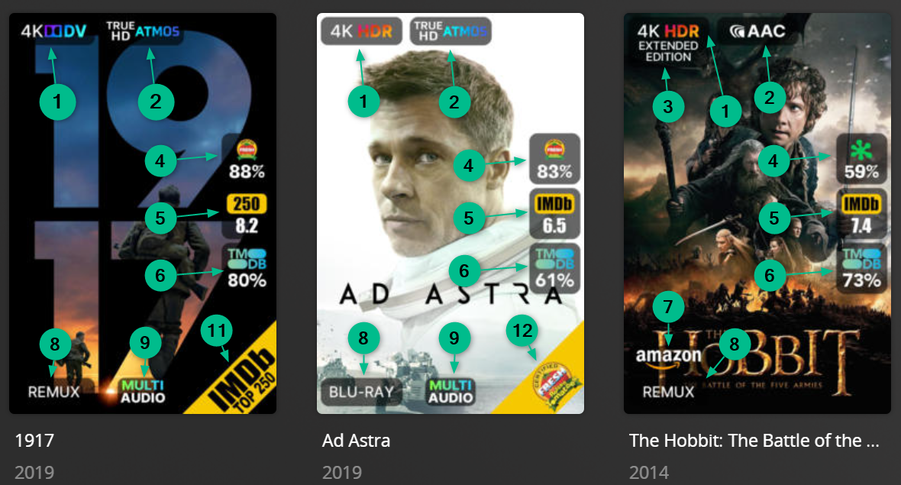
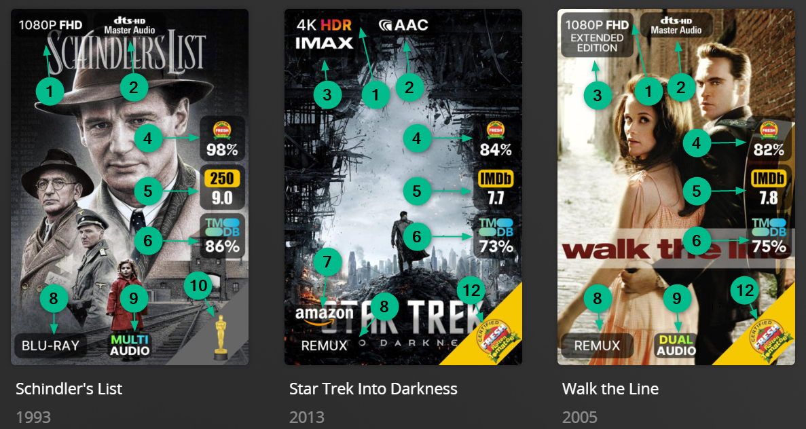
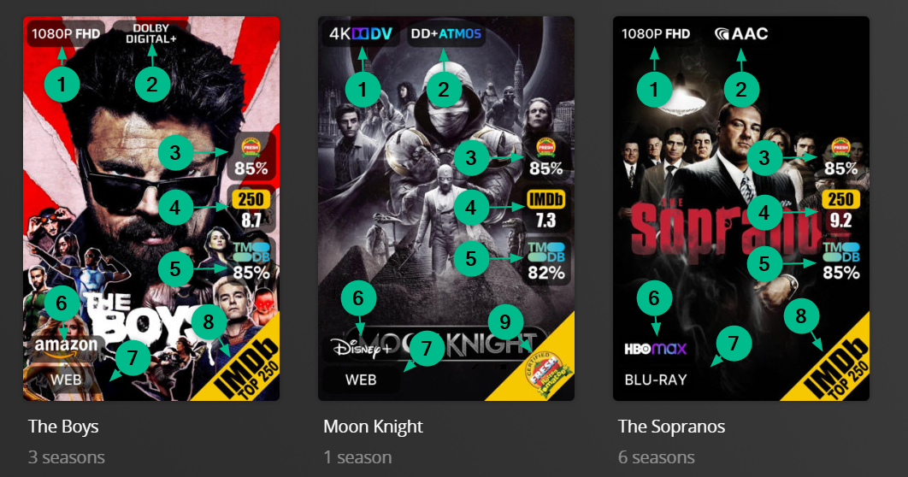
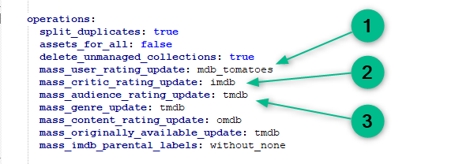

# Default Metadata & Overlays Files

There is a default set of Metadata and Overlay Files located in the [PMM Folder](https://github.com/meisnate12/Plex-Meta-Manager-Configs/tree/master/PMM) in the [Plex Meta Manager Configs](https://github.com/meisnate12/Plex-Meta-Manager-Configs) Repository.

The intention of this directory is to offer easy to use and slightly customizable (using [`template_variables`](../../config/paths.md#template-variables)) Metadata and Overlay Files for a general user who wants nice collections but doesn't want to learn all of Plex Meta Manager.

All posters defined in the Metadata Files are stored in the [Plex Meta Manager Images](https://github.com/meisnate12/Plex-Meta-Manager-Images) Repository and all Overlay images are in the [Configs](https://github.com/meisnate12/Plex-Meta-Manager-Configs) Repository at [pmm: images](https://github.com/meisnate12/Plex-Meta-Manager-Configs/tree/master/PMM/overlays/images), which allows for changes to be made in one central location that will deploy to all users of this setup when they next run PMM.


## Configurations

To run a file in git you can simply add it to your `metadata_path` (For Metadata Files) or `overlay_path` (For Overlay Files) using `git` like so:

```yaml
libraries:
  Movies:
    metadata_path:
    - pmm: actor
    - pmm: genre
    overlay_path:
    - remove_overlays: false
    - pmm: ribbon
    - pmm: ratings
```

## Overlays

The default set of overlays are a combination of Positional Overlays and Text Overlays.

### Example Poster Overlays



<details>
  <summary>Click to expand sample config.yml Movies overlays section:</summary>

```yaml
libraries:
  Movies:
    overlay_path:
    - remove_overlays: false
    - reapply_overlay: true
    - pmm: resolution                                       # 1
    - pmm: audio_codec                                      # 2
    - pmm: mediastinger                                     # 3
    - pmm: special_release                                  # 4
    - pmm: ratings                                          # 5,6,7
      template_variables:
        rating1: user                                                    # 5 as this is user and mass_user_rating_update: mdb_tomatoes
        rating1_image: rt_tomato                                         # 5 as this is user and mass_user_rating_update: mdb_tomatoes
        rating1_font: config/metadata/pmm: fonts/Adlib.ttf           # 5 local font accessible to PMM
        rating1_font_size: 63                                            # 5 adjusted font size to fit rating

        rating2: critic                                                  # 6 as this is critic and mass_critic_rating_update: imdb
        rating2_image: imdb                                              # 6 as this is critic and mass_critic_rating_update: imdb
        rating2_font: config/metadata/pmm: fonts/Impact.ttf          # 6 local font accessible to PMM
        rating2_font_size: 70                                            # 6 adjusted font size to fit rating

        rating3: audience                                                # 7 as this is audience and mass_audience_rating_update: tmdb
        rating3_image: tmdb                                              # 7 as this is audience and mass_audience_rating_update: tmdb
        rating3_font: config/metadata/pmm: fonts/Avenir_95_Black.ttf # 7 local font accessible to PMM
        rating3_font_size: 70                                            # 7 adjusted font size to fit rating

        horizontal_position: right                                       # the set of ratings is on the right of the poster
    - pmm: streaming                                                     # 8
    - pmm: video_format                                                  # 9
    - pmm: audio_language                                                # 10
    - pmm: oscars                                                        # 11
      template_variables:                                                # Bottom right sash is used by more than one overlay so a weight for priority is applied
        weight: 40                                                       # Weight of 40 applies if more than 1 sash is applied in bottom right
    - pmm: ribbon                                                        # 12, #13
      template_variables:                                                # Bottom right sash is used by more than one overlay so a weight for priority is applied
        weight: 30                                                       # Weight of 30 applies if more than 1 sash is applied in bottom right
    operations:
      mass_user_rating_update: mdb_tomatoes                              # 5 This operation will update the user rating in plex with Rotten Tomatoes ratings information
      mass_critic_rating_update: imdb                                    # 6 This operation will update the critic rating in plex with IMDb ratings information
      mass_audience_rating_update: tmdb                                  # 7 This operation will update the audience rating in plex with TMDb ratings information
```
</details>

### Example TV Shows - Show Overlays


<details>
  <summary>Click to expand sample config.yml TV Shows overlays section for the Show Poster:</summary>

```yaml
libraries:
  TV Shows:
    overlay_path:
    - remove_overlays: false
    - reapply_overlay: true
    - pmm: resolution                                       # 1
    - pmm: audio_codec                                      # 2
    - pmm: mediastinger                                     # 3
    - pmm: ratings                                          # 4,5,6
      template_variables:           
        rating1: user                                                    # 4 as this is user and mass_user_rating_update: mdb_tomatoes
        rating1_image: rt_tomato                                         # 4 as this is user and mass_user_rating_update: mdb_tomatoes
        rating1_font: config/metadata/pmm: fonts/Adlib.ttf           # 4 local font accessible to PMM
        rating1_font_size: 63                                            # 4 adjusted font size to fit rating

        rating2: critic                                                  # 5 as this is critic and mass_critic_rating_update: imdb
        rating2_image: imdb                                              # 5 as this is critic and mass_critic_rating_update: imdb
        rating2_font: config/metadata/pmm: fonts/Impact.ttf          # 5 local font accessible to PMM
        rating2_font_size: 70                                            # 5 adjusted font size to fit rating

        rating3: audience                                                # 6 as this is audience and mass_audience_rating_update: tmdb
        rating3_image: tmdb                                              # 6 as this is audience and mass_audience_rating_update: tmdb
        rating3_font: config/metadata/pmm: fonts/Avenir_95_Black.ttf # 6 local font accessible to PMM
        rating3_font_size: 70                                            # 6 adjusted font size to fit rating

        horizontal_position: right                                       # the set of ratings is on the right of the poster
    - pmm: streaming                                                     # 7
    - pmm: video_format                                                  # 8
    - pmm: ribbon                                                        # 9, #10
    operations:
      mass_user_rating_update: mdb_tomatoes                              # 4 This operation will update the user rating in plex with Rotten Tomatoes ratings information
      mass_critic_rating_update: imdb                                    # 5 This operation will update the critic rating in plex with IMDb ratings information
      mass_audience_rating_update: tmdb                                  # 6 This operation will update the audience rating in plex with TMDb ratings information
```
</details>

### Example TV Shows - Season Overlays


<details>
  <summary>Click to expand sample config.yml TV Shows overlays section for the Season Poster:</summary>
  
```yaml
libraries:
  TV Shows:
    overlay_path:
    - remove_overlays: false
    - reapply_overlay: true
    - pmm: resolution                                       # 1
      template_variables:
        overlay_level: season
    - pmm: audio_codec                                      # 2
      template_variables:
        overlay_level: season
    - pmm: video_format                                     # 3
      template_variables:
        overlay_level: season
```
</details>

### Example TV Shows - Episode Overlays


<details>
  <summary>Click to expand sample config.yml TV Shows overlays section for the Episode Poster:</summary>
  
```yaml
libraries:
  TV Shows:
    overlay_path:
    - remove_overlays: false
    - reapply_overlay: true
    - pmm: resolution                                       # 1
      template_variables:
        overlay_level: episode
    - pmm: audio_codec                                      # 2
      template_variables:
        overlay_level: episode
    - pmm: ratings                                          # 3,4
      template_variables:

        rating1: critic                                                  # 3 as this is critic and mass_critic_rating_update: imdb
        rating1_image: imdb                                              # 3 as this is critic and mass_critic_rating_update: imdb
        rating1_font: config/metadata/pmm: fonts/Impact.ttf          # 3 local font accessible to PMM
        rating1_font_size: 70                                            # 3 adjusted font size to fit rating

        rating2: audience                                                # 4 as this is audience and mass_audience_rating_update: tmdb
        rating2_image: tmdb                                              # 4 as this is audience and mass_audience_rating_update: tmdb
        rating2_font: config/metadata/pmm: fonts/Avenir_95_Black.ttf # 4 local font accessible to PMM
        rating2_font_size: 70                                            # 4 adjusted font size to fit rating

        horizontal_position: right                                       # the set of ratings is on the right of the poster
        overlay_level: episode
    - pmm: video_format                                     # 5
      template_variables:
        overlay_level: episode
    - pmm: episode_info                                     # 6
      template_variables:
        overlay_level: episode
    - pmm: runtimes                                         # 7
      template_variables:
        overlay_level: episode

    operations:
      mass_episode_critic_rating_update: imdb                            # 3 This operation will update the episodes critic rating in plex with IMDb ratings information
      mass_episode_audience_rating_update: tmdb                          # 4 This operation will update the episodes audience rating in plex with TMDb ratings information
```
</details>

## Collection Section Order

Almost every default metadata file has a `collection_section` attribute. These attributes determine the order of the various sections and can be set by [customizing your config](#customizing-configs).

For example: `collection_section:01` translates to `sort_title: "!<<collection_section>><<pre>><<order_<<key>>>><<sort>>"` and so for `genre.yml` if you have a `Fantasy` collection, plex is going to show `!06_Fantasy`

This is the default PMM collection ordering:


| Collection	                      | Order                  |
|:---------------------------------|------------------------|
| `pmm: seasonal.yml`              | collection_section: 00 |
| `pmm: anilist.yml`               | collection_section: 01 |
| `pmm: basic.yml`                 | collection_section: 01 |
| `pmm: imdb.yml`                  | collection_section: 01 |
| `pmm: myanimelist.yml`           | collection_section: 01 |
| `pmm: other.yml`                 | collection_section: 01 |
| `pmm: tautulli.yml`              | collection_section: 01 |
| `pmm: tmdb.yml`                  | collection_section: 01 |
| `pmm: trakt.yml`                 | collection_section: 01 |
| `pmm: universe.yml`               | collection_section: 02 |
| `pmm: streaming.yml`              | collection_section: 03 |
| `pmm: show/network.yml`           | collection_section: 04 |
| `pmm: genre.yml`                  | collection_section: 06 |
| `pmm: studio.yml`                 | collection_section: 07 |
| `pmm: country.yml`                | collection_section: 09 |
| `pmm: show/country.yml`           | collection_section: 09 |
| `pmm: audio_language.yml`         | collection_section: 10 |
| `pmm: subtitle_language.yml`      | collection_section: 11 |
| `pmm: decade.yml`                 | collection_section: 12 |
| `pmm: show/decade.yml`            | collection_section: 12 |
| `pmm: year.yml`                   | collection_section: 13 |
| `pmm: content_rating_uk.yml`      | collection_section: 14 |
| `pmm: content_rating_us.yml`      | collection_section: 14 |
| `pmm: show/content_rating_us.yml` | collection_section: 14 |
| `pmm: resolution.yml`             | collection_section: 15 |
| `pmm: resolution_standards.yml`   | collection_section: 15 |
| `pmm: bafta.yml`                  | collection_section: 16 |
| `pmm: cannes.yml`                 | collection_section: 16 |
| `pmm: choice.yml`                 | collection_section: 16 |
| `pmm: emmy.yml`                   | collection_section: 16 |
| `pmm: golden.yml`                 | collection_section: 16 |
| `pmm: oscars.yml`                 | collection_section: 16 |
| `pmm: other.yml`                  | collection_section: 16 |
| `pmm: separator.yml`              | collection_section: 16 |
| `pmm: spirit.yml`                 | collection_section: 16 |
| `pmm: sundance.yml`               | collection_section: 16 |
| `pmm: actor.yml`                  | collection_section: 17 |
| `pmm: director.yml`               | collection_section: 18 |
| `pmm: producer.yml`               | collection_section: 19 |
| `pmm: writer.yml`                 | collection_section: 20 |

## Ratings Overlays

By default for Movies in Plex, the `Ratings Source` dropdown (`#3`) below, can come from Rotten Tomatoes (and includes Critic Ratings and Audience Ratings) or IMDb (Audience Ratings). This only changes the tiny icons displayed and where Plex will retrieve the ratings from upon initial scan and import of the media metadata.

**Plex Meta Manager can insert up to three ratings of your choice into the three spots regardless of what you choose in the `Advanced` tab of that Plex library**


Plex has three available spots in the Plex DB to store ratings and thus Plex Meta Manager can be used to insert ratings sources of your choice into those spots. They are known as the User Rating (`#1`), Critic Rating (`#2`), and Audience Rating (`#3`). 

**Note that the little icons cannot be changed and that the numbers next to the little icons are reflected in the poster ratings overlay**


To be able to insert the ratings you want, Plex Meta Manager operations need to be defined. In this example below, User ratings (`#1`) are being filled with Rotten Tomatoes Critics Ratings. Critic ratings (`#2`) are filled with IMDb, and Audience ratings (`#3`) are filled with TMDb.

**mass_*_rating_update** sources can be found here: [operations](../../config/operations)



Finally, to show the ratings on the poster, the following was added to the `overlay_path` section in the `config.yml` file to post Rotten Tomatoes Critics Ratings in (`#1`), IMDb ratings in (`#2`), and TMDb ratings in (`#3`)


## Customizing Configs

Configs can be customized using the `template_variables` attribute when calling the file. These `template_variables` will be given to every template call in the file which allows them to affect how that file runs.

This example changes the ratings overlay to work on episodes.

```yaml
libraries:
  TV Shows:
    overlay_path:
    - pmm: ratings
      template_variables:
        overlay_level: episode
```

Each of these when passed will change how the collection runs slightly. 
* `use_separator` Turn the separator collection on/off
* `sort_by` Sets how the collection is sorted
* `collection_mode` Sets the collection mode of the collection 
* `collection_section` Sets the value at the start of the sort title

**In addition to the defined `template_variables` each file in the PMM Folder has access to the `radarr_add_missing` and `sonarr_add_missing` template variables and for dynamic collections most attributes can be passed as template variables**

For example if you want yearly oscar collections that go back 10 years instead of 5 all of which gets sent to radarr use the `data` and `radarr_add_missing` template variables.

```yaml
libraries:
  Movies:
    metadata_path:
    - pmm: oscars
      template_variables:
        radarr_add_missing: true
        data:
          starting: current_year-10
          ending: current_year
```

Or maybe you want to change the number of actor collections made using pmm: actor.

```yaml
libraries:
  Movies:
    overlay_path:
    - pmm: actor
      template_variables:
        collection_mode: hide
        data:
          depth: 5
          limit: 50
```

Or maybe you want to change the collection sort order of the genre collections using pmm: genre.

```yaml
libraries:
  Movies:
    metadata_path:
    - pmm: genre
      template_variables:
        collection_section: 11
```

Or maybe you want to disable separators globally per library.

```yaml
libraries:
  LIBRARYNAME:
    template_variables:
      use_separator: false
    metadata_path:
```

Alternatively it can be turned off individually per git file:

```yaml
libraries:
  LIBRARYNAME:
    metadata_path:
      - pmm: <file1>    # separator is disabled
        template_variables:
          use_separator: false
      - pmm: <file2>    # separator is enabled by default
      - pmm: <file3>    # separator is disabled
        template_variables:
          use_separator: false
```

## Errors

If there are collections being made that have configuration errors or missing posters please either bring it up in our Discord or raise an Issue on the [Configs Repo](https://github.com/meisnate12/Plex-Meta-Manager-Configs/issues/new/choose). 

## Example Configuration File

<details>
  <summary>Click to expand sample config.yml file:</summary>

```yaml
libraries:
  Movies:
    metadata_path:
    - pmm: bafta
    - pmm: cannes
    - pmm: choice
    - pmm: golden
    - pmm: oscars
    - pmm: other_award
    - pmm: spirit
    - pmm: sundance
    - pmm: anilist
    - pmm: basic
    - pmm: imdb
    - pmm: myanimelist
    - pmm: other_chart
    - pmm: tautulli
    - pmm: tmdb
    - pmm: trakt
    - pmm: actor
    - pmm: audio_language
    - pmm: content_rating_us           # Choose content_rating_uk or content_rating_us
    - pmm: genre
    - pmm: resolution_standards              # Choose resolution_standards or resolution
    - pmm: streaming
    - pmm: studio
    - pmm: subtitle_language
    - pmm: year
    - pmm: country
    - pmm: decade
    - pmm: director
    - pmm: franchise
    - pmm: universe
    - pmm: producer
    - pmm: seasonal
    - pmm: writer
    overlay_path:
    - remove_overlays: false
    - pmm: audio_codec
    - pmm: audio_language
    - pmm: commonsense
    - pmm: direct_play
    - pmm: mediastinger
    - pmm: ribbon
    - pmm: ratings
      template_variables:
        rating1: critic
        rating1_image: rt_tomato
    - pmm: resolution
    - pmm: special_release
    - pmm: streaming
    - pmm: versions
    - pmm: video_format
  TV Shows:
    metadata_path:
    - pmm: choice
    - pmm: golden
    - pmm: emmy
    - pmm: anilist
    - pmm: basic
    - pmm: imdb
    - pmm: myanimelist
    - pmm: other_chart
    - pmm: tautulli
    - pmm: tmdb
    - pmm: trakt
    - pmm: actor
    - pmm: audio_language
    - pmm: content_rating_us            # Choose content_rating_uk or content_rating_us
    - pmm: genre
    - pmm: resolution_standards              # Choose resolution_standards or resolution
    - pmm: streaming
    - pmm: studio
    - pmm: subtitle_language
    - pmm: year
    - pmm: country
    - pmm: decade
    - pmm: network
    overlay_path:
    - remove_overlays: false
    - pmm: audio_codec
    - pmm: audio_codec
      template_variables:
        overlay_level: episode
    - pmm: audio_codec
      template_variables:
        overlay_level: season
    - pmm: audio_language
    - pmm: audio_language
      template_variables:
        overlay_level: episode
    - pmm: audio_language
      template_variables:
        overlay_level: season
    - pmm: commonsense
    - pmm: commonsense
      template_variables:
        overlay_level: episode
    - pmm: commonsense
      template_variables:
        overlay_level: season
    - pmm: direct_play
    - pmm: direct_play
      template_variables:
        overlay_level: episode
    - pmm: direct_play
      template_variables:
        overlay_level: season
    - pmm: episode_info
      template_variables:
        overlay_level: episode
    - pmm: mediastinger
    - pmm: mediastinger
      template_variables:
        overlay_level: episode
    - pmm: mediastinger
      template_variables:
        overlay_level: season
    - pmm: ribbon
    - pmm: ribbon
      template_variables:
        overlay_level: episode
    - pmm: ribbon
      template_variables:
        overlay_level: season
    - pmm: ratings
      template_variables:
        rating2: audience
        rating2_image: imdb
    - pmm: ratings
      template_variables:
        rating2: audience
        rating2_image: imdb
        overlay_level: episode
    - pmm: resolution
    - pmm: resolution
      template_variables:
        overlay_level: episode
    - pmm: resolution
      template_variables:
        overlay_level: season
    - pmm: runtimes
      template_variables:
        overlay_level: episode
    - pmm: special_release
    - pmm: special_release
      template_variables:
        overlay_level: episode
    - pmm: special_release
      template_variables:
        overlay_level: season
    - pmm: streaming
    - pmm: versions
    - pmm: versions
      template_variables:
        overlay_level: episode
    - pmm: versions
      template_variables:
        overlay_level: season
    - pmm: versions
      template_variables:
        overlay_level: show
    - pmm: video_format
    - pmm: video_format
      template_variables:
        overlay_level: episode
    - pmm: video_format
      template_variables:
        overlay_level: season
playlist_files:
- pmm: playlist
```
</details>
