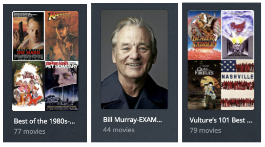

# Docker Walkthrough

This article will walk you through getting Plex-Meta-Manager [PMM] set up and running via Docker.  It will cover:

1. Installing Docker
2. Retrieving the image
3. Setting up the initial config file
4. Setting up a metadata file and creating a couple sample collections
5. Creating a docker container that will keep running in the background

The specific steps you will be taking:
1. Verify that Docker is installed and install it if not
2. Use `docker` to retrieve the PMM Docker image
3. Create a directory for your config files and learn how to tell Docker to use it
4. Gather two things that the script requires:
   1. TMDB API Key
   2. Plex URL and Token
5. Then, iteratively:
   1. use `docker` to run the image
   2. use a text editor to modify a couple of text files until you have a working config file and a single working metadata file.

## Prerequisites.

Anywhere you see

```
something like this
```

That’s a command you’re going to type or paste into your terminal (OSX or Linux) or Powershell (Windows).

IMPORTANT NOTE:
This walkthrough is going to be pretty pedantic.  I’m assuming you’re reading it because you have no idea how to get a Docker container going, so I’m proceeding from the assumption that you want to be walked through every little detail.   You’re going to deliberately cause errors and then fix them as you go through it.  This is to help you understand what exactly is going on behind the scenes so that when you see these sorts of problems in the wild you will have some background to understand what’s happening.  If I only give you the happy path walkthrough, then when you make a typo later on you’ll have no idea where that typo might be or why it’s breaking things.

I am assuming you do not have any of these tools already installed.  When writing this up I started with a brand new Windows 10 install.

I'm also assuming you are doing this on a computer, not through a NAS interface or the like.  You can do all this through something like the Synology NAS UI or Portainer or the like, but those aren't documented here.  This uses the docker command line because it works the same on all platforms.

You may want to take an hour to get familiar with Docker fundamentals with the [official tutorial](https://www.docker.com/101-tutorial/).

DO NOT MAKE ANY CHANGES BELOW if you want this to just work.  Don't change the docker image [`linuxserver.io` will not work for this, for example]; don't change the paths, etc.

### Installing Docker.

To run Docker images, you need to have Docker installed.  It is not typically installed on new Mac, Linux, or Windows machines.

The Docker install is discussed here: [Installing Docker](https://docs.docker.com/engine/install/)

Once you have Docker installed, test it at the command line with:

[type this into your terminal]
```
docker run --rm hello-world
```

You should see something that starts with:

```
Hello from Docker!
This message shows that your installation appears to be working correctly.

...
```

---

#### Important note on Docker images

This tutorial uses the official image, and you should, too.  Don't change `meisnate12/plex-meta-manager` to the `linuxserver.io` image or any other; the lsio image specifically has [idiosyncracies](alternative-docker.md) that will prevent this walkthrough from working.  The official image *will* behave exactly as documented below.  Other very possibly won't.


The great thing about Docker is that all the setup you'd have to do to run PMM is already done inside the docker image.

That means we can just jump right into running it.  At the command prompt, type:

```
docker run --rm meisnate12/plex-meta-manager --run

```

This is going to fail with an error.  That's expected.

You should see something like this:

```
Unable to find image 'meisnate12/plex-meta-manager:latest' locally
latest: Pulling from meisnate12/plex-meta-manager
7d63c13d9b9b: Already exists
6ad2a11ca37b: Already exists
8076cdef4689: Pull complete
0ba90f5a7dd0: Pull complete
27c191df269f: Pull complete
c75e4c0924fa: Pull complete
ed6716577767: Pull complete
0547721ab7a3: Pull complete
ea4d35bce959: Pull complete
Digest: sha256:472be179a75259e07e68a3da365851b58c2f98383e02ac815804299da6f99824
Status: Downloaded newer image for meisnate12/plex-meta-manager:latest
Config Error: config not found at //config
```

That error means you don’t have a config file, but we know that most everything is in place to run the image.

### Setting up a volume map

PMM, inside that Docker container, can only see other things *inside the container*.  We want to add our own files for config and metadata, so we need to set something up that lets PMM see files we create *outside* the container.  This is called a "volume map".

Go to your home directory and create a new directory:

[type this into your terminal]
```
cd ~
mkdir plex-meta-manager
```

cd into that directory:

[type this into your terminal]
```
cd ~/plex-meta-manager
```

get the full path:

[type this into your terminal]
```
pwd
```

This will display a full path:
<details>
  <summary>OS X</summary>
  <br />

  ```
  /Users/YOURUSERNAME/plex-meta-manager
  ```
</details>

<details>
  <summary>Linux</summary>
  <br />

  ```
  /home/YOURUSERNAME/plex-meta-manager
  ```
</details>

<details>
  <summary>Windows</summary>
  <br />

  ```
  C:\Users\YOURUSERNAME\plex-meta-manager
  ```
</details>

You'll need to add this to the docker command every time you run it, like this:


<details>
  <summary>Linux</summary>
  <br />

  ```
  docker run --rm -it -v "/home/YOURUSERNAME/plex-meta-manager:/config:rw" meisnate12/plex-meta-manager
  ```
</details>

<details>
  <summary>Windows</summary>
  <br />

  ```
  docker run --rm -it -v "C:\Users\YOURUSERNAME\plex-meta-manager:/config:rw" meisnate12/plex-meta-manager
  ```
</details>

If you run that command now it will display a similar error to before, but without all the image loading:

```
 $ docker run --rm -it -v "/Users/mroche/plex-meta-manager:/config:rw" meisnate12/plex-meta-manager --run
Config Error: config not found at //config
```

Note that I show the example path there.

### Setting up the initial config file

Next you’ll set up the config file.  ThIs tells PMM how to connect to Plex and a variety of other services.

Before you do this you’ll need:

1. TMDb API key.  They’re free.
1. Plex URL and Token

There are a bunch of other services you *can* configure in the config file, but these two are the bare minimum.

#### Getting a TMDb API Key

Note that if you already have an API key, you can use that one.  You don’t need another.

Go to https://www.themoviedb.org/.  Log into your account [or create one if you don’t have one already], then go to “Settings” under your account menu.

In the sidebar menu on the left, select “API”.

Click to generate a new API key under "Request an API Key".  If there is already one there, copy it and go to the next step.

There will be a form to fill out; the answers are arbitrary.  The URL can be your personal website, or probably even google.com or the like.

Once you’ve done that there should be an API Key available on this screen.

Copy that value, you’ll need it for the config file.

#### Getting a Plex URL and Token

The Plex URL is whatever URL you’d use **from this machine** to connect directly to your Plex server [i.e. NOT app.plex.tv].

As with the TMDb API Key, if you already have a Plex Token, you can use that one.

This article will describe how to get a token: [Finding an authentication token](https://support.plex.tv/articles/204059436-finding-an-authentication-token-x-plex-token/)


#### Editing the config template

First, make a copy of the template, then open the copy in an editor:

<details>
  <summary>OS X/Linux</summary>
  <br />

  Get a copy of the template to edit [type this into your terminal]:
  ```
  curl -fLvo config.yml https://raw.githubusercontent.com/meisnate12/Plex-Meta-Manager/master/config/config.yml.template
  ```

  Open it in an editor [type this into your terminal]:
  ```
  nano config.yml
  ```

  I’m using `nano` here simply because it’s built into OSX.  On Linux you may need to install `nano`, or you can use any other text editor you wish provided it saves files as PLAIN TEXT.
</details>

<details>
  <summary>Windows</summary>
  <br />

  Download the file `https://raw.githubusercontent.com/meisnate12/Plex-Meta-Manager/master/config/config.yml.template` using a web browser or whatever means and save it in this directory as `config.yml`

  [type this into your terminal]
  ```
  notepad config.yml
  ```
  I’m using `notepad` here simply because it’s built into Windows.  You can use any other text editor provided it saves files as PLAIN TEXT.

</details>

From here on in, when I say "open the config file", I mean the `nano` or `notepad` command.  You don't want to download the template again.

---

Scroll down a bit and update the three things you just collected; Plex URL, Plex Token, and TMDb API Key.

```yaml
plex:                                           # Can be individually specified per library as well
  url: http://bing.bang.boing                <<< ENTER YOUR PLEX URL HERE
  token: XXXXXXXXXXXXXXXXXXXX                <<< ENTER YOUR PLEX TOKEN HERE
  timeout: 60
  clean_bundles: false
  empty_trash: false
  optimize: false
tmdb:
  apikey: XXXXXXXXXXXXXXXXXXXXXXXXXXXXXXXX   <<< ENTER YOUR TMDb API KEY HERE
  language: en
```

Now scroll up and look at the top section:

```yaml
## This file is a template remove the .template to use the file

libraries:                                      # This is called out once within the config.yml file
  Movies:                                       # Each library must match the Plex library name
    metadata_path:
      - file: config/Movies.yml                 # This is a local file on the system
      - folder: config/Movies/                  # This is a local directory on the system
      - git: meisnate12/MovieCharts             # This is a file within the GitHub Repository
  TV Shows:
    metadata_path:
      - file: config/TVShows.yml
      - folder: config/TV Shows/
      - git: meisnate12/ShowCharts              # This points to the https://github.com/meisnate12/Plex-Meta-Manager-Configs Repository
  Anime:
    metadata_path:
      - file: config/Anime.yml
  Music:
    metadata_path:
      - file: config/Music.yml
```

You will ultimately need an entry here for each of the libraries on which you want PMM to act.  Those top-level elements [Movies, TV Shows, Anime, Music] are names of libraries on your Plex server.

For now, delete the “TV Shows”, “Anime”, and "Music" sections and change the name of the “Movies” section to “Movies-NOSUCHLIBRARY":

```yaml
libraries:
  Movies-NOSUCHLIBRARY:                         ## <<< CHANGE THIS LINE
    metadata_path:
      - file: config/Movies.yml
      - git: meisnate12/MovieCharts
```

This is intended to cause an error.

#### Testing the config file

Save the file:

<details>
  <summary>OS X/Linux</summary>
  <br />

  If you're using `nano`, type control-`x`, then `y`, then the enter key.

</details>

<details>
  <summary>Windows</summary>
  <br />

  If you're using `notepad`, type alt-`s` or choose `Save` from the `File` menu.

</details>

Then run the script again:

[type this into your terminal]
```
docker run --rm -it -v "PMM_PATH_GOES_HERE:/config:rw" meisnate12/plex-meta-manager --run
```

I’ve removed some of the lines for space, but have left the important bits:

```
...
|                                            Starting Run|
...
| Locating config...
|
| Using /Users/mroche/Plex-Meta-Manager/config/config.yml as config
...
| Connecting to TMDb...
| TMDb Connection Successful
...
| Connecting to Plex Libraries...
...
| Connecting to Movies-NOSUCHLIBRARY Library...                                                      |
...
| Plex Error: Plex Library Movies-NOSUCHLIBRARY not found                                            |
| Movies-NOSUCHLIBRARY Library Connection Failed                                                     |
|====================================================================================================|
| Plex Error: No Plex libraries were connected to                                                    |
...
```

You can see there that PMM found its config file, was able to connect to TMDb, was able to connect to Plex, and then failed trying to read the “Movies-NOSUCHLIBRARY library, which of course doesn’t exist.

Open the config file again and change "Movies-NOSUCHLIBRARY" to reflect your Plex.  Then delete any lines that start with “git”.  Those are all sets of collections, and we just want to create a few as examples.

My Movies library is called “Main Movies", so mine looks like this:

```yaml
libraries:
  Main Movies:                            ## <<< CHANGE THIS LINE
    metadata_path:
      - file: config/Movies.yml
```

Save the file:

<details>
  <summary>OS X/Linux</summary>
  <br />

  If you're using `nano`, type control-`x`, then `y`, then the enter key.

</details>

<details>
  <summary>Windows</summary>
  <br />

  If you're using `notepad`, type alt-`s` of choose `Save` from the `File` menu.

</details>

Then run the script again:

[type this into your terminal]
```
docker run --rm -it -v "PMM_PATH_GOES_HERE:/config:rw" meisnate12/plex-meta-manager --run
```

Now you’ll see some more activity in the Plex connection section:

```
$ docker run --rm -it -v "/Users/mroche/plex-meta-manager:/config:rw" meisnate12/plex-meta-manager --run
...
| Connecting to Plex Libraries...
...
| Connecting to Main Movies Library...
...
| Loading Metadata File: config/Movies.yml
|
| YAML Error: File Error: File does not exist config/Movies.yml
...
| Metadata File Error: No valid metadata files found
|
| Main Movies Library Connection Failed
...
```

PMM may start cataloging your movies at this point; you cna hit control-C to stop that if it's happening.

We can see there that it connected to the Plex Library but failed to find that `Movies.yml` metadata file.

So far so good.

### Setting up a metadata file and creating a few sample collections.

Now we have to set up that metadata file that PMM just complained about.

This metadata file contains definitions of the actions you want PMM to take; these can be things like creating collections or playlists, adding overlays, changing things like posters, etc.  You can find lots of examples [here](https://github.com/meisnate12/Plex-Meta-Manager-Configs) and throughout the wiki.

For now we’re going to create a few collections so you can watch the process work, then you’re on your own to create whatever others you want.

First, open the metadata file [this will create the file if it doesn't already exist]:

<details>
  <summary>OS X/Linux</summary>
  <br />

  [type this into your terminal]
  ```
  nano "Movies.yml"
  ```

</details>

<details>
  <summary>Windows</summary>
  <br />

  [type this into your terminal]
  ```
  notepad "Movies.yml"
  ```

</details>

In this file, add the following, exactly as it is shown here:

```yaml
templates:
  Actor:
    actor: tmdb
    tmdb_person: <<person>>
    tmdb_actor_details: <<person>>
    sort_title: +_<<collection_name>>
    sync_mode: sync
    collection_order: release
    collection_mode: hide
collections:
  Bill Murray:
    template: {name:  Actor, person: 1532}
  Best of the 1980s:
    tmdb_discover:
      primary_release_date.gte: 01/01/1980
      primary_release_date.lte: 12/31/1989
      with_original_language: en
      sort_by: popularity.desc
      limit: 100
    summary: A collection of the Top Content of the 1980s
  Vulture’s 101 Best Movie Endings:
    letterboxd_list: https://letterboxd.com/brianformo/list/vultures-101-best-movie-endings/
```

I chose a letterboxd list for the last one since trakt requires authentication and again, I didn’t want to complicate this walkthrough.

This is going to create three collections.  One contains movies that feature Bill Murray.  One is up to 100 movies that came out in the 1980s sorted by popularity.  The last are movies that appear on a list of good endings according to Vulture.

The first one is based on a template to illustrate that concept.  If you wanted to create a collection for another actor you just have to copy and edit those two lines [the ID comes from TMDb].  All the other config details come from the template.

Save the file:

<details>
  <summary>OS X/Linux</summary>
  <br />

  If you're using `nano`, type control-`x`, then `y`, then the enter key.

</details>

<details>
  <summary>Windows</summary>
  <br />

  If you're using `notepad`, type alt-`s` of choose `Save` from the `File` menu.

</details>

Then run the script again:

[type this into your terminal]
```
docker run --rm -it -v "PMM_PATH_GOES_HERE:/config:rw" meisnate12/plex-meta-manager --run
```

This time you should see that the metadata file gets loaded:

```
| Loading Metadata File: config/Movies.yml
| Metadata File Loaded Successfully
```

And this time it will catalog all your movies.  This could take a while depending on how many movies are in that library.

Once this mapping is complete it will move on to build those three collections.

As it builds the collections, you should see a fair amount of logging about which movies are being added and which ones aren’t found.  Once it completes, go to Plex, go to your Movies library, and click “Collections” at the top.

You should see the three new collections:



When you click into each, you’ll see the movies that PMM added to each collection.

Each time you run the script, new movies that match the collection definition will be added.  For example, if you don’t have “The Razors’ Edge” now, when you download it and run PMM again it will be added to the Bill Murray collection.

If you download any of the missing 22 movies on the Vulture list, running PMM would add them to that collection.  And so on.

### What comes next:

Delete these three collections if you want, from both Plex and the metadata file [`config/Movies.yml`].

Edit `Movies.yml` to reflect the actions you want PMM to perform on *your* libraries.

TV Shows and other libraries work the same way as you've seen above.  Create a section under `Libraries:` in the config.yml, create a metadata file, define collections, run the script.

Investigate the rest of the wiki to learn about everything Plex-Meta-Manager can do for you.

### Running the container in the background:

The docker commands in this article are creating and deleting containers.

However, you probably ultimately want a container that runs all the time, even after reboots, and wakes up to do its thing.

This would be the minimal case:

```
docker run -d \
  --restart=unless-stopped \
  -v PMM_PATH_GOES_HERE:/config:rw \
  meisnate12/plex-meta-manager
```

That will create a container that will run in the background until you explicitly stop it, surviving reboots, and waking up every morning at 3AM to process collections.

There are of course [other flags you can add](../environmental.md), but this is the minimal command to create this container.
