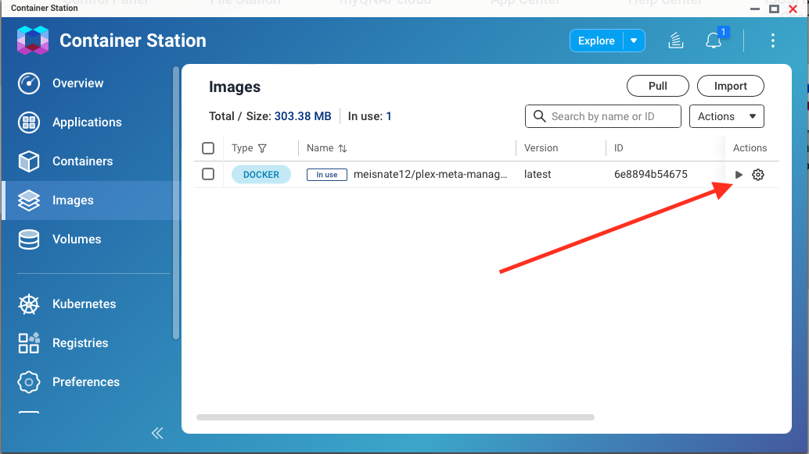
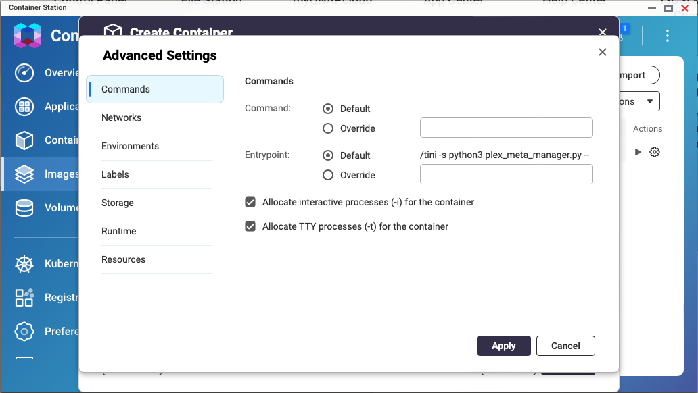
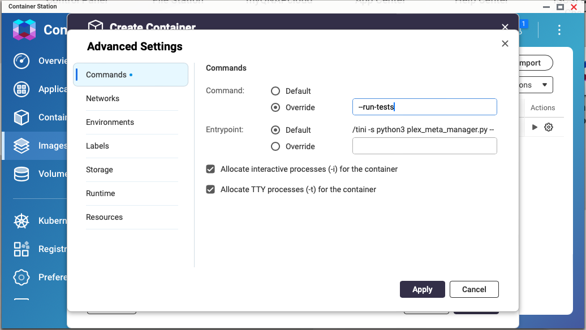
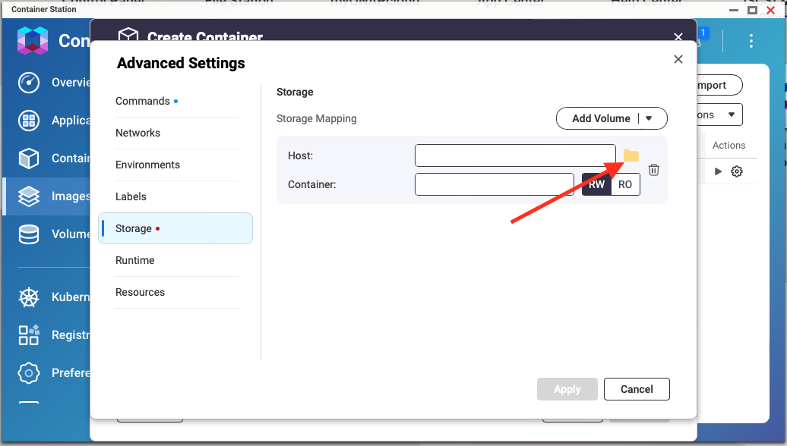
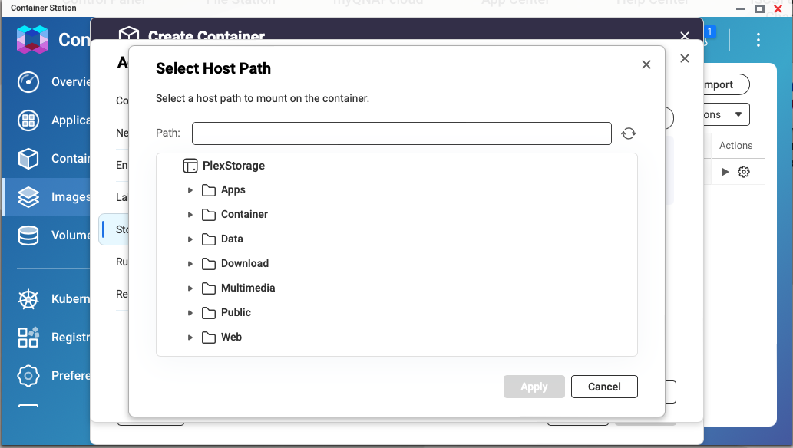

# QNAP Walkthrough

This is a quick walkthrough of setting up the Plex-Meta-Manager Docker container in the QNAP "Container Station" UI.

The "Container Station" UI on your QNAP may differ from these screenshots, but the concepts are the same:

1. Create a container based on the `meisnate12/plex-meta-manager` image.
2. Set environment variables to control the container's behavior [optional].
3. Point the container to the directory where your configuration files are to be stored.

Detailed steps:

````{tab} Container Station v. 3.0.5.623
1. Open Container Station; click “Images”

    

1. Select “Pull” from the top-right

    

1. Leave Mode set to “Basic Mode”
   
   For the Registry select “Docker Hub”
   
   Under the "Image" section you will be typing in the name and version of the docker image you wish to pull. Type in the image you wish to use as follows:

   ```
   meisnate12/plex-meta-manager:latest
   meisnate12/plex-meta-manager:develop
   meisnate12/plex-meta-manager:nightly
   ```

   Then click Pull.

    

   Note: You can repeat this step for each of the different versions and you’ll end up with this:

    

   After the pull is complete the image(s) will now be available for use.

1. From the "Images" menu under the "Actions" column click the "play" button to bring up the “Create Container” option.

    

1. "Create Container" Step 1: "Select Image" – you’ve already done this so just click "Next". 

    

1. "Create Container" Step 2: "Configure Container" - you can edit the name if you wish. From here on you’ll be working in the Advanced Settings sub-menu. Click on "Advanced Settings".

    

1. You can add [command-line switches](../environmental) to the "Command" field here.  Do not edit the "Entrypoint" field.

    

   For example, if you wanted to run the collections you have defined as tests, add the `--run-tests` command-line flag:

    

   Generally speaking, editing these is not recommended as it is easy to render the container non-functional by doing so.

   It is more typical in Docker contexts to set these things with environment variables.

   Anything you can do via command-line arguments can be done with [Environment Variables](../environmental), which is more typical in Docker environments.

   For example, you could add an environment variable named `PMM_TESTS` with a value of `true` to run the collections you have defined as tests.

   Click "Environments" on the left to set environment variables.

1. Select "Storage":

    

1. Click the Trash Can icon to remove the default Storage Mapping:

    

1. Click "Add Volume" then choose “Bind Mount Host Path”:

    

1. Select the Yellow Folder icon

    

   “Select Host Path” will appear as seen below, letting you select the folder you want to use. 

    

   After selecting your folder and choosing "Apply" the "Host" path will be filled in. For the "Container" path you MUST use `/config`:

   

1. Select Next to advance to “Step 3 Summary”

1. Select Finish

````
````{tab} Container Station v. unknown

1. Open Container Station; click "Create" in the left column.


   


2. Search for `meisnate12/plex-meta-manager`.

   On the "Docker Hub" tab you should see the image; click on it and click "Install".


   


1. Select the version you want to run from the dropdown and click "Next".

   The options are:
    - `latest`: most recent official release; typically the most stable
    - `develop`: development release, contains new features that haven't made it to latest yet, but may have minor problems
    - `nightly`: bleeding-edge development version; latest fixes go here, but breakage should be expected.


   


2. Change the container name if you wish.

   Command line arguments can be entered in the "Entrypoint" field after `/tini -s python3 plex_meta_manager.py --`  

   IMPORTANT: **DO NOT REMOVE** ANY ELEMENT OF THAT TEXT.  DO NOT ENTER ANYTHING INTO THE "Command" FIELD.

   For example, you could enter the following into the "Entrypoint" field to make PMM run immediately when the container starts up: `/tini -s python3 plex_meta_manager.py -- --run`

   Typically, in a Docker environment, this sort of thing is done via Environment Variables [the next step here].  Editing the "Entrypoint" is not recommended, as it's easy to render the container non-functional if you are not sure what you're doing.

   Information on available command line arguments can be found [here](../environmental)

   Click "Advanced Settings >>"


   


3. Environment Variables can be added here:

   Anything you can do via command-line arguments can be done with Environment Variables, which is more typical in Docker environments.

   For example, you could add an environment variable named `PMM_RUN` with a value of `True` to make PMM run immediately when the container starts up.

   Information on available Environment Variables can be found [here](../environmental)


   


4. Click Shared Folders Tab:

   Click "Add" in the middle section "Volume from host".

   "Volume from host" is the location on your QNAP where you want to store the config files.

   "Mount Point" must be `/config`

   When finished, click "Create".


   

````
