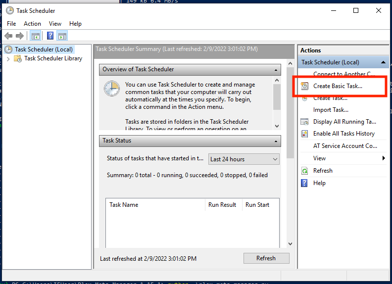
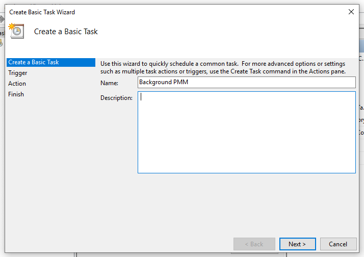
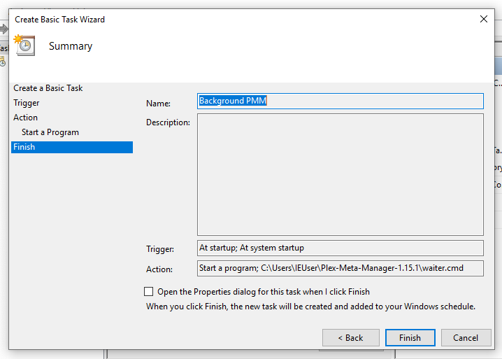

# Scheduling Guide

Plex Meta Manager is designed to be a background running service that "wakes up" and "sleeps" when it is scheduled to do so. By default and unless configured using the [Time to Run Command](../environmental.md#time-to-run), Plex Meta Manager expects to run every day at 3AM local time.

Whilst it is possible to have `python plex-meta-manager.py` running in an open window constantly, this is not the recommended approach as it relies on an always-open command window that can be obtrusive to the user.

Instead, it is recommended to set an automated scheduling service so that Plex Meta Manager can run in the background when scheduled to without any visible impact to the user (other than the Plex libraries and playlists updating).

## Docker Run

<details>
  <summary>Click to Expand</summary>
  <br />

Using docker is the simplest and most robust solution to automating Plex Meta Manager scheduling.

When running Plex Meta Manager within docker, the session will resume after a system reboot (assuming Docker is set to start at system startup, which is the default) and Plex Meta Manager will run in the background at all times.

There's a [Docker Walkthrough](docker) with more detailed instructions on setting up Plex Meta Manager within docker. The simplest command to facilitate a docker run is:

```
docker run -d \
  --restart=unless-stopped \
  -v /path/to/config:/config:rw \
  meisnate12/plex-meta-manager
```

This will run Plex Meta Manager in the background persistently until it is stopped by the user. While the docker container will be persistently running, Plex Meta Manager will not begin the run until the scheduled time.

Further customizations of the docker run command can be used to specify set times to run Plex Meta Manager, further information on this and other Run Commands can be found [here](../environmental.md#time-to-run)
</details>

## Windows

<details>
  <summary>Click to Expand</summary>
  <br />

### Task Scheduler

Windows Task Scheduler is advised for those who followed the Windows instructions in the [Local Walkthrough Guides](local) and/or do not want to run Plex Meta Manager within docker.

Windows Task Scheduler allows the user to run commands and services at scheduled times and intervals.

There are two methods of running Plex Meta Manager:
* Single run Scheduled Task
* Background run Scheduled Task

These will be explained further down this page.

These guides assume the user has followed the Windows instructions in the [Local Walkthrough Guides](local) which includes setting up the [virtual environment](local.md#setting-up-a-virtual-environment). Please also ensure to edit any commands to be reflective of the live environment (such as usernames, installation directories).

### Background Run Scheduled Task

This method will start Plex Meta Manager at system startup and will keep the script running in the background indefinitely. The user can then define set days and times for the Configuration File to be processed, and Plex Meta Manager will handle processing as and when required.

This is the recommended approach as it allows the user additional control over how and when Plex Meta Manager processes.

<details>
  <summary>Background Run Scheduled Task</summary>
  <br />

1. Create a `waiter.cmd` file by opening the text editor (i.e. Notepad, TextEdit) and pasting the following code:

   ```batch
   cd C:\Users\USERNAMEHERE\Plex-Meta-Manager
   .\pmm-venv\Scripts\python .\plex_meta_manager.py
   ```
* This will navigate to the PMM directory, then run PMM. At the scheduled time [as defined within Plex Meta Manager], PMM will process the Configuration File and will then wait until the next scheduled time.

1. Open Task Scheduler by searching for it in the Start Menu or by opening the Run window (Windows + R) and typing taskschd.msc before hitting OK.

* ** Ensure that Task Scheduler is opened and not Task Manager **

   

3. Select "Create a basic task" on the right-hand column

   

4. Give the task a name, in this example `Background PMM` and then select "Next"

   

5. Choose the frequency that PMM should run and then select "Next", `When the computer starts` is recommended.

   

6. Choose the action "Start a program" and select "Next".

   

7. Click "Browse", Navigate to the PMM directory and choose `waiter.cmd`, which was created in Step 1, then select "Open".  NOTE: Your path may vary from the illustration here; navigate to the file you created and saved in Step 1.

   

8. Copy the directory everything up to but not including `waiter.cmd` from the "Program/Script" field, and paste it into the "Start in" field.  This is `C:\User\IEUser\Plex-Meta-Manager-1.15.1` in the example below, then select "next".  NOTE: Your path may vary from the illustration or example.

   

9. Click "Finish".

10. Click "Task Schedule Library" on the left. The "Background PMM" task should be visible.

Plex Meta Manager will now launch at system startup, but will wait until the user-specified scheduled time before executing, and will then wait in the background for the next scheduled run.

</details>

### Single Run Scheduled Task

This method will start Plex Meta Manager at the desired time, immediately begin running the Configuration File and will then kill the process once it has completed.

<details>
  <summary>Single Run Scheduled Task</summary>
  <br />

1. Create a `runner.cmd` file by opening the text editor (i.e. Notepad, TextEdit) and pasting the following code:

   ```batch
   cd C:\Users\USERNAMEHERE\Plex-Meta-Manager
   .\pmm-venv\Scripts\python .\plex_meta_manager.py --run
   ```
* This will navigate to the PMM directory, then launch PMM using the `-r`/`--run` flag which triggers an immediate run. Once complete, Plex Meta Manager will exit.

   Save this file to C:\Users\USERNAMEHERE\Plex-Meta-Manager\runner.cmd`.

2. Open Task Scheduler by searching for it in the Start Menu or by opening the Run window (Windows + R) and typing taskschd.msc before hitting OK.

* ** Ensure that Task Scheduler is opened and not Task Manager **

   

3. Select "Create a basic task" on the right-hand column

   

4. Give the task a name, in this example `Run PMM` and then select "Next"

   

5. Choose the frequency that PMM should run and then select "Next", `Daily` is recommended.

   

6. Specify the first date and time at which PMM should run and then select "Next".

   

7. Choose the action "Start a program" and select "Next".

   

8. Click "Browse", Navigate to the PMM directory and choose `runner.cmd`, which was created in Step 1, then select "Open".

   

9. Copy the directory everything up to but not including `runner.cmd` from the "Program/Script" field, and paste it into the "Start in" field.  This is `C:\User\IEUser\Plex-Meta-Manager-1.15.1` in the example below, then select "next".

   

10. Check "Open the properties dialog" if desired (not required) then select "Finish".

   


11. Click "Task Schedule Library" on the left. The PMM Run task should be visible.

   

Plex Meta Manager will now run at the set date/time you selected in Step 6, and will run each subsequent day at the same time.

</details><br />
</details>

## MacOS

<details>
  <summary>Click to Expand</summary>
  <br />

<br />
<details>
  <summary>Launchd Service</summary>
  <br />

1. Create launchd service:

   A couple examples; you'll want to edit the THINGS IN ALL CAPS to reflect your system.

   Keep PMM running constantly, let it wait to do its thing at 3AM:

   ```
   <?xml version="1.0" encoding="UTF-8"?>
   <!DOCTYPE plist PUBLIC "-//Apple//DTD PLIST 1.0//EN" "http://www.apple.com/DTDs/PropertyList-1.0.dtd">
   <plist version="1.0">
   <dict>
   	<key>Label</key>
   	<string>com.YOUR_USERNAME.plex-meta-manager</string>
   	<key>ProgramArguments</key>
   	<array>
   		<string>sh</string>
   		<string>-c</string>
   		<string>pmm-venv/bin/python plex-meta-manager.py --config /PATH/TO/PMM/config/config.yml</string>
   	</array>
   	<key>UserName</key>
   	<string>YOUR_USERNAME</string>
   	<key>WorkingDirectory</key>
   	<string>/PATH/TO/PMM</string>
   </dict>
   </plist>
   ```

   Run PMM every 6 hours, running it immediately and letting it quit:

   ```
   <?xml version="1.0" encoding="UTF-8"?>
   <!DOCTYPE plist PUBLIC "-//Apple//DTD PLIST 1.0//EN" "http://www.apple.com/DTDs/PropertyList-1.0.dtd">
   <plist version="1.0">
   <dict>
   	<key>Label</key>
   	<string>com.YOUR_USERNAME.plex-meta-manager</string>
   	<key>ProgramArguments</key>
   	<array>
   		<string>sh</string>
   		<string>-c</string>
   		<string>pmm-venv/bin/python plex-meta-manager.py --config /PATH/TO/PMM/config/config.yml --run</string>
   	</array>
   	<key>StartCalendarInterval</key>
   	<array>
   		<dict>
   			<key>Hour</key>
   			<integer>6</integer>
   		</dict>
   		<dict>
   			<key>Hour</key>
   			<integer>12</integer>
   		</dict>
   		<dict>
   			<key>Hour</key>
   			<integer>18</integer>
   		</dict>
   		<dict>
   			<key>Hour</key>
   			<integer>24</integer>
   		</dict>
   	</array>
   	<key>UserName</key>
   	<string>YOUR_USERNAME</string>
   	<key>WorkingDirectory</key>
   	<string>/PATH/TO/PMM</string>
   </dict>
   </plist>
   ```

   A useful tool to generate these plist files is [https://zerolaunched.herokuapp.com/](https://zerolaunched.herokuapp.com/)

   Save this file as `com.YOUR_USERNAME.plex-meta-manager.plist` in `~/Library/LaunchAgents`.

2. Load and start the agent 🚀

   Retrieve your user id with `id -u` in Terminal.  You'll need it for the commands in this step.

   Load the agent by executing the following commands:

   ```
   cd ~/Library/LaunchAgents/
   launchctl bootstrap gui/YOUR-USER-ID com.YOUR_USERNAME.plex-meta-manager.plist
   ```

   And then kick-start it with:

   ```
   launchctl kickstart -k gui/YOUR-USER-ID/com.YOUR_USERNAME.plex-meta-manager
   ```

   Note that this command uses the *label*, not the plist filename. The -k options means that the service will first be killed, if running.

   The agent should now be active and starting the program according to the schedule you set.
</details><br />


<details>
  <summary>cron Schedule</summary>
  <br />

See the cron section below.
</details><br />

</details>

## Linux

<details>
  <summary>Click to Expand</summary>
  <br />

<br />
<details>
  <summary>cron Schedule</summary>
  <br />

1. Decide when you want to run Plex Meta Manager

   `cron` needs a specific syntax to express schedules.  A cron schedule is something like "Every Tuesday at 4" or "5 minutes past every other hour".

   You can generate the required line by checking boxes using something like [crontab-generator](https://crontab-generator.org/).

   The command you use in crontab will probably be the command you use to run it on the command line.

   A command you could use for this:

   ```
   /path/to/plex-meta-manager/pmm-venv/bin/python /path/to/plex-meta-manager/plex_meta_manager.py --config /path/to/plex-meta-manager/config/config.yml --run
   ```

   NOTE: This is assuming you created the `pmm-venv` virtual environment as described in the [Local Walkthrough](local)

2. Open the system crontab for editing:

   ```bash
   sudo crontab -e
   ```

3. Paste in the crontab line you got from `crontab-generator`, or type in one of your own.

4. Save and close the file.
</details><br />

<details>
  <summary>Systemctl Service</summary>
  <br />

1. Create the service file:

   ```bash
   sudo nano /etc/systemd/system/plex-meta-manager.service
   ```

   Put the following into the file:
   ```
   # /etc/systemd/system/plex-meta-manager.service

   [Unit]
   Description=Plex Meta Manager
   After=network-online.target

   [Service]
   User=USER
   Group=GROUP
   Type=simple
   Environment=LC_ALL=C.UTF-8
   Environment=LANG=C.UTF-8
   WorkingDirectory=/path/to/plex-meta-manager
   ExecStart=/path/to/plex-meta-manager/pmm-venv/bin/python /path/to/plex-meta-manager/plex_meta_manager.py
   Restart=always
   RestartSec=10

   [Install]
   WantedBy=default.target
   ```

   Change `USER` and `GROUP` to reflect your user and group.

   Change `/path/to/plex-meta-manager` to reflect where you've installed Plex Meta Manager.

   NOTE: This is assuming you created the `pmm-venv` virtual environment as described in the [Local Walkthrough](local)

   Save and close the file.

2. Load and start the service

   ```shell
   sudo systemctl daemon-reload
   sudo systemctl start plex-meta-manager.service
   ```

3. You can check whether the service is running with:

   ```shell
   sudo systemctl status plex-meta-manager.service
   ```
</details><br />
</details>