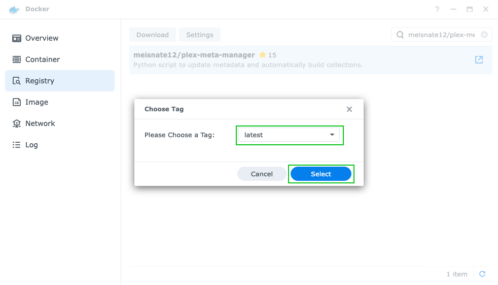
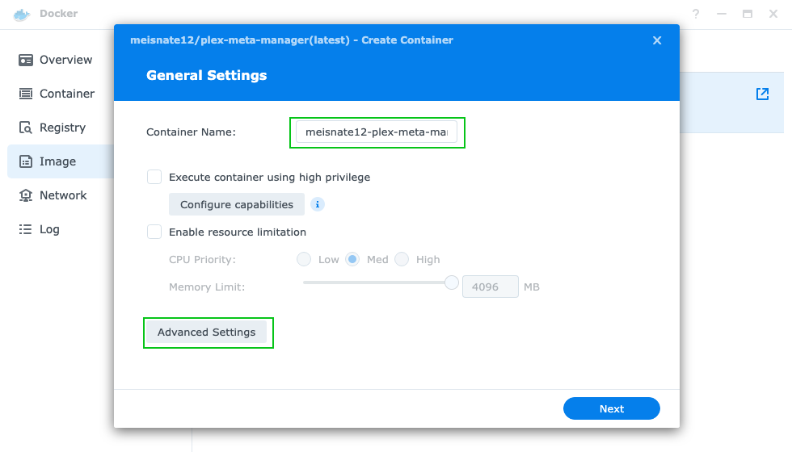
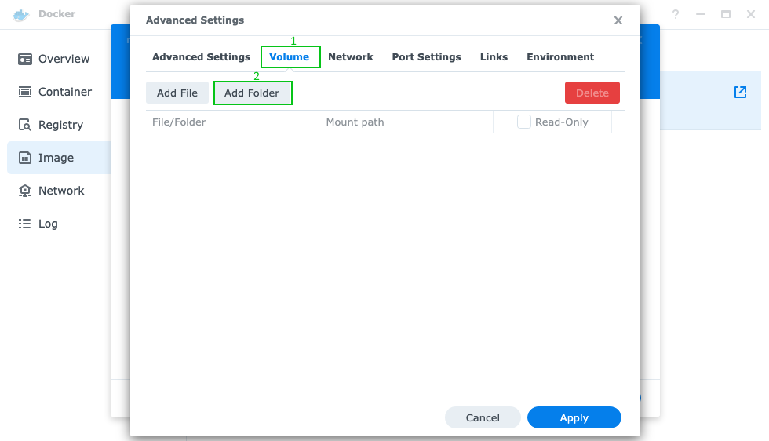
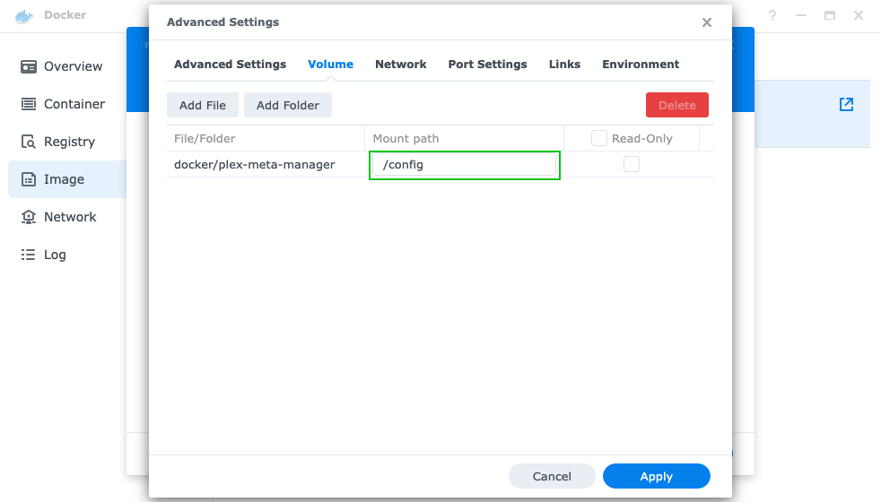
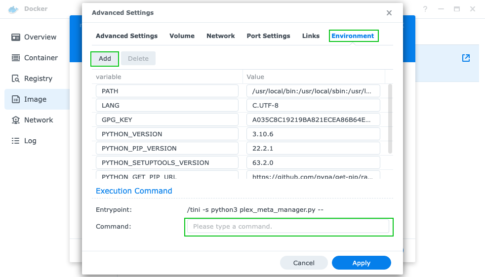
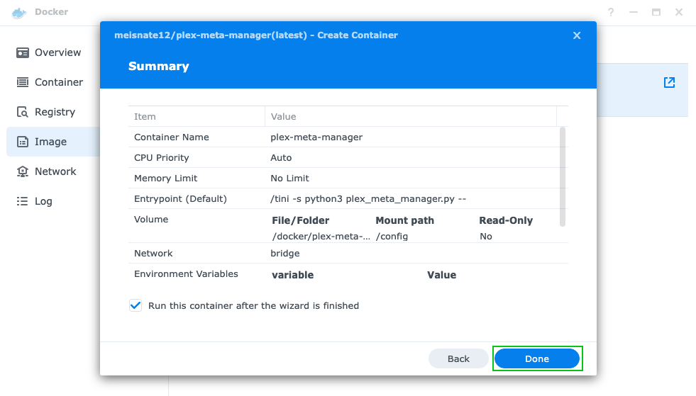

# Synology Walthrough

This is a quick walkthrough of setting up the Plex-Meta-Manager Docker container in the Synology UI.

## Prerequisite: Installing Docker

* Open the Package Center app from the Synology Web GUI.

   

* Type `docker` in the search bar and once it comes up click "Install" to add Docker. and then click "Open" to bring it up.

   

## Installing Plex Meta Manager

1. Open the Docker app.

   

2. Search and Download the Image.
   1. Click Registry.
   2. Search for `meisnate12/plex-meta-manager`.
   3. Select the Repository.
   4. Click Download.

   

3. Select the tag you want to run from the dropdown and click "Select".

   The options are:
    - `latest` - most recent official release; typically the most stable.
    - `develop` - development release, contains new features that haven't made it to latest yet, but may have minor problems.
    - `nightly` - bleeding-edge development version; latest fixes go here, but breakage should be expected.

   

4. Select the Image and Create a Container.
   1. Click Image.
   2. Select the `meisnate12/plex-meta-manager` Image.
   4. Click Launch.

   

5. You can name the Container whatever you want using the "Container Name" text Box. Then click "Advance Settings".

   

6. Select the "Volume" Tab, click "Add Folder", and select from your Synology File System where you want to store your PMM config files.

   

7. Enter `/config` as the "Mount Point".

   

8. Select the "Environment" Tab. (Optional)
   
   Environment Variables and Command line arguments can be added here.

   - To add an Environment Variable Click "Add".
   - To use Command line arguments put the arguments in the "Command" text field.

   Information on available command line argument and Environment Variables can be found [here](../environmental.md)

   

9. Select "Apply" to save the "Advance Settings", select "Next" to go to the Summary, and select "Done" to finish and creating the container.

   
