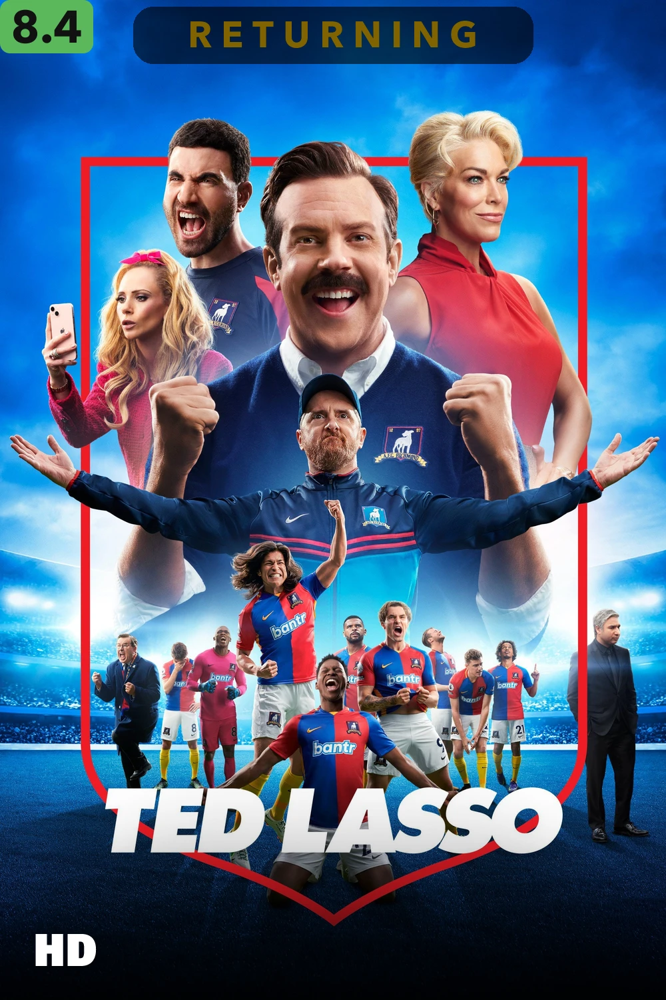
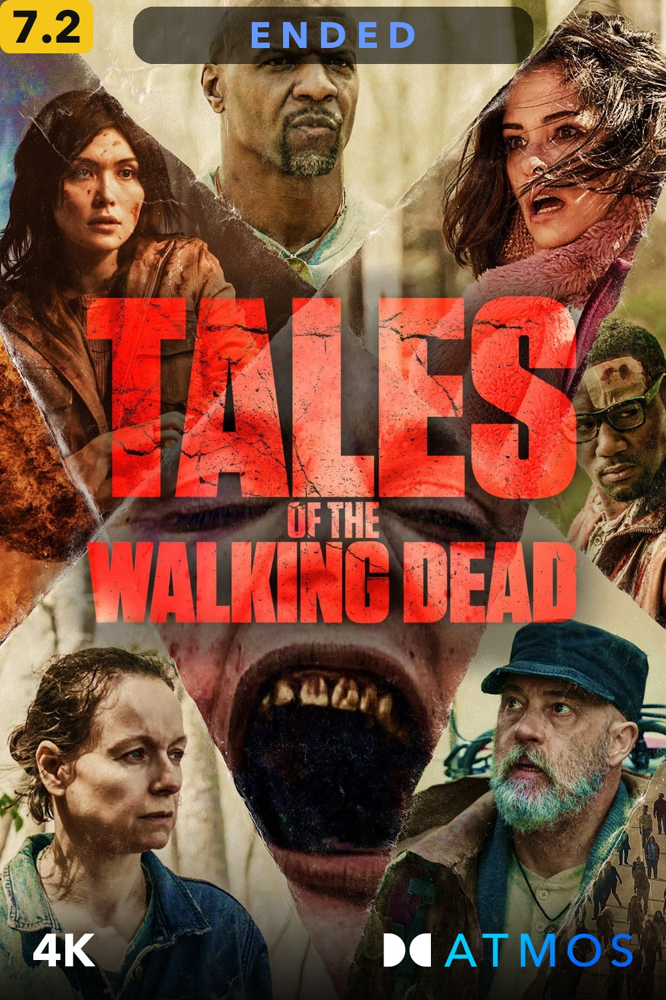
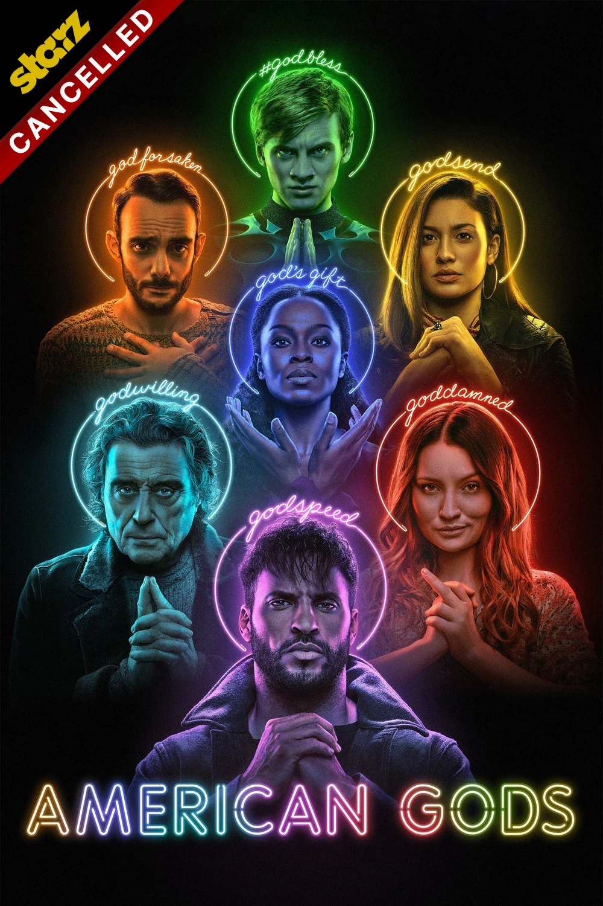
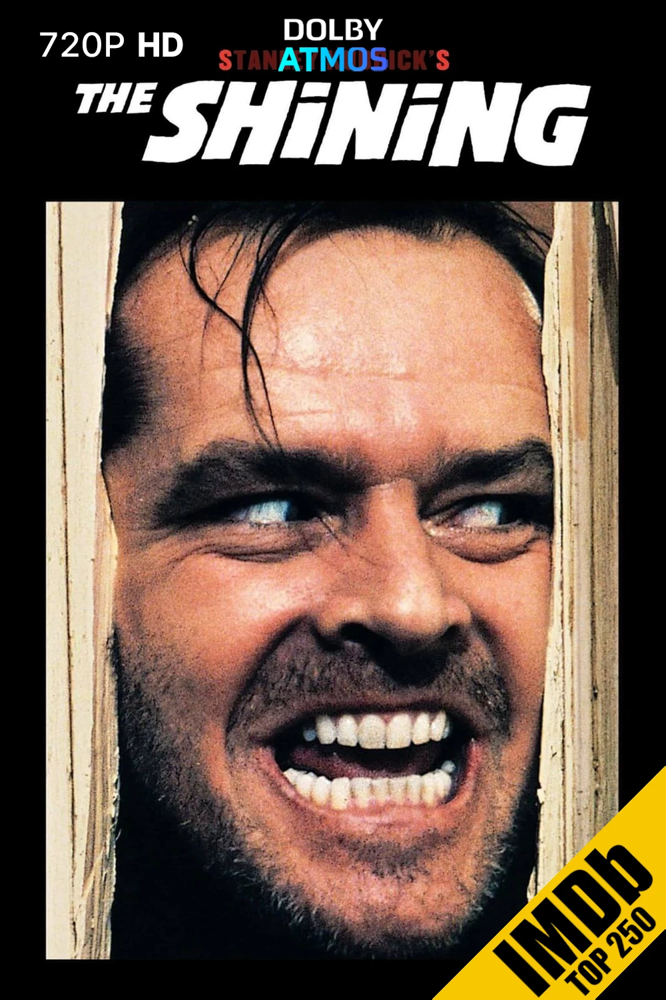
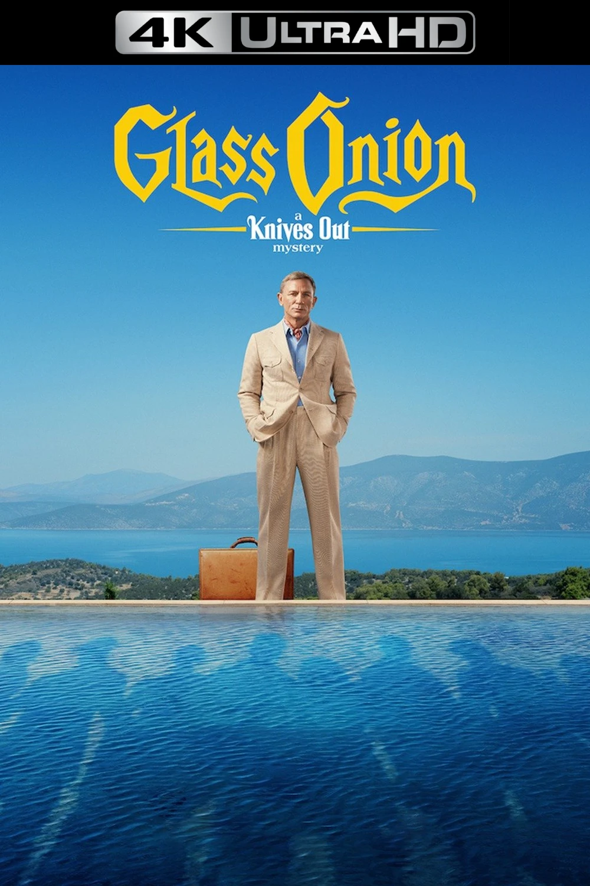
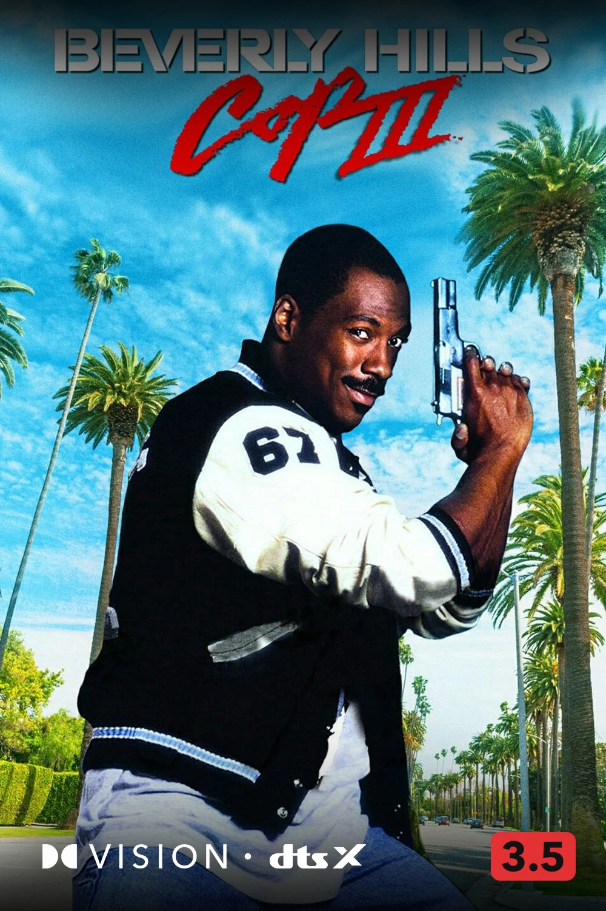
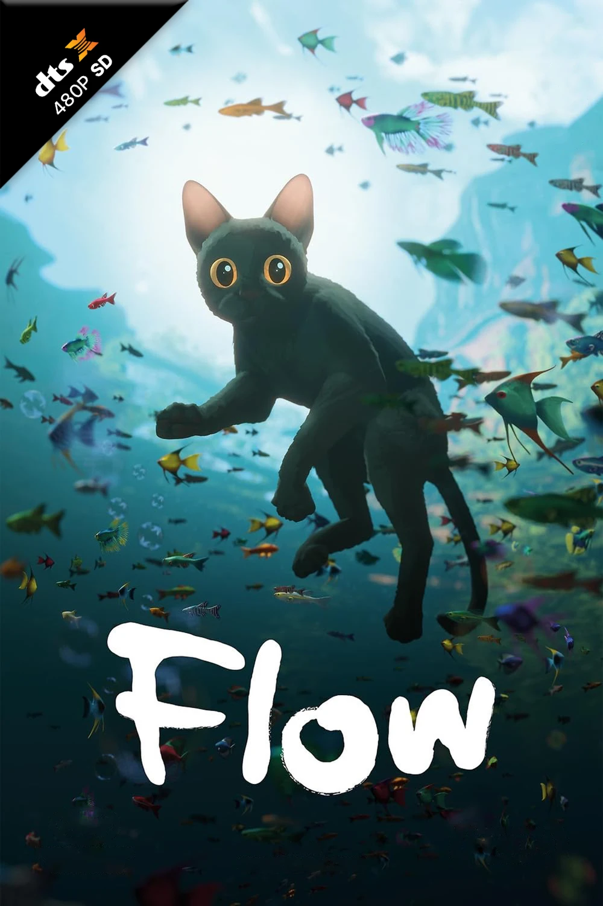





  

    <figure data-label="Max">
      
    </figure>
    <figure data-label="Metacritic Must See">
      
    </figure>
    <figure data-label="Shrek">
      
    </figure>
    <figure data-label="Animation">
      
    </figure>
    <figure data-label="Common Sense Selection">
      
    </figure>
    <figure data-label="Newly Released Episodes">
      
    </figure>
    <figure data-label="United Kingdom">
      
    </figure>
    <figure data-label="Oscars Best Pictures">
      
    </figure>
    <figure data-label="Best of 2000s">
      
    </figure>
    <figure data-label="Plex Popular">
      
    </figure>
    <figure data-label="IMDb Top 250">
      
    </figure>
    <figure data-label="Food Network">
      
    </figure>
    <figure data-label="Emmy Best Directors">
      
    </figure>
    <figure data-label="Netflix">
      
    </figure>
    <figure data-label="Based on a Book">
      
    </figure>
    <figure data-label="Marvel Cinematic Universe">
      
    </figure>
    <figure data-label="Parental Guidance">
      
    </figure>
    <figure data-label="Hallmark">
      
    </figure>
    <figure data-label="Bafta Best Pictures">
      
    </figure>
    <figure data-label="IMDb Popular">
      
    </figure>
    <figure data-label="Golden Globes Best Pictures">
      
    </figure>
    <figure data-label="Hulu">
      
    </figure>
    <figure data-label="DC Extended Universe">
      
    </figure>
    <figure data-label="Disney+ Originals">
      
    </figure>
    <figure data-label="In Association with Marvel">
      
    </figure>
    <figure data-label="RT Certified Fresh">
      
    </figure>

  



  

    <figure>
      
    </figure>
    <figure>
      
    </figure>
    <figure>
      
    </figure>
    <figure>
      
    </figure>
    <figure>
      
    </figure>
    <figure>
      
    </figure>
    <figure>
      
    </figure>
    <figure>
      
    </figure>
    <figure>
      
    </figure>
    <figure>
      
    </figure>
    <figure>
      
    </figure>
    <figure>
      
    </figure>
    <figure>
      
    </figure>
    <figure>
      
    </figure>
    <figure>
      
    </figure>
    <figure>
      
    </figure>
    <figure>
      
    </figure>
    <figure>
      
    </figure>
    <figure>
      
    </figure>
    <figure>
      
    </figure>
    <figure>
      
    </figure>
    <figure>
      
    </figure>
    <figure>
      
    </figure>

  



