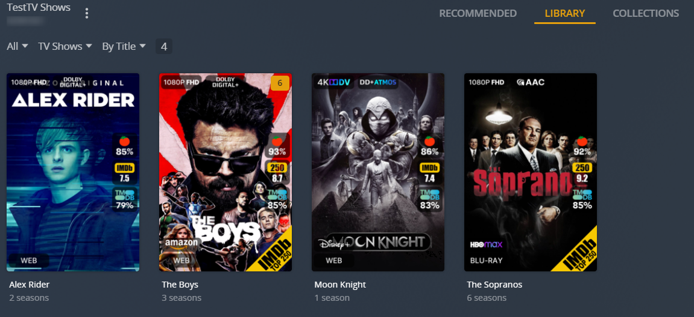





-   :octicons-versions-24:{ .lg .middle } __Overhaul Your Media Libraries__

    ---

    
 
-   :octicons-sliders-16:{ .lg .middle } __Kometa Defaults__

    ---

    

-   :material-connection:{ .lg .middle } __Third-Party Integrations__

    ---

    

    

-   :material-tools:{ .lg .middle } __Library Operations__

    ---

    

    

-   :material-star-face:{ .lg .middle } __And More!__

    ---

    

    



#### Running in Docker

??? "Develop Branch (click to expand)"

    

    === "Running in Docker"
        
    === "Running on the Host"
        
    
    

??? warning "Nightly Branch (click to expand)"

    

    === "Running in Docker"
        
    === "Running on the Host"
        
    
    

