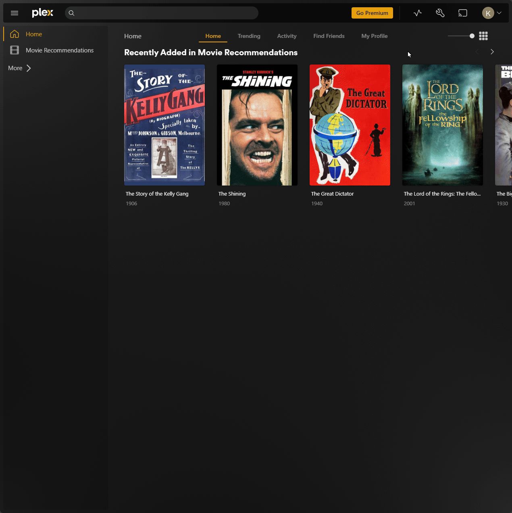
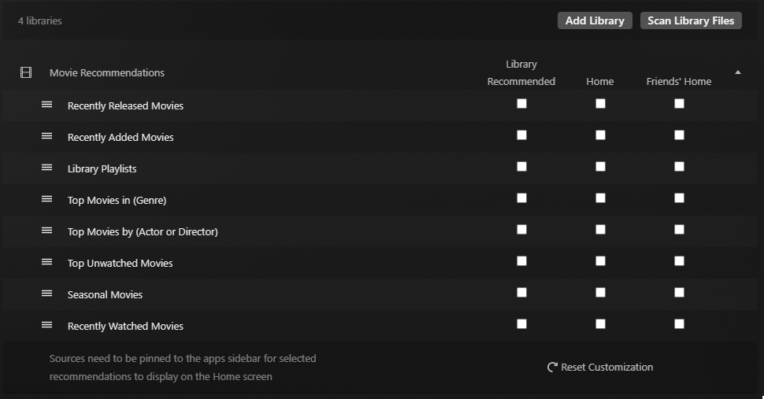
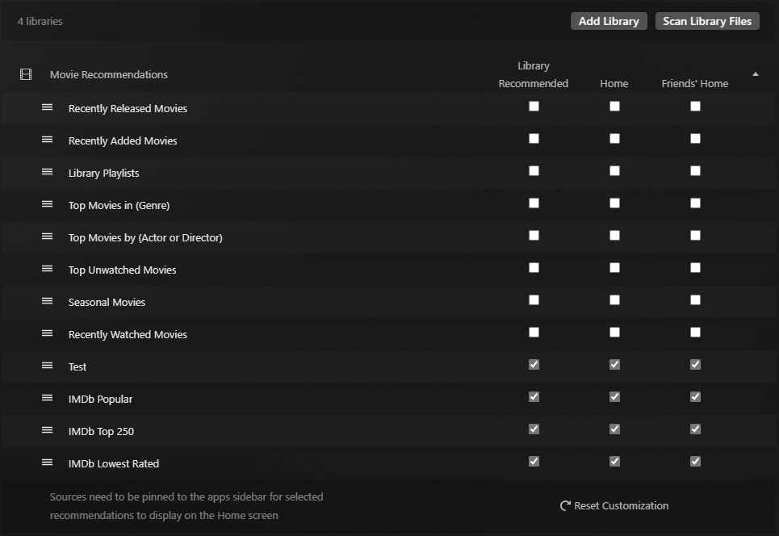
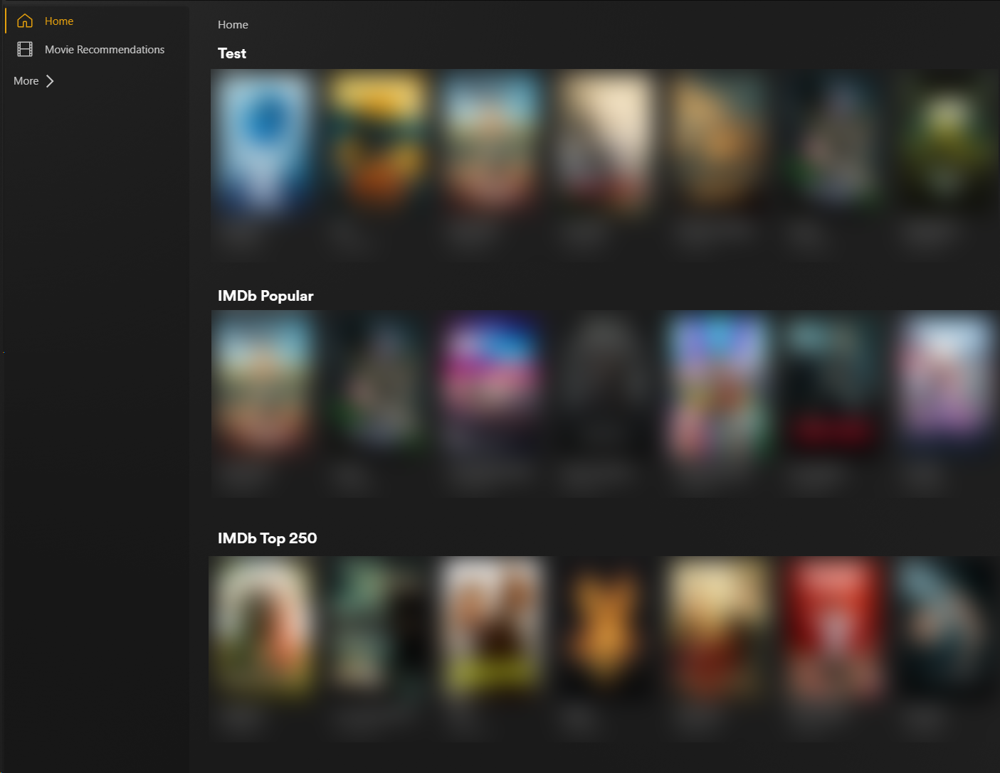
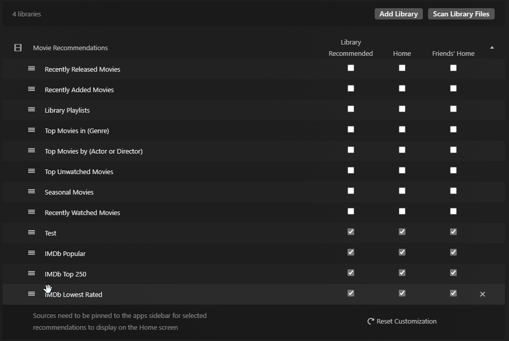

# Managing Recommendations

The Recommendations Hub allows you granular control over which collections appear on your home screen, the home screen of other users, and the Recommended tab of any given library.

You can use this to disable Plex's default recommendations (such as "Recently Added in Movies") and replace them with any of your favorite Kometa Collections.


## Getting Started

The Recommendations tab is accessed by going to `Settings > Server > Manage > Libraries` within Plex. You can then press the "Manage Recommendations" button against any of your libraries to view the current configuration.



For the purpose of this guide we will disable **all** enabled recommendations.



In order for a Kometa collection to appear as a Row in the Manage Recommendations section, it must have one of the `visible_home`/`visible_shared`/`visible_library` attributes set to `true`, this can be done in your Collection definition or via a template variable for Defaults files. You can also set these visibilities within the Plex UI, you can read [Plex's guidance](https://support.plex.tv/articles/manage-recommendations/) on how to do this. 

Here is an example Collection definition setting all three `visible_*` attributes:

```yaml
collections:
  Test:
    plex_all: true
    visible_home: true
    visible_shared: true
    visible_library: true
```

And an example Defaults file setting the same attributes:
```yaml
libraries:
  Movie Recommendations:
    collection_files:
      - default: imdb
        template_variables:
          visible_home: true
          visible_shared: true
          visible_library: true
```

The results are:



And if I visit my Plex homepage:



Collections will be added in the order that Kometa processes them, but you can reorganize them by drag-and-dropping each Row using the tree-line icon.



