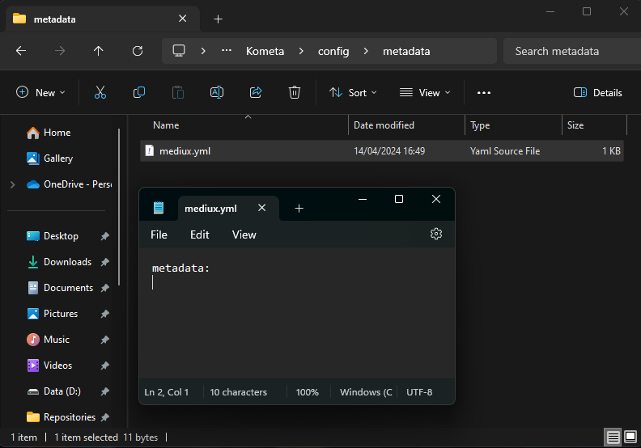
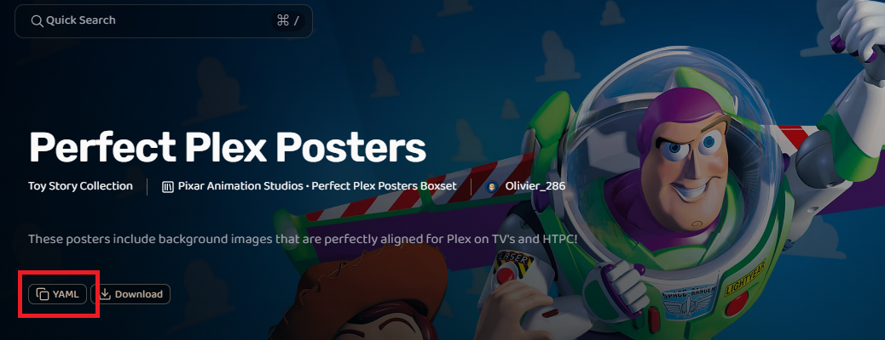
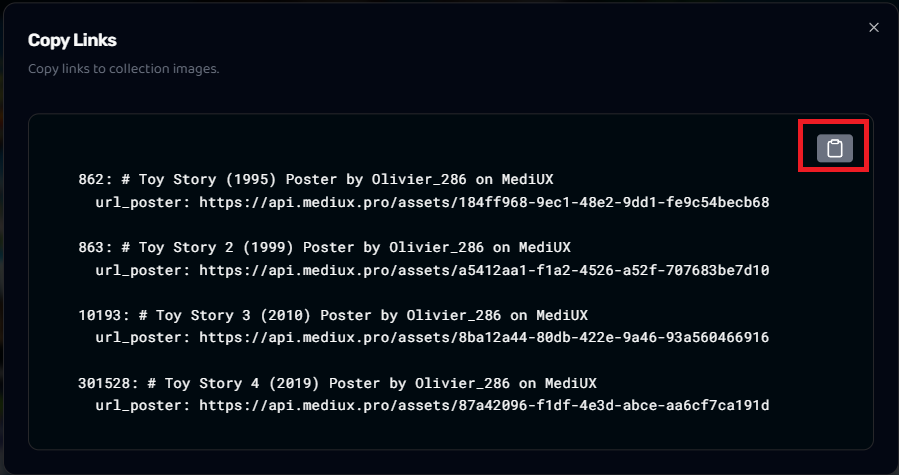
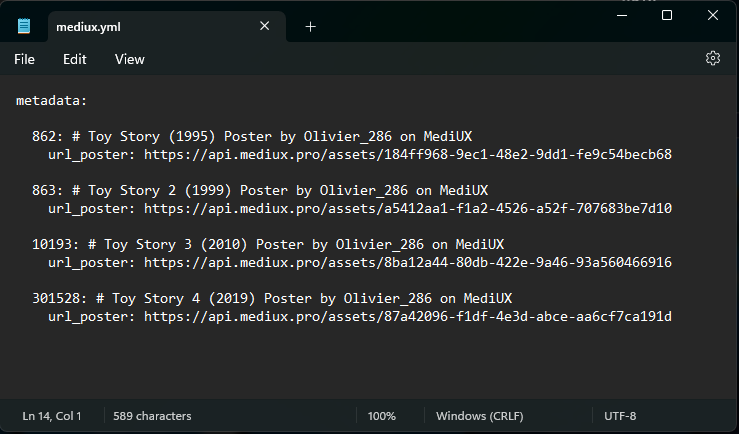
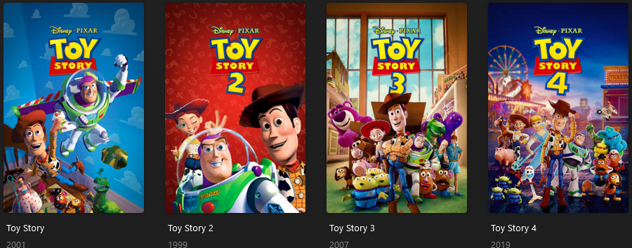

---
search:
  boost: 2
hide:
  - toc
---
# Using MediUX Sets

Have you noticed the "YAML" button on MediUX but aren't sure what it does?

Using Kometa, you can automatically apply MediUX assets to the items in your library without having to manually download and/or set each one within Plex.

This is done using a [Metadata File](../../files/metadata.md).

## Setting up the Metadata File

Let's start by creating a folder called "metadata" within the `config` directory of our system. I will then create a file called "mediux.yml" within that folder.

For now, we will just add a simple line to start the `mediux.yml` file:

```yaml
metadata:
```

You should have something like this:




## Adding your Set

!!! danger "Important"

    It is imperative that the `metadata:` line only appears **once** within the mediux.yml file. If it appears more than once, the file will not load in Kometa and your assets will not be set.

    If your Set in MediUX includes a `metadata:` line, you should remove it and only have `metadata:` appearing on line 1 of your `mediux.yml` file.

Now let's navigate to the MediUX website and find the Set that we want to use. In this case, I'm going to use [Olivier_286's Toy Story Collection Set](https://mediux.pro/sets/15639)

Once I have logged in to MediUX, I can click on the "YAML" button here:



I am now presented with a "Copy Links" button which includes the YAML code I need to set the assets from the Set against my library.

!!! tip "Tip"

    At present, Kometa cannot set Collection images from Metadata files. This is a known limitation.

    In this example, the "Toy Story Collection" image is not present in the "Copy Links" pop-up, you would need to manually set the Collection image yourself.

I will click the copy button highlighted:



And now I will paste it directly into my `mediux.yml` file, and it now looks like this:



The file can now be saved and is ready for use.

## Running the Metadata File

Now that my Metadata File is ready, I can run it against my library.

I will open my `config.yml` file and add the `mediux.yml` within the `metadata_files` section of my Movies library:

My config.yml `libraries` section now looks like this:
```yaml
libraries:
  Movies:
    metadata_files:
      - file: config/metadata/mediux.yml
```

After running Kometa and navigating to Plex, I can see that my posters for the Toy Story movies have been updated with the images from the Set in MediUX:


