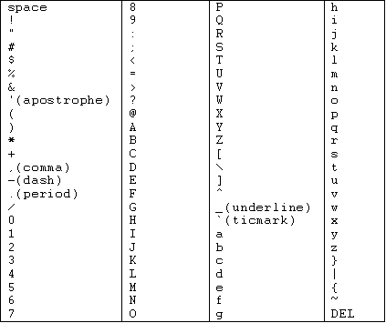

# Sorting Guide

There are various sort options available depending on what you want to sort.

## ASCII Sort Order

The first thing to note is that Kometa utilizes the ASCII sort order, which defines which priority a character gets.



## Collection Sorting

Collections can be sorted so that they appear in a specific order in the `Collections` and `Library` tab of your library. This is done using the `sort_title` attribute.

When using the above [ASCII Sort Order](#ascii-sort-order), a collection with a sort title of `!!!My Collection` would appear before a sort title of `!My Collection`, which would be placed before a sort title of `My Collection`

Let's start with an unmodified set of collections which do **not** specify a custom sort order:

???+ example "Example 1 - No Sorting"

    ```yaml
    collections:
      Collection 1:
        plex_all: true
      Collection 2:
        plex_all: true
      Collection 3:
        plex_all: true
    ```

    


Now let's use the `sort_title` attribute to reorder these collections slightly

???+ example "Example 2 - Basic Reorder Sorting"

    ```yaml
    collections:
      Collection 1:
        plex_all: true
        sort_title: Collection 3
      Collection 2:
        plex_all: true
        sort_title: Collection 1
      Collection 3:
        plex_all: true
        sort_title: Collection 2
    ```

    

    The above could also be achieved using any form of ASCII sort order. This example will produce the same outcome, but uses a (perhaps) illogical set of ASCII characters to define the sort title.

    ```yaml
    collections:
      Collection 1:
        plex_all: true
        sort_title: "()*Collection 3"
      Collection 2:
        plex_all: true
        sort_title: "!#$Collection 1"
      Collection 3:
        plex_all: true
        sort_title: "%&'Collection 2"
    ```

You will often see users using sort titles such as `+++++++_My Collection` or `!010_My Collection` in order to force a specific order of collections. Whilst it may not seem logical at a glance, the ASCII sort order allows a lot of flexibility for power users to be able to tailor the ordering of collections.

### Kometa Default Collection Sorting

When utilizing the [Kometa Defaults](../../defaults/files.md), they are all built on the same format for their sort titles:

`<<sort_prefix>><<collection_section>><<pre>><<order_<<key>>>><<sort>>`

Users aren't expected to understand what this does, but users can use the `collection_section` template variable to amend the order of categories of collections.

???+ example "Example 3 - Reordering Kometa Defaults"

    ```yaml
    libraries:
      Movies:
        collection_files:
          - default: tmdb
          - default: trakt
            template_variables:
              collection_section: "!000" #(1)!
    ```

    1.  Because the `!` character is a higher priority ASCII character, that will place ahead of the `000` for the seasonal collections.

    

You can also re-order collections within each Defaults file using the `order_<<key>>` template variable. <<key>> refers to the identifier that Kometa uses for each collection, which you can find on the relative default's wiki page.

???+ example "Example 4 - Reordering Collections within a Kometa Defaults file"

    ```yaml
    libraries:
      Movies:
        collection_files:
          - default: trakt
            template_variables:
              collection_section: "!000" #(1)!
          - default: tmdb
            template_variables: #(2)!
              order_top: 1
              order_popular: 2
              order_airing: 3
              order_air: 4
              order_trending: 5
    ```

    1.  Because the `!` character is a higher priority ASCII character, that will place ahead of the `000` for the seasonal collections.
    2.  file has 5 collections, each with a defined key. I have reordered each of the collections to appear in the order that I specified.

    

## Builder Sorting

When using a collection [Builder](../../files/builders/overview.md), it is possible to sort the items within the collection in a number of ways.

### Collection Order

Within Plex, the attribute that controls the top-level sorting is called the `collection_order` and there are three options presented within the Plex UI for this:

-  Alpha (sorted alphabetically)
-  Release (sorted by release date, this is the default order if you do not specify one)
-  Custom (sorted in a custom order)

When using Kometa builders, the majority of builders will require `collection_order: custom` to be set, which allows you to sort either by a sort order that the builder source allows for (such as sorting an MDBList by revenue), or by the default order that Kometa receives the items from the builder (such as sorting the IMDb Top 250 in the order that they appear on the list).

???+ example "Example 5 - Custom Collection Order"

    If I failed to set `collection_order: custom` in this builder, the Collection Order would be the default Plex order, which is release date.

    ```yaml
    collections:
      IMDb Top 250:
        imdb_chart: top_movies
        collection_order: custom
    ```

## Dumb and Smart Collection Sorting

Plex has two types of collections, "Dumb" and "Smart".

When using Kometa, a "Dumb" collection is one which is static - the collection will only update when you run Kometa.

A "Smart" collection is one which is a living/breathing collection, as you add new media or the data about your media changes, the collection will update in real-time to reflect those changes.

Dumb collections can utilize the `sort_by` attribute to define the sorting.

???+ example "Example 6 - Dumb Collection Sorting"

    ```yaml
    collections:
      Top Action Movies:
        collection_order: custom
        plex_search:
          all:
            genre: Action
          sort_by: audience_rating.desc
          limit: 50
    ```

    to reduce line count, you can replace the `custom` collection order with your desired `sort_by` value. This will still set the collection order to `custom` within Plex, but will reorder the items within the collection as it would if you were using the `sort_by` attribute.

    ```yaml
    collections:
      Top Action Movies:
        collection_order: audience_rating.desc
        plex_search:
          all:
            genre: Action
          limit: 50
    ```

The Sort Orders available for "Dumb" collections are outlined on the **[Dumb Plex Builder](../../files/builders/plex.md)** page.

??? tip
    
    Although the Sort Options are listed on the Dumb Plex Builder page, the options are available to mostly any builder if you use the `collection_order` attribute to define a `sort_by` value

    ```yaml
    collections:
      IMDb Top 250:
        imdb_chart: top_movies
        collection_order: audience_rating.desc
    ```

    ```yaml
    collections:
      Marvel Cinematic Universe:
        trakt_list: https://trakt.tv/users/jawann2002/lists/marvel-cinematic-universe-movies?sort=rank,asc
        collection_order: added.desc
    ```

Smart collections can only utilize `sort_by` if it is part of a Smart Filter.

???+ example "Example 7 - Smart Filter Sorting"

    ```yaml
    collections:
      Best 2010+ Movies:
        smart_filter:
          all:
            year.gte: 2010
          sort_by: audience_rating.desc
          limit: 20
    ```

if you have a Smart Label collection, you can pass the `sort_by` value you want as part of the `smart_label` attribute.

???+ example "Example 8 - Smart Label Sorting"

    ```yaml
    collections:
      Marvel Cinematic Universe:
        trakt_list: https://trakt.tv/users/jawann2002/lists/marvel-cinematic-universe-movies?sort=rank,asc
        smart_label: audience_rating.desc
    ```

The Sort Orders available for "Smart" collections are outlined on the **[Smart Plex Builder](../../files/builders/smart.md)** page.

??? tip
    
    Although the Sort Options are listed on the Smart Plex Builder page, the options are available to mostly any builder when you use a smart Label builder.

    ```yaml
    collections:
      Marvel Cinematic Universe:
        trakt_list: https://trakt.tv/users/jawann2002/lists/marvel-cinematic-universe-movies?sort=rank,asc
        smart_label: audience_rating.desc
    ```

    ```yaml
    collections:
      Marvel Cinematic Universe:
        trakt_list: https://trakt.tv/users/jawann2002/lists/marvel-cinematic-universe-movies?sort=rank,asc
        collection_order: added.desc
    ```
### Secondary Sorting
You can also leverage "Secondary Sorting" This goes beyond the single sort settings you can apply to a collection in Plex.

???+ example "Example 8 - Secondary Sorting"
    ```yaml
    collections:
      Best 2010+ Movies (By Year):
        smart_filter:
          all:
            year.gte: 2010
          sort_by:
            - year.desc
            - audience_rating.desc
          limit: 20
      ```