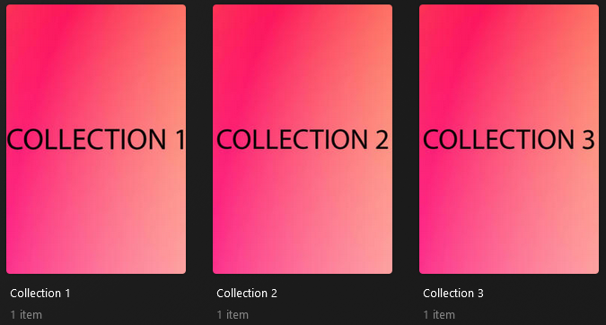
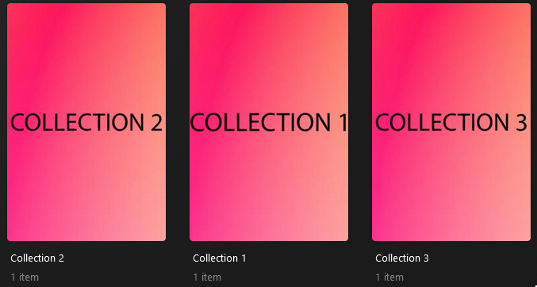
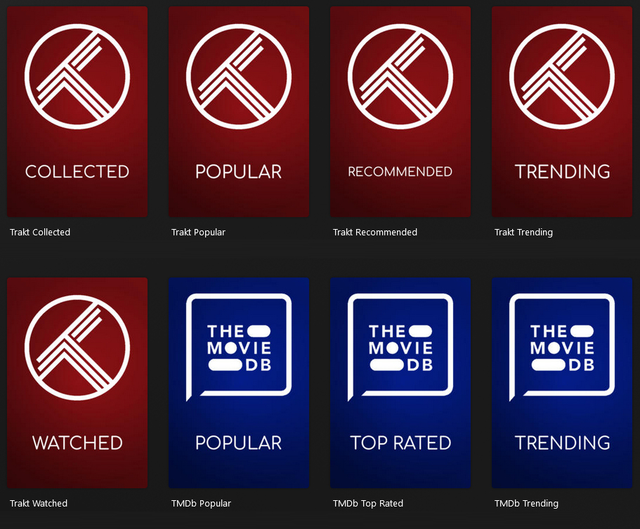
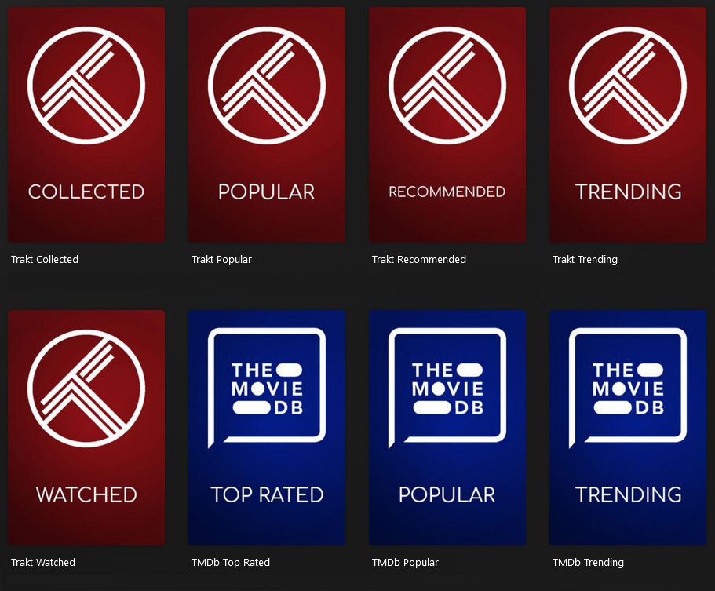

---
hide:
  - toc
tags:
  - sort
  - sorting
---
# Sorting Guide

There are various sort options available depending on what you want to sort.

## Plex Sort Order

The first thing to note is that Plex utilizes an ASCII based sort order, which defines which priority a character gets.

???+ important "Character Priority for Plex Sorting"

    This is the sorting priority as of Plex Media Server release 1.41.2.9200

    ```yaml linenums="1"
      - space
    _ - underscore
    - - dash
    , - comma
    ; - semicolon
    : - colon
    ! - exclamation
    ? - question mark
    . - period
    ' - apostrophe
    " - quotation mark
    ( - open parenthesis
    ) - close parenthesis
    [ - open bracket
    ] - close bracket
    { - open curly brace
    } - close curly brace
    @ - at sign
    * - asterisk
    / - forward slash
    \ - backslash
    # - hash
    % - percent
    ` - backtick
    ^ - caret
    + - plus
    < - less than
    = - equals
    > - greater than
    | - pipe
    ~ - tilde
    $ - dollar sign
    0 - zero
    1 - one
    2 - two
    3 - three
    4 - four
    5 - five
    6 - six
    7 - seven
    8 - eight
    9 - nine
    a - lowercase a
    A - uppercase A
    b - lowercase b
    B - uppercase B
    c - lowercase c
    C - uppercase C
    d - lowercase d
    D - uppercase D
    e - lowercase e
    E - uppercase E
    f - lowercase f
    F - uppercase F
    g - lowercase g
    G - uppercase G
    h - lowercase h
    H - uppercase H
    i - lowercase i
    I - uppercase I
    j - lowercase j
    J - uppercase J
    k - lowercase k
    K - uppercase K
    l - lowercase l
    L - uppercase L
    m - lowercase m
    M - uppercase M
    n - lowercase n
    N - uppercase N
    o - lowercase o
    O - uppercase O
    p - lowercase p
    P - uppercase P
    q - lowercase q
    Q - uppercase Q
    r - lowercase r
    R - uppercase R
    s - lowercase s
    S - uppercase S
    t - lowercase t
    T - uppercase T
    u - lowercase u
    U - uppercase U
    v - lowercase v
    V - uppercase V
    w - lowercase w
    W - uppercase W
    x - lowercase x
    X - uppercase X
    y - lowercase y
    Y - uppercase Y
    z - lowercase z
    Z - uppercase Z
    ```

## Collection Sorting

Collections can be sorted so that they appear in a specific order in the `Collections` and `Library` tab of your library. This is done using the `sort_title` attribute.

When using the above [Plex Sort Order](#plex-sort-order), a collection with a sort title of `!!!My Collection` would appear 
before a sort title of `!My Collection`, which would be placed before a sort title of `My Collection`

Let's start with an unmodified set of collections which do **not** specify a custom sort order:

???+ example "Example 1 - No Sorting"

    ```yaml
    collections:
      Collection 1:
        plex_all: true
      Collection 2:
        plex_all: true
      Collection 3:
        plex_all: true
    ```

    

Now let's use the `sort_title` attribute to reorder these collections slightly

???+ example "Example 2 - Basic Reorder Sorting"

    ```yaml
    collections:
      Collection 1:
        plex_all: true
        sort_title: Collection 3
      Collection 2:
        plex_all: true
        sort_title: Collection 1
      Collection 3:
        plex_all: true
        sort_title: Collection 2
    ```

    

    The above could also be achieved using any form of ASCII sort order. This example will produce the same outcome, but uses a (perhaps) illogical set of ASCII characters to define the sort title.

    ```yaml
    collections:
      Collection 1:
        plex_all: true
        sort_title: "()*Collection 3"
      Collection 2:
        plex_all: true
        sort_title: "!#$Collection 1"
      Collection 3:
        plex_all: true
        sort_title: "%&'Collection 2"
    ```

You will often see users using sort titles such as `+++++++_My Collection` or `!010_My Collection` in order to force a specific order of collections. 
Whilst it may not seem logical at a glance, the ASCII sort order allows a lot of flexibility for power users to be able to tailor the ordering of collections.

### Kometa Default Collection Sorting

When utilizing the [Kometa Defaults](../../defaults/files.md), they are all built on the same format for their sort titles:

`<<sort_prefix>><<collection_section>><<pre>><<order_<<key>>>><<title>>`

Users aren't expected to understand what this does, but users can use the `sort_prefix` and `collection_section` Template Variable to amend the order of categories of collections.

??? important "I want to know what that means"

    `<<sort_prefix>><<collection_section>><<pre>><<order_<<key>>>><<title>>`

    Those parts are all defined as Template Variables, and as such you can override any of them. 
    This format itself is *also* defined as a Template Variable, so you can override the entire format if you wish.

    As a specific example, the "IMDB Lowest Rated" collection has a sort title of `!020_IMDb Lowest Rated`

    ```
    <<sort_prefix>><<collection_section>><<pre>><<order_<<key>>>><<title>>
      !              020                   _                       IMDb Lowest Rated
    ```

    - The `!` character makes sure these collections appear at the top of the collection tab.
    - The `020` is the collection section, which is used to group collections together.
    - The `_` is a separator between the collection section and the title; no particular purpose other than that.
    - The `IMDb Lowest Rated` is the title of the collection.

    `<<order_<<key>>>>` is a Template Variable that is used to order collections within the same collection section. Without this, as above, the collections are sorted by their titles, 
    since everything before that will be identical for all the collections in a given "section". If you want to modify this, you can set the order key.

???+ example "Example 3 - Reordering Kometa Defaults"

    ```yaml
    libraries:
      Movies:
        collection_files:
          - default: tmdb
          - default: trakt
            template_variables:
              sort_prefix: ":" #(1)!
    ```

    1. Because the `:` character is a higher priority character than the default `! in the [Plex Sort Order](#plex-sort-order), 
    this will place the Trakt collections at the top of the list ahead of all other collections.

    

#### Sorting the **groups** of Default collections

Each group of collections created by the Kometa defaults has a default "collection section", so they are displayed in a standard order, which is shown 
[here](../../defaults/collections.md#collection-section-order). If you want to change the order in which the sections appear within the set of 
default-generated collections, you would use the `collection_section` Template Variable.

For example, these collection groups display in this order, by default:

```
streaming 030
universe  040
network   050
genre     060
```

If you wanted to reverse the order in which those groups of collections appear [not the collections within them], you would use the `collection_section` Template Variable:

```yaml
  libraries:
    Movies:
      collection_files:
        - default: streaming
          template_variables:
            collection_section: "060" #(1)!
        - default: universe
          template_variables:
            collection_section: "050" #(2)!
        - default: network
          template_variables:
            collection_section: "040" #(3)!
        - default: genre
          template_variables:
            collection_section: "030" #(4)!
```

1. This sets the `collection_section` for the streaming collections to `060`, so they take the place of the genre collections.
2. This sets the `collection_section` for the universe collections to `050`, so they take the place of the network collections.
3. This sets the `collection_section` for the network collections to `040`, so they take the place of the universe collections.
4. This sets the `collection_section` for the genre collections to `030`, so they take the place of the streaming collections.

That will result in those four groups of collections appearing in the opposite order to the default.

#### Sorting the **collections** within the **groups** of Default collections

You can re-order collections within each Defaults File using the `order_<<key>>` Template Variable. 
<<key>> refers to the identifier that Kometa uses for each collection, which you can find on the relevant default's wiki page.

???+ example "Example 4 - Reordering Collections within a Kometa Defaults File"

    ```yaml
    libraries:
      Movies:
        collection_files:
          - default: trakt
            template_variables:
              sort_prefix: ":" #(1)!
          - default: tmdb
            template_variables: #(2)!
              order_top: 1
              order_popular: 2
              order_airing: 3
              order_air: 4
              order_trending: 5
    ```

    1. Because the `:` character is a higher priority character than the default `! in the [Plex Sort Order](#plex-sort-order), 
    this will place the Trakt collections at the top of the list ahead of all other collections.
    2. file has 5 collections, each with a defined key. I have reordered each of the collections to appear in the order that I specified.

    

#### Sorting the **contents** of the **collections** within the **groups** of Default collections

You can also re-order the contents of each collection within a Defaults File using **either** the `sort_by` or `collection_order` Template Variables. The specific option you use will depend 
on the specific default file [it is ultimately controlled by which type of collection is created by the file, manual or smart], and will be listed on the relevant wiki page.

For example:

```yaml
  libraries:
    Movies:
      collection_files:
        - default: basic
          template_variables:
            sort_by: year.desc #(1)!
            sort_by_episodes: episode_release.asc #(2)!
        - default: imdb
          template_variables:
            collection_order: release #(3)!
            collection_order_lowest: alpha.asc #(4)!
```

1. This sets the sort_by for all collections created by `basic` to `year.desc`, overriding the default of `release.desc`. `basic` creates smart collections, so it uses `sort_by`.
2. This sets the sort_by for the `New Episodes` collection created by `basic` to `episode_release.`, 
overriding the default of `release.desc` AND the override value set by the previous Template Variable.
3. This sets the `collection_order` for the IMDB collections to `release`, overriding the default of `custom`. `imdb` creates manual collections, so it uses `collection_order`.
4. This sets the `collection_order` for the `IMDb Lowest Rated` collection to `alpha.`,  overriding the default of `custom` AND the override value set by the previous Template Variable.

## Builder Sorting

When using a collection [Builder](../../files/builders/overview.md), it is possible to sort the items within the collection in a number of ways.

This can be useful to control the particular items that end up in the collection, or to control the order that they appear in.

For example, perhaps you want the ten most recent horror movies in your library ordered by critic rating

```yaml
collections:
  Recent Horror:
    # start with all the horror in my library, sorted in descending release order
    plex_search:
      sort_by: release.desc
      any:
        genre: horror
    # put the first ten of those [so the most recent] in the collection
    limit: 10
    # Sort the items that end up in the collection by critic rating descending
    collection_order: critic_rating.desc
```

### Collection Order

Within Plex, the attribute that controls the top-level sorting is called the `collection_order` and there are three options presented within the Plex UI for this:

-  Alpha (sorted alphabetically)
-  Release (sorted by release date, this is the default order if you do not specify one)
-  Custom (sorted in a custom order)

When using Kometa builders, the majority of builders will require `collection_order: custom` to be set, which allows you to sort either by a sort order that the Builder source allows for 
(such as sorting an MDBList by revenue), or by the default order that Kometa receives the items from the Builder (such as sorting the IMDb Top 250 in the order that they appear on the list).

???+ example "Example 5 - Custom Collection Order"

    If I failed to set `collection_order: custom` in this Builder, the Collection Order would be the default Plex order, which is release date.

    ```yaml
    collections:
      IMDb Top 250:
        imdb_chart: top_movies
        collection_order: custom
    ```

## Manual and Smart Collection Sorting

Plex has two types of collections, "Manual" and "Smart".

When using Kometa, a "Manual" collection is one which is static - the collection will only update when you run Kometa.

A "Smart" collection is one which is a living/breathing collection, as you add new media or the data about your media changes, the collection will update in real-time to reflect those changes.

Manual collections can utilize the `sort_by` attribute to define the sorting.

???+ example "Example 6 - Manual Collection Sorting"

    ```yaml
    collections:
      Top Action Movies:
        collection_order: custom
        plex_search:
          all:
            genre: Action
          sort_by: audience_rating.desc
          limit: 50
    ```

    to reduce line count, you can replace the `custom` collection order with your desired `sort_by` value. This will still set the collection order to `custom` within Plex, 
    but will reorder the items within the collection as it would if you were using the `sort_by` attribute.

    ```yaml
    collections:
      Top Action Movies:
        collection_order: audience_rating.desc
        plex_search:
          all:
            genre: Action
          limit: 50
    ```

The Sort Orders available for "Manual" collections are outlined on the **[Manual Plex Builder](../../files/builders/plex.md)** page.

??? tip
    
    Although the Sort Options are listed on the Manual Plex Builder page, the options are available to mostly any Builder if you use the `collection_order` attribute to define a `sort_by` value

    ```yaml
    collections:
      IMDb Top 250:
        imdb_chart: top_movies
        collection_order: audience_rating.desc
    ```

    ```yaml
    collections:
      Marvel Cinematic Universe:
        trakt_list: https://trakt.tv/users/jawann2002/lists/marvel-cinematic-universe-movies?sort=rank,asc
        collection_order: added.desc
    ```

Smart collections can only utilize `sort_by` if it is part of a Smart Filter.

???+ example "Example 7 - Smart Filter Sorting"

    ```yaml
    collections:
      Best 2010+ Movies:
        smart_filter:
          all:
            year.gte: 2010
          sort_by: audience_rating.desc
          limit: 20
    ```

if you have a Smart Label collection, you can pass the `sort_by` value you want as part of the `smart_label` attribute.

???+ example "Example 8 - Smart Label Sorting"

    ```yaml
    collections:
      Marvel Cinematic Universe:
        trakt_list: https://trakt.tv/users/jawann2002/lists/marvel-cinematic-universe-movies?sort=rank,asc
        smart_label: audience_rating.desc
    ```

The Sort Orders available for "Smart" collections are outlined on the **[Plex Builder](../../files/builders/plex.md)** page.

??? tip
    
    Although the Sort Options are listed on the Smart Plex Builder page, the options are available to mostly any Builder when you use a smart Label Builder.

    ```yaml
    collections:
      Marvel Cinematic Universe:
        trakt_list: https://trakt.tv/users/jawann2002/lists/marvel-cinematic-universe-movies?sort=rank,asc
        smart_label: audience_rating.desc
    ```

    ```yaml
    collections:
      Marvel Cinematic Universe:
        trakt_list: https://trakt.tv/users/jawann2002/lists/marvel-cinematic-universe-movies?sort=rank,asc
        collection_order: added.desc
    ```

### Secondary Sorting

You can also leverage "Secondary Sorting" This goes beyond the single sort settings you can apply to a collection in Plex.

???+ example "Example 8 - Secondary Sorting"

    ```yaml
    collections:
      Best 2010+ Movies (By Year):
        smart_filter:
          all:
            year.gte: 2010
          sort_by:
            - year.desc
            - audience_rating.desc
          limit: 20
    ```
