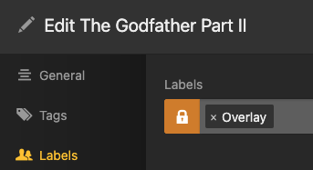

---
search:
  boost: 2
hide:
  - toc
---
# Overlays Guide

Kometa can apply overlays to item posters [movies, shows, and seasons] and episode images.

The how of doing this is covered on the [overlays files](../../files/overlays.md) page.

There are also a number of [default overlays](../../defaults/overlays.md) that you can leverage.

This article is intended as an overview of how Kometa handles and applies overlays.

## Important Prerequisite Facts

### Applying overlays to a subset of the library

Overlays are computed and applied at the library level.  There is no way to manipulate overlays in any way on a subset of a library.

The current implementation is:

1. Determine what items in the library get which overlays.
2. Make the library look like that, removing and applying overlaid images as needed.

Again, there is no way to target a **subset** of the library with overlays.  You cannot:

1. Skip applying overlays to items that don't change
2. Apply overlays to just that one new movie
3. Apply your show overlays on Monday and your episode overlays on Tuesday
4. Any other thing you can imagine that involves manipulating overlays on any other level than the **entire library**

### Modifying existing overlays

There is no need to remove overlays prior to changing them.  Kometa will automatically add and remove overlays to reflect your current config.  For example, if you add the default `network` and `streaming` overlays and then decide that you don't want the `streaming` one after all, you need only remove it from the config and run Kometa.  That streaming overlay will be removed on the next run.  *There is no need to remove overlays first or force Kometa to reapply overlays for this purpose*.

## NOTE

Some things in this article are discussed *later in the article*.  These things are indicated in ***bold italic***.

As you make your way through the article, all should fall into place.

## How do overlays work?

1. Kometa processes your library against your defined overlays, and decides which of those overlays apply to which items in the library.  We'll call this the "overlay list".
2. Kometa removes overlays from ***items which presently have overlays*** but no longer appear in the overlay list
3. Then, for each item in the overlay list:

    a. Kometa applies overlays as needed to the ***clean art*** for the item.  "As needed" here means generally that the visual appearance of the overlay has changed because overlays have been added or removed, or a value that drives an overlay like `resolution` changed, the base art changed [in cases where Kometa knows this], etc.

    b. Kometa uploads that overlaid image to Plex.

    c. Kometa makes a ***backup of the clean art*** (if one does not already exist)

    d. Kometa sets an ***"Overlay" label on the item*** in Plex so it knows that overlays have been applied to the item

    e. Kometa caches a description of the overlays it just applied to the item to use next time in step 3a above.

Let's discuss each step.

### Step 1: which overlays apply to which items

Kometa processes the overlays in your config in sequence, tracking which items meet the criteria for each.

This ends up with something like this:

```shell
|                     Overlay                      | Number |
| ================================================ | ====== |
| Overlay File (0) Oscars Best Picture             |   20   |
| Overlay File (0) Oscars Best Director            |   21   |
| Overlay File (0) Golden Globe Winner             |   30   |
| Overlay File (0) Golden Globe Best Director      |   17   |
| Overlay File (0) BAFTA Winners                   |   14   |
| Overlay File (0) Cannes Winners                  |   6    |
| Overlay File (0) Berlinale Winners               |   0    |
| Overlay File (0) Venice Winners                  |   3    |
| Overlay File (0) Sundance Winners                |   3    |
| Overlay File (0) Emmys Winner                    |   0    |
| Overlay File (0) Critics Choice Winners          |   9    |
| Overlay File (0) Spirit Winners                  |   8    |
| Overlay File (0) Cesar Winners                   |   1    |
| Overlay File (0) IMDb Top 250                    |  117   |
| Overlay File (0) Letterboxd Top 250              |   67   |
| Overlay File (0) Rotten Tomatoes Verified Hot    |   47   |
| Overlay File (0) Rotten Tomatoes Certified Fresh |  450   |
| Overlay File (0) Metacritic Must See             |  152   |
| Overlay File (0) Commonsense Selection           |   52   |
| Overlay File (0) Razzies Winner                  |   0    |
```

That's a single overlay [the default `ribbon`], just for illustration.

Let's discuss the numbers.

This library contains 806 items:

```shell
| Loading All Movies from Library: Movies
| Loaded 806 Movies
```

but you will note that those values in the table sum to 1017.

This is because a couple hundred items qualify for more than one ribbon; for example there are surely movies that meet all these:

```
| Overlay File (0) Oscars Best Picture             |   20   |
| Overlay File (0) Golden Globe Winner             |   30   |
| Overlay File (0) IMDb Top 250                    |  117   |
| Overlay File (0) Letterboxd Top 250              |   67   |
| Overlay File (0) Rotten Tomatoes Certified Fresh |  450   |
| Overlay File (0) Metacritic Must See             |  152   |
```

These are weighted, and only one will end up being applied.

### Step 2. remove overlays from items which no longer appear in the overlay list

As mentioned above, when Kometa applies an overlay to an item, it applies a label ("Overlay") to that item in Plex.

In this step, Kometa queries Plex for everything with that label, and if anything with the label is **not** found in the current overlay list, the art for that item is replaced by the ***clean backup art***.

### Step 3. Overlay application loop

Now Kometa is going to iterate through every item in the library, applying the required overlays to each item.

Here's a flowchart detailing the steps performed for each item in the library when applying overlays:


#### 3a. Apply overlays as needed to the ***clean art*** for the item

Kometa applies overlays to a item in the overlay list in any of the following scenarios:

1. This item has never had overlays before
2. This item's overlays differ from what got applied last time
3. `reapply_overlays` is set to true

In cases like the example above where some items qualify for more than one of a given "set" of overlays, the relative weights of the multiple overlays in each set [or queue] are evaluated to leave one "winner" from the set that gets applied.

When applying overlays, Kometa takes a copy of the ***current clean art*** for the item, scales it to a standard size (1000x1500 or 1920x1080), then composites the various overlay components on top of it.  This overlaid image is generated in the format and quality level you have specified in the config.

This image also gets an internal tag identifying it as an overlaid image which was created by Kometa.  This prevents Kometa from double-overlaying an image in the event that Plex provides an already-overlaid image as the "clean art".

#### 3b. Kometa uploads that overlaid image to Plex

Once the image is generated, Kometa uploads that image to Plex.  Plex requires that an uploaded image be smaller than 10MB, so if this composited image is larger than that [which is unlikely], the upload will be aborted and this will be noted in the log.  This is typically only a problem if you are attempting to use very large source images from an external source.

Every time a new image is uploaded to Plex, whether or not that image is the same as one that's already there, that new image is added to the Plex metadata, which increases the size of that metadata.  Over time, this can lead to significant bloat, so things like reapplying overlays should be avoided.

#### 3c. Kometa makes a backup of the clean art (if one does not already exist)

If you are not using the [asset directory](./assets.md) to manage your custom art, Kometa will download the current art from Plex and store it in:

```
config/overlays/LIBRARY_NAME Original Posters/
```

The images are named with the internal rating key of the item in Plex.  This is fairly opaque, but it is the simplest unambiguous way to link the clean art with the item to which it applies.

This clean art is used when overlays are updated, removed, or reapplied.  You should not mess with this directory or its contents.

This backup is required since once Kometa uploads new art, it no longer has any idea what the art on the thing *was*.  This clean backup copy is the only source of that information.

If you *ARE* using the [asset directory](./assets.md) to manage your custom art, then that asset image becomes the source of truth for the clean art and the backup directory is not used.

#### 3d. Kometa sets an ***"Overlay" label on the item*** in Plex so it knows that overlays have been applied to the item

Once the image has been generated and uploaded, Kometa sets a sharing label on the item in Plex: "Overlay"



Kometa uses this label as discussed earlier to determine which items already have overlays; this mainly affects where it should get the clean art [in the absence of a asset image].  Is there a label?  Get the art from the backup directory.  No label?  Download the art from Plex.  As above, if there is asset art for this item, the label is not used for this purpose since the asset image is the single source of truth.

#### 3e. Kometa caches a description of the overlays it just applied to the item to use next time in step 3a above

Last, when an overlay is successfully applied, Kometa caches [in its own database] a record indicating which overlays were applied.  It uses this cache on each run to decide if the overlays on the current run differ from the last run, as discussed above in step 3a.

## Overlay Success in Logs

If overlay application succeeds, you will see one of two things in the log:

Overlay was applied successfully on this run:

```
           | Some Cool Movie
[INFO]     |   Overlays Applied: Overlay File (0) 1080P, Overlay File (5) WEB
```

Overlay was NOT applied on this run because it hasn't changed from last time:

```
           | Some Cool Movie
[INFO]     |   Overlay Update Not Needed
```

## Common Overlay Issues

The most common issue with overlays is that the item you expected an overlay on doesn't qualify for the overlay for some reason.  With the defaults, a common reason is that you aren't using TRaSH naming for your files, and some of the default overlays expect it.

The next most common is when the image sent from Plex is already overlaid:

```
| Overlay Error: This item's poster already has an Overlay. There is no Kometa setting to change; manual attention required.
```

The most common reason for *that* is a season which does not have artwork of its own, so Plex provides the already-overlaid show artwork when asked for the season artwork.

The "manual attention" that is required is you going into the edit screen in Plex and choosing a poster that doesn't already have overlays on it, then rerunning Kometa.

Less common:

```
| Overlay Error: cannot identify image file '/config/overlays/TV Shows Original Posters/18482.jpg'
```

The backup art that Plex provided and Kometa saved has gone corrupt.  This is typically indicative of some disk issues.

## So You Wanna...

### So you wanna change the artwork on something after overlays are applied?

Simplest:

Put the new artwork into an [asset directory](./assets.md), make sure the `assets_for_all` operation is enabled on the library and `prioritize_assets` is set to `true`, and run Kometa.  Kometa will pick up the new art, apply overlays to it, and send it to Plex.  if you want to change the art, just drag a new image into that folder.

Slightly less Simple:

Change the art on the item in Plex, and remove the "Overlay" label from the item.  If you have Plex Pass, you can remove the label from the item in the UI for Movies and Shows.  You can't remove the label from seasons or episodes in the UI at all.  You will need to use a script or Kometa itself to do that.

??? "Removing the Overlay label from seasons (click to expand)"

    ```yaml
    collections:
      Remove Overlay Labels:
        build_collection: false
        builder_level: season
        item_label.remove: Overlay
        plex_search:
        all:
            season_label: Overlay
            title:  NAME OF SHOW HERE
    ```

??? "Removing the Overlay label from episodes (click to expand)"

    ```yaml
    collections:
      Remove Overlay Labels:
        build_collection: false
        builder_level: episode
        item_label.remove: Overlay
        plex_search:
        all:
            episode_label: Overlay
            title:  NAME OF SHOW HERE
    ```

