---
search:
  boost: 2
hide:
  - toc
---
# Kometa Ratings Explained

As of Kometa v2.4.5, there are two methods for placing ratings on posters using the `ratings` Defaults file:

1. **Direct Rating Overlays** (preferred method) fetches ratings directly from the configured source during the overlay run.
2. **Plex Rating Slots Overlays** (legacy method) reads Plex's `critic`, `audience`, and `user` rating fields. If you want those fields to contain ratings from IMDb, TMDb, Trakt, MDBList, or similar sources, you must first use Library Operations to write those values into Plex.

We recommend the first method. It keeps Plex's own rating fields intact and skips Library Operations entirely, which means faster runs and ratings that always match the source.

## Direct Rating Overlays

The `ratings` default overlay now accepts source names directly in `rating1`, `rating2`, and `rating3`.

???+ example "Direct-source ratings overlay"

    ```yaml
    libraries:
      Movies:
        overlay_files:
          - default: ratings
            template_variables:
              rating1: plex_tomatoes
              rating2: mdb_metacritic
              rating3: trakt
    ```

Kometa fetches Rotten Tomatoes (from Plex), Metacritic (via MDBList), and Trakt, and picks matching icons for each automatically.

No `operations` block is required for those three ratings. Kometa fetches the values at overlay time and places them on the image. Fetched values are cached and reused for a while rather than pulled fresh every run — see [Caching](#caching) below.

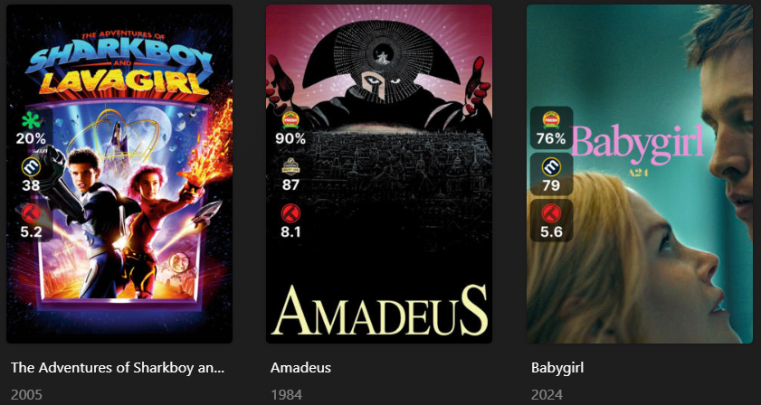

### Source Names

The ratings overlay can use `critic`, `audience`, and `user`, but those three names are special: they mean "read the value already stored in Plex."

All other supported values are fetched directly from their source or integration:

| Source key              | Rating displayed                                                   |
|-------------------------|--------------------------------------------------------------------|
| `imdb`                  | IMDb rating                                                        |
| `tmdb`                  | TMDb rating                                                        |
| `trakt`                 | Trakt public rating                                                |
| `trakt_user`            | Your Trakt user rating                                             |
| `mdb`                   | MDBList score                                                      |
| `mdb_average`           | MDBList average                                                    |
| `mdb_imdb`              | IMDb rating through MDBList                                        |
| `mdb_metacritic`        | Metacritic rating through MDBList                                  |
| `mdb_metacriticuser`    | Metacritic user rating through MDBList                             |
| `mdb_trakt`             | Trakt rating through MDBList                                       |
| `mdb_tomatoes`          | Rotten Tomatoes critic rating through MDBList                      |
| `mdb_tomatoesaudience`  | Rotten Tomatoes audience rating through MDBList                    |
| `mdb_tmdb`              | TMDb rating through MDBList                                        |
| `mdb_letterboxd`        | Letterboxd rating through MDBList                                  |
| `mdb_myanimelist`       | MyAnimeList rating through MDBList                                 |
| `omdb`                  | IMDb rating through OMDb (OMDb-branded icon)                       |
| `omdb_imdb`             | IMDb rating through OMDb (IMDb-branded icon)                       |
| `omdb_metascore`        | Metacritic metascore through OMDb                                  |
| `omdb_tomatoes`         | Rotten Tomatoes rating through OMDb                                |
| `plex_imdb`             | IMDb rating from Plex's available ratings data                     |
| `plex_tmdb`             | TMDb rating from Plex's available ratings data                     |
| `plex_tomatoes`         | Rotten Tomatoes critic rating from Plex's available ratings data   |
| `plex_tomatoesaudience` | Rotten Tomatoes audience rating from Plex's available ratings data |
| `anidb`                 | AniDB permanent rating                                             |
| `anidb_average`         | AniDB temporary average                                            |
| `anidb_score`           | AniDB review score                                                 |
| `mal`                   | MyAnimeList score                                                  |

Most of these source keys are also used by the Mass Rating Update operations, but in the new setup they are used directly by the overlay instead of being written into Plex first. Two exceptions: the operations equivalent of `anidb` is named `anidb_rating`, and `omdb_imdb` has no operations equivalent — it's only available as a direct overlay source.

Not every source works at every level. Episode overlays only support `audience`, `critic`, `user`, `tmdb`, and `imdb` — anything else (`mdb_*`, `omdb_*`, `trakt`, `anidb`, `mal`, `plex_*`) is silently skipped. Season overlays only support `user` and `tmdb`. If a rating overlay isn't showing up at those levels, check the source is on this shorter list first.

### Images

For direct-source configs, you do not need to set `rating1_image`, `rating2_image`, or `rating3_image`.

??? example "Let Kometa pick the images"

    ```yaml
    libraries:
      Movies:
        overlay_files:
          - default: ratings
            template_variables:
              rating1: mdb_tomatoes
              rating2: mdb_tomatoesaudience
              rating3: imdb
    ```

Kometa will select the Rotten Tomatoes critic image for `mdb_tomatoes`, the Rotten Tomatoes audience image for `mdb_tomatoesaudience`, and the IMDb image for `imdb`.

You can still override the image when you want a different display style:

??? example "Override a rating image"

    ```yaml
    libraries:
      Movies:
        overlay_files:
          - default: ratings
            template_variables:
              rating1: mdb_trakt
              rating1_image: trakt
              rating2: tmdb
              rating3: imdb
    ```

Use image overrides carefully. The image is only presentation; it does not change which rating value is fetched.

### Fresh, Rotten, and Top Badges

Notice the Certified Fresh tomato on the Amadeus and Babygirl posters above, and the plain tomato on Sharkboy and Lavagirl? Kometa picks that automatically based on the fetched value.

By default, a rating at or above `6.0` (on Kometa's normalized 0–10 scale, so 60%) gets the Fresh/Certified-Fresh treatment; below that, it gets the Rotten treatment. You can move that line with three template variables:

| Variable | Default | Controls |
| -------- | ------- | -------- |
| `fresh_rating` | `6.0` | The cutoff between Fresh and Rotten |
| `minimum_rating` | `0.0` | The lowest value treated as valid |
| `maximum_rating` | `10.0` | The highest value treated as valid |

??? example "Raise the Fresh threshold to 7.0"

    ```yaml
    libraries:
      Movies:
        overlay_files:
          - default: ratings
            template_variables:
              rating1: plex_tomatoes
              rating2: mdb_metacritic
              rating3: trakt
              fresh_rating: 7.0
    ```

One quirk worth knowing: for `plex_tomatoes`, `mdb_tomatoes`, `plex_tomatoesaudience`, and `mdb_tomatoesaudience` specifically, a Fresh result uses a distinct "Direct" tomato icon rather than the standard Certified Fresh badge. That's intentional — it signals the Fresh/Rotten call was computed by Kometa from the fetched number, not officially awarded by Rotten Tomatoes. If you see a tomato icon that looks slightly different from what you're used to, that's why.

### Filtering Items by Rating

Beyond swapping the icon, you can stop an overlay from applying at all below a threshold using `value_filter` — a separate overlay-file attribute that filters items at selection time based on the fetched rating.

```yaml
overlays:
  RT Fresh:
    overlay:
      name: text(mdb_tomatoes_rating)
      default: rating/RT-TomatoFresh.png
    value_filter:
      mdb_tomatoes_rating.gte: 6.0
```

This only applies the overlay to items whose `mdb_tomatoes_rating` is `6.0` or higher; everything else is excluded from that overlay entirely, rather than just getting a different badge. See [Value Filter](../../files/overlays.md#value-filter) for the full syntax, comparators, and how it combines with `filters`.

### Caching

Fetched rating values aren't pulled fresh on every run. Kometa writes them to a local cache and reuses that value until it expires, based on the `cache_expiration` setting (default 60 days, set under `settings` in your config). The badge selection (Fresh/Rotten/Top) and the number displayed on the poster both come from that same cached value, so both update together the next time the cache refreshes.

### Direct Ratings and Plex Ratings

Direct-source overlays do not change the ratings shown in the Plex UI. Plex may still show Rotten Tomatoes icons and values while the poster overlay shows IMDb, TMDb, Trakt, or MDBList values.

That is expected. The overlay is drawn onto the poster image by Kometa; Plex's rating fields are not modified unless you configure Library Operations.

### When Operations Are Still Needed

You still need Library Operations when your overlay uses `critic`, `audience`, or `user` and you want those Plex slots populated from another source. This can be useful if you want the ratings in Plex's UI to directly match the ratings shown on the poster.

??? example "Plex-slot ratings still need operations"

    ```yaml
    libraries:
      Movies:
        overlay_files:
          - default: ratings
            template_variables:
              rating1: critic
              rating2: audience
              rating3: user
        operations:
          mass_critic_rating_update: mdb_trakt
          mass_audience_rating_update: tmdb
          mass_user_rating_update: imdb
    ```

In that config, `rating1`, `rating2`, and `rating3` are not fetching Trakt, TMDb, or IMDb directly. They are reading Plex's critic, audience, and user rating slots. The `operations` block is what puts the selected external ratings into those Plex slots.

This is **not** a recommended approach, as using Library Operations will increase runtimes. Instead, you should put the `mdb_trakt`, `tmdb` and `imdb` data into the `ratingX` values.

### Examples

??? example "IMDb, TMDb, and Trakt without changing Plex"

    ```yaml
    libraries:
      Movies:
        overlay_files:
          - default: ratings
            template_variables:
              rating1: imdb
              rating2: tmdb
              rating3: mdb_trakt
    ```

??? example "Use Plex's current rating slots"

    ```yaml
    libraries:
      Movies:
        overlay_files:
          - default: ratings
            template_variables:
              rating1: critic
              rating2: audience
              rating3: user
    ```

## Legacy Setup: Plex Rating Slots Overlays

The legacy method uses Plex's three rating fields:

* `critic`
* `audience`
* `user`

Each thing in Plex that can have a rating [movie, show, episode, album, track] has those three ratings "boxes" or "fields".

The Critic and Audience ratings are typically managed by Plex, pulling from whatever you specify as the ratings source for the library; this is what determines the images that are displayed in the Plex UI. The User rating is the star rating assigned by you to the item.

Kometa can insert a broader range of values into those fields than Plex supports natively, then it can leverage those values in overlays and the like.

It's doing this "behind Plex's back", so there can be some seeming inconsistencies in the way things are displayed in the UI. The rest of this guide explains the legacy method.

### Setup

Here's our starting point if you want to run through this yourself:

Set up a brand new Library with only one movie in it. Ensure the Ratings source on the library is set to Rotten Tomatoes:

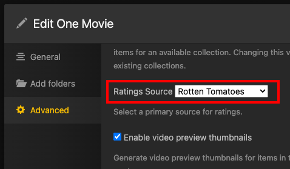

The Plex UI shows the correct ratings and icons for Rotten Tomatoes and is aligned with the Rotten Tomatoes site:

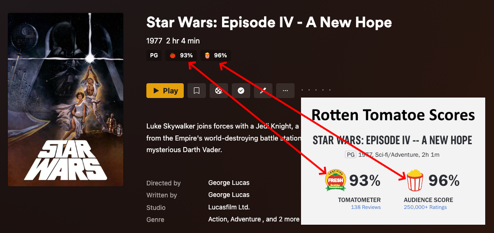

Also note that we have not given this a user rating.

### Initial Overlay

Now let's add rating overlays to the poster. We're going to use the minimal config needed here to illustrate the concepts.

??? example "Initial minimal config"

    ```yaml
    libraries:
      One Movie:
        reapply_overlays: true
        overlay_files:
          - default: ratings
            template_variables:
              rating1: critic
              rating1_image: rt_tomato
              rating2: audience
              rating2_image: rt_popcorn
              rating3: user
              rating3_image: imdb
    ```

    * `rating1`, `rating1_image`, `rating2`, `rating2_image` are set to match the ratings that Plex already has assigned to those fields (critic/audience). The order here is arbitrary.
    * `rating3` is set to be the user rating and its image (`rating3_image`) is set to IMDb just because we have to pick something.
    * `reapply_overlays` is set to true to ensure that Kometa always updates the overlays as we run things. This should NEVER be required in a typical scenario, it's being done here just as belt-and-suspender insurance.
    * `reapply_overlays: true` should NEVER be used in a live/production environment without a very specific reason. Make sure to switch this back to `false` when finished.

After Kometa is run on this library, you'll get this result:

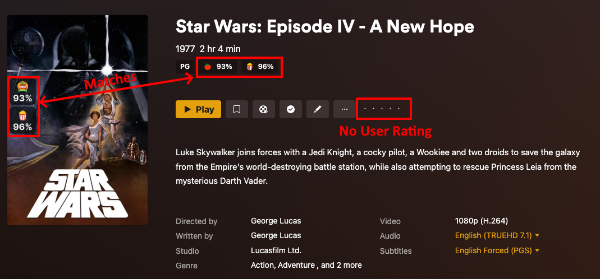

* Kometa has added those two ratings to the poster using the values already stored with the movie. The icons and values are correctly associated simply because we made sure they are in the config file.
* The two ratings match, and there is no IMDb rating icon on the poster since there is no user rating. (no star rating on the right)

Now we're going to add a user rating by clicking the middle star on the right for a rating of 3/5:

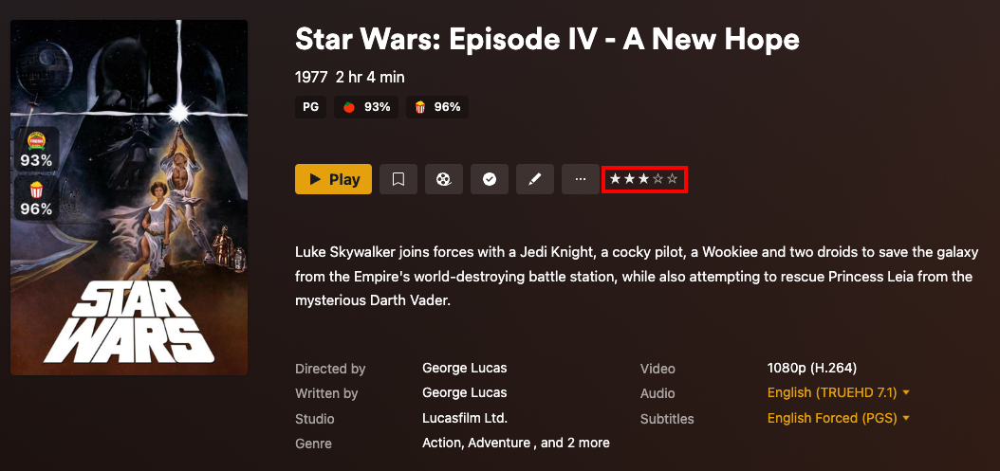

Now just run Kometa again without changing anything else and the user rating overlay will appear:

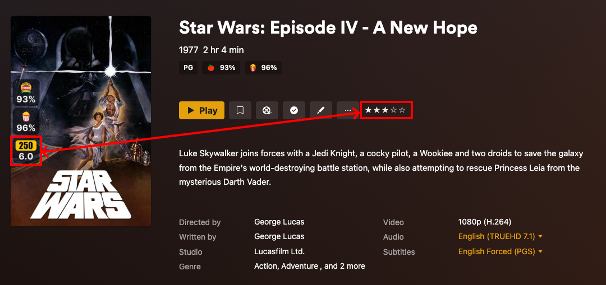

* Kometa added the third rating overlay, since there is now a value in the user rating.
* It gave it an IMDb icon because we told it to in the config file. ([Why does it say 250 instead of IMDb?](#why-do-different-images-appear-for-the-same-source))
* It's displaying 6.0 since 3 stars on a 5-star scale is 60%.

### Change Rating Image

You and I both know that the IMDb rating isn't 6.0, but Kometa is just doing what it's told. Nobody but us humans know where those numbers come from.

As an example, let's change the icons to show that Kometa does not know or care where Plex-slot values came from:

??? example "Updated config"

    ```yaml
    libraries:
      One Movie:
        reapply_overlays: true
        overlay_files:
          - default: ratings
            template_variables:
              rating1: critic
              rating1_image: imdb
              rating2: audience
              rating2_image: imdb
              rating3: user
              rating3_image: imdb
    ```

    * `rating1_image` and `rating2_image` were both changed from `rt_tomato` and `rt_popcorn` respectively to `imdb`.
    * `reapply_overlays: true` should NEVER be used in a live/production environment without a very specific reason. Make sure to switch this back to `false` when finished.

When the above is run you see this result:

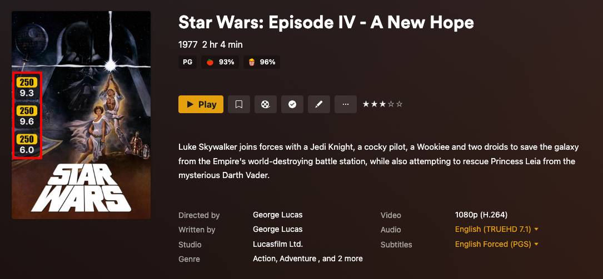

* Three different ratings on the poster, all IMDb; all while the Plex UI still shows RT icons.
* Note that the existing RT ratings numbers (`93%` and `96%`) display on the poster as `9.3` and `9.6`. This is happening because we just told Kometa that those ratings were IMDb, and IMDb ratings are on a 1-10 scale. Kometa does not know where those numbers are from; it places the value from the configured Plex rating box onto the poster.
* That first overlay showing an IMDb rating of `9.3` is not evidence that Kometa pulled the wrong IMDb rating. It just shows that it has been told to display the number in the critic rating box as an IMDb rating.

### Update User Ratings

Now let's actually update the ratings and push some numbers into those boxes using library operations. We'll start with making that user rating accurate:

??? example "Updated config"

    ```yaml
    libraries:
      One Movie:
        reapply_overlays: true
        overlay_files:
          - default: ratings
            template_variables:
              rating1: critic
              rating1_image: rt_tomato
              rating2: audience
              rating2_image: rt_popcorn
              rating3: user
              rating3_image: imdb
        operations:
          mass_user_rating_update: imdb
    ```

    * `operations` with the attribute `mass_user_rating_update` set to `imdb` is added.
    * `rating1_image` and `rating2_image` were both changed back to `rt_tomato` and `rt_popcorn` respectively from `imdb`.
    * `reapply_overlays: true` should NEVER be used in a live/production environment without a very specific reason. Make sure to switch this back to `false` when finished.

This will put the actual IMDb rating value, retrieved from IMDb, into the `user` rating field.

After that has been run, we see:

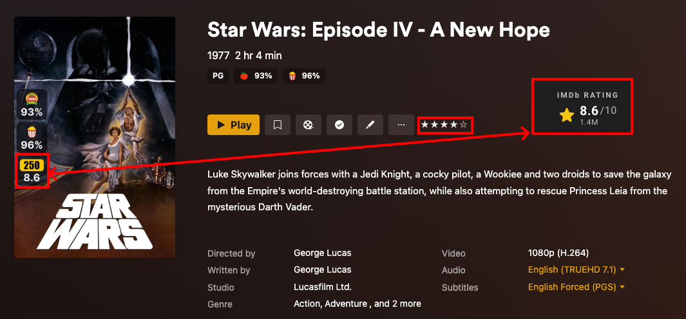

* The IMDb Rating Overlay on the poster matches the rating from the IMDb page for Star Wars.
* The number of stars has also changed to 4 stars. (since `8.6` split in half is `4.3` and then rounded down to the nearest half gives you 4 stars)

### Update Critic & Audience Ratings

Now let's update the critic and audience ratings to some different ratings:

??? example "Updated config"

    ```yaml
    libraries:
      One Movie:
        reapply_overlays: true
        overlay_files:
          - default: ratings
            template_variables:
              rating1: critic
              rating1_image: rt_tomato
              rating2: audience
              rating2_image: rt_popcorn
              rating3: user
              rating3_image: imdb
        operations:
          mass_critic_rating_update: trakt_user
          mass_audience_rating_update: tmdb
          mass_user_rating_update: imdb
    ```

    * under `operations` the attribute `mass_critic_rating_update` set to `trakt_user` and `mass_audience_rating_update` set to `tmdb` are added.
    * `reapply_overlays: true` should NEVER be used in a live/production environment without a very specific reason. Make sure to switch this back to `false` when finished.

Running the above will put the Trakt user's personal rating into the critic box and the TMDb rating into the audience box. Note that we haven't changed the rating images yet.

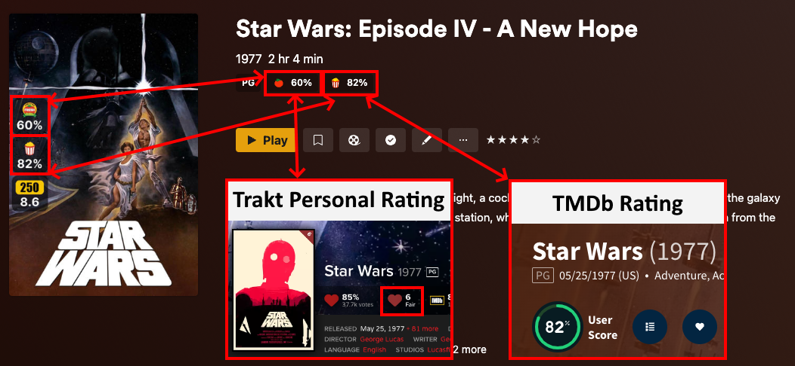

* Critic rating matches the Trakt personal user rating of `6`, which is displayed as `60%`.
* Audience rating matches the TMDb rating of `82%`.
* Note how the values have changed dramatically and all match between the overlay, Plex ratings, and external sites.

The log will show Kometa updating those values.

```text
| Processing: 1/1 Star Wars: Episode IV - A New Hope     |
| Batch Edits                                            |
| Audience Rating | 8.2                                  |
| Critic Rating | 6.0                                    |
```

* And the poster reflects those numbers, though with the wrong icons, since that's what **Kometa has been told to do**.
* The Plex UI still shows RT icons, and it always will, even though the numbers displayed are no longer RT ratings. Plex has no idea.

### Use Trakt Rating

Let's change the Trakt rating to that Trakt public rating of `85%` instead, which is available via MDBList:

??? example "Updated config"

    ```yaml
    libraries:
      One Movie:
        reapply_overlays: true
        overlay_files:
          - default: ratings
            template_variables:
              rating1: critic
              rating1_image: rt_tomato
              rating2: audience
              rating2_image: rt_popcorn
              rating3: user
              rating3_image: imdb
        operations:
          mass_critic_rating_update: mdb_trakt
          mass_audience_rating_update: tmdb
          mass_user_rating_update: imdb
    ```

    * under `operations` the attribute `mass_critic_rating_update` was changed to `mdb_trakt` from `trakt_user`. (This step requires MDBList to be configured)
    * `reapply_overlays: true` should NEVER be used in a live/production environment without a very specific reason. Make sure to switch this back to `false` when finished.

    ???+ tip "Note on `mdb` sources"

        MDBList is not a live reflection of third-party sites such as CommonSense and Trakt. The data on MDBList is often days, weeks and months out of date as it is only periodically refreshed.
        As such, the data that Kometa applies using `mdb_` operations may not be the same as you see if you visit those third-party sources directly.

When the above is run you should get:

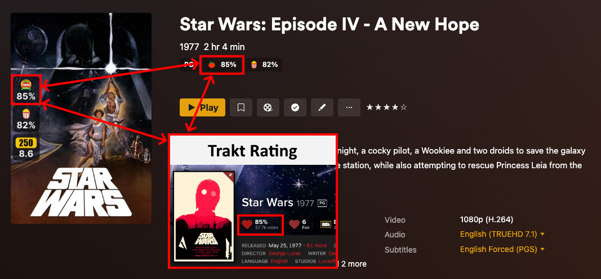

* Note how the `60%` in `rating1` became `85%`.

### Use Proper Images

Now, finally, let's make the poster rating images match the numbers we put in there:

??? example "Click to see the updated config"

    ```yaml
    libraries:
      One Movie:
        reapply_overlays: true
        overlay_files:
          - default: ratings
            template_variables:
              rating1: critic
              rating1_image: trakt
              rating2: audience
              rating2_image: tmdb
              rating3: user
              rating3_image: imdb
        operations:
          mass_critic_rating_update: mdb_trakt
          mass_audience_rating_update: tmdb
          mass_user_rating_update: imdb
    ```

    * `rating1_image` was changed to `trakt` from `rt_tomato`.
    * `rating2_image` was changed to `tmdb` from `rt_popcorn`.
    * `reapply_overlays: true` should NEVER be used in a live/production environment without a very specific reason. Make sure to switch this back to `false` when finished.

    ???+ tip "Note on `mdb` sources"

        MDBList is not a live reflection of third-party sites such as CommonSense and Trakt. The data on MDBList is often days, weeks and months out of date as it is only periodically refreshed.
        As such, the data that Kometa applies using `mdb_` operations may not be the same as you see if you visit those third-party sources directly.

When the above is run you should get:

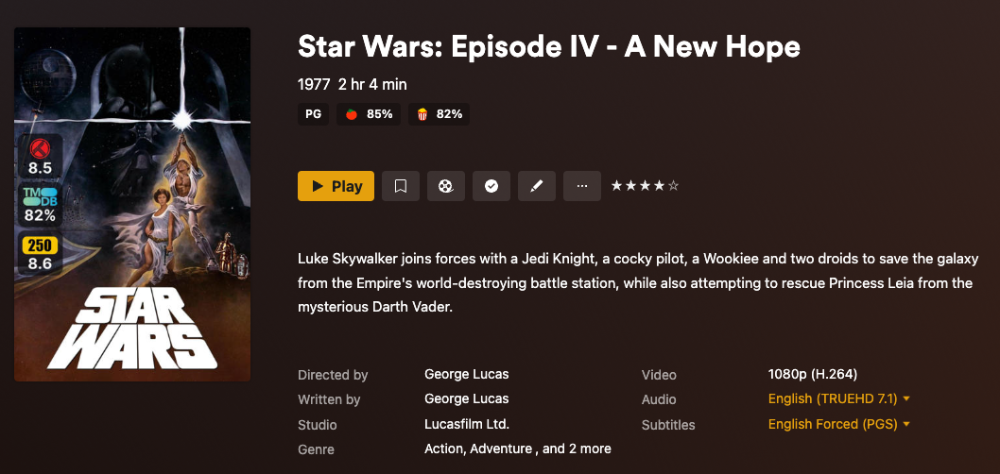

This config file is the **only linkage** between the ratings we are setting and the icons we want displayed, as we've seen above.

You can see that the Plex UI still shows the RT icons with the Trakt and TMDb numbers we put into the relevant fields, since again, it has no idea those numbers got changed behind its back.

The poster displays the correct icons because we told Kometa to do so in the config file.

## Why do different Images appear for the same source?

As seen in the images above, the IMDb rating image says `250` instead of `IMDb` and the Rotten Tomatoes rating images have the Certified Fresh logo vs their normal logo.

This is because Star Wars: Episode IV - A New Hope is in the IMDb Top 250 list as well as being Certified Fresh by Rotten Tomatoes, and that gets reflected by the rating image.
