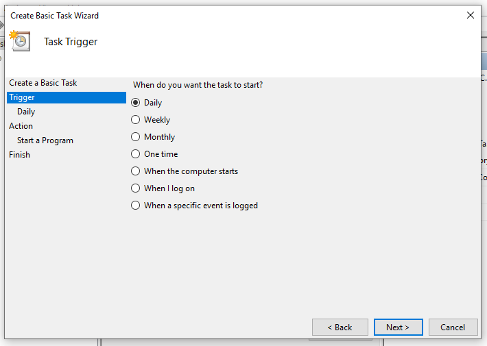

---
search:
  boost: 3
---
# Scheduling Kometa Runs Guide

Kometa can run in two ways:

1. Run in the background, waking up at 5AM to process your config, then going back to sleep until tomorrow.
2. Run immediately, process the config, then exit [the container, if you are running in docker]

These two modes are mutually exclusive, and the first is the default behavior.

While it is possible to have `python kometa.py` running in an open window constantly, this is not the recommended approach as it relies on an always-open command window that can be obtrusive to the user.

Instead, it is recommended to set an automated scheduling service so that Kometa can run in the background when scheduled to without any visible impact to the user (other than the Plex libraries and playlists updating).

This page discusses how to set up this "When should Kometa run" level of schedule, and it leverages both the "modes" of running discussed above.

**You can also put schedule information in your config to control things like "process the Movie library only on Tuesdays" or the like.  That level of scheduling is independent of when Kometa runs, and is discussed [here](../../config/schedule.md)**

IMPORTANT: Every time you see `/path/to` below, it's a placeholder for the path to that directory on *your* system.

=== "Docker"
    Using docker is the simplest and most robust solution to automating Kometa scheduling.
    
    When running Kometa within docker, the session will resume after a system reboot (assuming Docker is set to start at system startup, which is the default) and Kometa will run in the background at all times.
    
    There's a [Docker Walkthrough](../install/docker.md) with more detailed instructions on setting up Kometa within docker. The simplest command to facilitate a docker run is:
    
    ```
    docker run -d \
      --restart=unless-stopped \
      -e TZ=<TIMEZONE> \
      -v /path/to/config:/config:rw \
      kometateam/kometa
    ```
    Change `/path/to/config` to reflect where you've installed Kometa.

    TZ=<TIMEZONE>
    <TIMEZONE> is replaced with your local timezone, or the timezone your device is in that is running Kometa. For a list of available timezones, please see [Timezones](https://en.wikipedia.org/wiki/List_of_tz_database_time_zones). You want to replace <TIMEZONE> with the TZ Database Name. 
    
    ```
    TZ=America/New_York
    ```
    
    This will run Kometa in the background persistently until it is stopped by the user. While the docker container will be persistently running, Kometa will not begin the run until the scheduled time.
    
    Further customizations of the docker run command can be used to specify set times to run Kometa, further information on this and other Run Commands can be found [here](../environmental.md#time-to-run)

=== "Windows Task Scheduler"
    
    Windows Task Scheduler is advised for those who followed the Windows instructions in the [Local Walkthrough Guides](../install/local.md) and/or do not want to run Kometa within docker.
    
    Windows Task Scheduler allows the user to run commands and services at scheduled times and intervals.
    
    There are two methods of running Kometa:
    * Single run Scheduled Task
      * Background run Scheduled Task
    
    These will be explained further down this page.
    
    These guides assume the user has followed the Windows instructions in the [Local Walkthrough Guides](../install/local.md) which includes setting up the [virtual environment](../install/local.md#setting-up-a-virtual-environment). Please also ensure to edit any commands to be reflective of the live environment (such as usernames, installation directories).
    
    ### Background Run Scheduled Task
    
    This method will start Kometa at system startup and will keep Kometa running in the background indefinitely. The user can then define set days and times for the Configuration File to be processed, and Kometa will handle processing as and when required.
    
    This is the recommended approach as it allows the user additional control over how and when Kometa processes.
    
    If you don't specify a time, the script will run at 5AM each day.  You can change this with the [time-to-run](../environmental.md#time-to-run) runtime flag.

    ??? abstract "Background Run Scheduled Task"
    
        1. Create a `waiter.cmd` file by opening the text editor (i.e. Notepad, TextEdit) and pasting the following code:
        
           ```batch
           cd C:\Users\USERNAMEHERE\Kometa
           .\kometa-venv\Scripts\python .\kometa.py
           ```
           * This will navigate to the Kometa directory, then run Kometa. At the scheduled time [as defined within Kometa], Kometa will process the Configuration File and will then wait until the next scheduled time.
        
        2. Open Task Scheduler by searching for it in the Start Menu or by opening the Run window (Windows + R) and typing taskschd.msc before hitting OK.
        
           * ** Ensure that Task Scheduler is opened and not Task Manager **
        
              
        
        3. Select "Create a basic task" on the right-hand column
        
              
        
        4. Give the task a name, in this example `Background Kometa` and then select "Next"
        
              
        
        5. Choose the frequency that Kometa should run and then select "Next", `When the computer starts` is recommended.
        
              
        
        6. Choose the action "Start a program" and select "Next".
        
              
        
        7. Click "Browse", Navigate to the Kometa directory and choose `waiter.cmd`, which was created in Step 1, then select "Open".  NOTE: Your path may vary from the illustration here; navigate to the file you created and saved in Step 1.
        
              
        
        8. Copy the directory everything up to but not including `waiter.cmd` from the "Program/Script" field, and paste it into the "Start in" field.  This is `C:\User\IEUser\Kometa-1.15.1` in the example below, then select "next".  NOTE: Your path may vary from the illustration or example.
        
              
        
        9. Click "Finish".
        
        10. Click "Task Schedule Library" on the left. The "Background Kometa" task should be visible.
        
        Kometa will now launch at system startup, but will wait until the user-specified scheduled time before executing, and will then wait in the background for the next scheduled run.
        
    
    ### Single Run Scheduled Task
    
    This method will start Kometa at the desired time, immediately begin running the Configuration File and will then kill the process once it has completed.
    
    ??? abstract "Single Run Scheduled Task"
        
        1. Create a `runner.cmd` file by opening the text editor (i.e. Notepad, TextEdit) and pasting the following code:
        
           ```batch
           cd C:\Users\USERNAMEHERE\Kometa
           .\kometa-venv\Scripts\python .\kometa.py --run
           ```
           * This will navigate to the Kometa directory, then launch Kometa using the `-r`/`--run` flag which triggers an immediate run. Once complete, Kometa will exit.
        
              Save this file to C:\Users\USERNAMEHERE\Kometa\runner.cmd`.
        
        2. Open Task Scheduler by searching for it in the Start Menu or by opening the Run window (Windows + R) and typing taskschd.msc before hitting OK.
        
           * ** Ensure that Task Scheduler is opened and not Task Manager **
        
              
        
        3. Select "Create a basic task" on the right-hand column
        
              
        
        4. Give the task a name, in this example `Run Kometa` and then select "Next"
        
              
        
        5. Choose the frequency that Kometa should run and then select "Next", `Daily` is recommended.
        
              
        
        6. Specify the first date and time at which Kometa should run and then select "Next".
        
              
        
        7. Choose the action "Start a program" and select "Next".
        
              
        
        8. Click "Browse", Navigate to the Kometa directory and choose `runner.cmd`, which was created in Step 1, then select "Open".
        
              
        
        9. Copy the directory everything up to but not including `runner.cmd` from the "Program/Script" field, and paste it into the "Start in" field.  This is `C:\User\IEUser\Kometa-1.15.1` in the example below, then select "next".
        
              
        
        10. Check "Open the properties dialog" if desired (not required) then select "Finish".
        
           
   
        11. Click "Task Schedule Library" on the left. The Kometa Run task should be visible.
        
           
        
        Kometa will now run at the set date/time you selected in Step 6, and will run each subsequent day at the same time.


=== "MacOS Launchd Service"

    1. Create launchd service:

    A couple examples; you'll want to edit the THINGS IN ALL CAPS to reflect your system.

    Change `/path/to/kometa` to reflect where you've installed Kometa.

    Keep Kometa running constantly, let it wait to do its thing at 5 AM:
    
       ```
       <?xml version="1.0" encoding="UTF-8"?>
       <!DOCTYPE plist PUBLIC "-//Apple//DTD PLIST 1.0//EN" "http://www.apple.com/DTDs/PropertyList-1.0.dtd">
       <plist version="1.0">
       <dict>
        <key>Label</key>
        <string>com.YOUR_USERNAME.kometa</string>
        <key>ProgramArguments</key>
        <array>
            <string>sh</string>
            <string>-c</string>
            <string>kometa-venv/bin/python kometa.py --config /path/to/kometa-config/config.yml</string>
        </array>
        <key>UserName</key>
        <string>YOUR_USERNAME</string>
        <key>WorkingDirectory</key>
        <string>/PATH/TO/KOMETA</string>
       </dict>
       </plist>
       ```  

    Run Kometa every 6 hours, running it immediately and letting it quit:
    
       ```
       <?xml version="1.0" encoding="UTF-8"?>
       <!DOCTYPE plist PUBLIC "-//Apple//DTD PLIST 1.0//EN" "http://www.apple.com/DTDs/PropertyList-1.0.dtd">
       <plist version="1.0">
       <dict>
        <key>Label</key>
        <string>com.YOUR_USERNAME.kometa</string>
        <key>ProgramArguments</key>
        <array>
            <string>sh</string>
            <string>-c</string>
            <string>kometa-venv/bin/python kometa.py --config /path/to/kometa-config/config.yml --run</string>
        </array>
        <key>StartCalendarInterval</key>
        <array>
            <dict>
                <key>Hour</key>
                <integer>6</integer>
            </dict>
            <dict>
                <key>Hour</key>
                <integer>12</integer>
            </dict>
            <dict>
                <key>Hour</key>
                <integer>18</integer>
            </dict>
            <dict>
                <key>Hour</key>
                <integer>24</integer>
            </dict>
        </array>
        <key>UserName</key>
        <string>YOUR_USERNAME</string>
        <key>WorkingDirectory</key>
        <string>/PATH/TO/KOMETA</string>
       </dict>
       </plist>
       ```

       A useful tool to generate these plist files is [https://zerolaunched.herokuapp.com/](https://zerolaunched.herokuapp.com/)
    
       Save this file as `com.YOUR_USERNAME.kometa.plist` in `~/Library/LaunchAgents`.

    2. Load and start the agent 🚀

       Retrieve your user id with `id -u` in Terminal.  You'll need it for the commands in this step.
    
       Load the agent by executing the following commands:

       ```
       cd ~/Library/LaunchAgents/
       launchctl bootstrap gui/YOUR-USER-ID com.YOUR_USERNAME.kometa.plist
       ```

     And then kick-start it with:

       ```
       launchctl kickstart -k gui/YOUR-USER-ID/com.YOUR_USERNAME.kometa
       ```
    
       Note that this command uses the *label*, not the plist filename. The -k options means that the service will first be killed, if running.
    
       The agent should now be active and starting the program according to the schedule you set.

=== "Linux Systemctl Service"

    1. Create the service file:
    
       ```bash
       sudo nano /etc/systemd/system/kometa.service
       ```
    
       Put the following into the file:
       ```
       # /etc/systemd/system/kometa.service
    
       [Unit]
       Description=Kometa
       After=network-online.target
    
       [Service]
       User=USER
       Group=GROUP
       Type=simple
       Environment=LC_ALL=C.UTF-8
       Environment=LANG=C.UTF-8
       WorkingDirectory=/path/to/kometa
       ExecStart=/path/to/kometa/kometa-venv/bin/python /path/to/kometa/kometa.py
       Restart=always
       RestartSec=10
    
       [Install]
       WantedBy=default.target
       ```
    
       Change `USER` and `GROUP` to reflect your user and group.
    
       Change `/path/to/kometa` to reflect where you've installed Kometa.
    
       NOTE: This is assuming you created the `kometa-venv` virtual environment as described in the [Local Walkthrough](../install/local.md)
    
       Save and close the file.
    
    2. Load and start the service
    
          ```shell
          sudo systemctl daemon-reload
          sudo systemctl start kometa.service
          ```
    
    3. You can check whether the service is running with:
    
          ```shell
          sudo systemctl status kometa.service
          ```

=== "cron"
    The cron utility is used for running scripts and commands at regular intervals, and at specific times and dates. It’s built into most Operating Systems (namely Linux and Mac), and provides a very useful way to schedule tasks on your server. It also works for running Docker commands on a schedule.
    
    1. Decide when you want to run Kometa
    
       `cron` needs a specific syntax to express schedules.  A cron schedule is something like "Every Tuesday at 4" or "5 minutes past every other hour".
    
       You can generate the required line by checking boxes using something like [crontab-generator](https://crontab-generator.org/).
    
       The command you use in crontab will probably be the command you use to run it on the command line.
    
       A command you could use for this:
    
       ```
       cd /path/to/kometa && kometa-venv/bin/python kometa.py --config config/config.yml --run
       ```
       Change `/path/to/kometa` to reflect where you've installed Kometa.

       This is an example, which does nothing but run the script immediately.  If you want to add additional flags you can do so.

       NOTE: This is assuming you created the `kometa-venv` virtual environment as described in the [Local Walkthrough](../install/local.md)
    
    2. Open the system crontab for editing:
    
          ```bash
          sudo crontab -e
          ```

    3. Paste in the crontab line you got from `crontab-generator`, or type in one of your own.  Depending on the editor being used, you may need to put it into insert mode first.  There's a good chance it's `vi`, in which case you need to press `i` to put it into insert mode, after which you will see `-- INSERT -- ` in the lower left.

    4. Save and close the file.  How you do that depends on which editor is being used.  There's a good chance it's `vi`, in which case `ESC : w RETURN` will save and `ESC : q RETURN` will exit.
