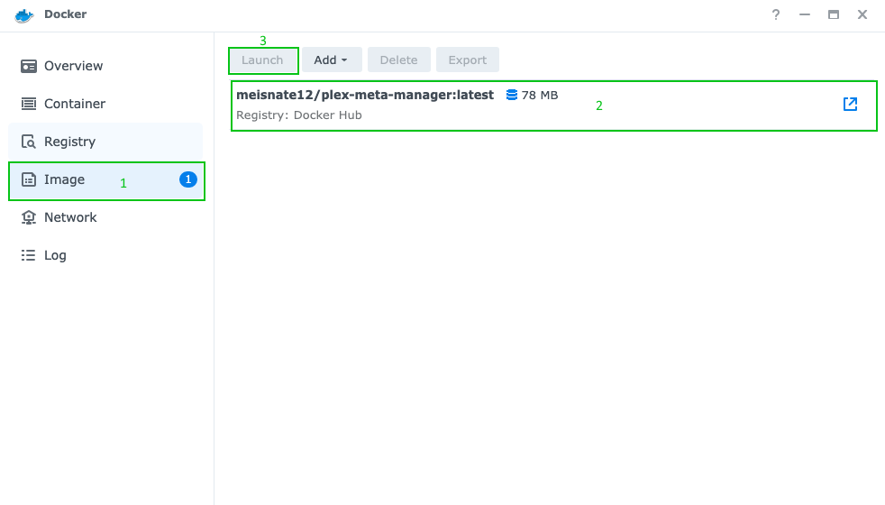
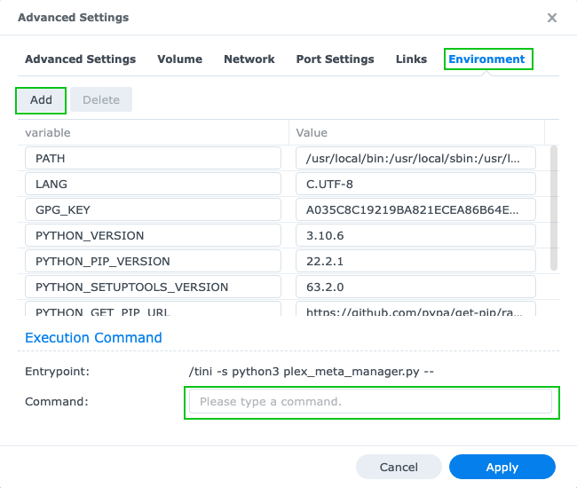

# Synology Walkthrough

This is a quick walkthrough of setting up the Kometa Docker container in the Synology UI.

## Prerequisite: Installing Docker

1.  Open the Package Center app from the Synology Web GUI.

    

2.  Type `docker` in the search bar and once it comes up, click "Install" to add Docker. Then click "Open" to bring it up.

    

## Installing Kometa

1.  Open the Docker app.

    

2.  Search and Download the Image.

    1.  Click Registry.
    2.  Search for `kometateam/kometa`.
    3.  Select the Repository.
    4.  Click Download.

    

3.  Select the tag you want to run from the dropdown and click "Select."

    The options are:

    - `latest` - most recent official release; typically the most stable.
    - `develop` - development release, contains new features that haven't made it to latest yet, but may have minor problems.
    - `nightly` - bleeding-edge development version; latest fixes go here, but breakage should be expected.

    

4.  Select the Image and Create a Container.

    1.  Click Image.
    2.  Select the `kometateam/kometa` Image.
    3.  Click Launch.

    

**From this point on the setup looks a little different depending on if the Synology is running DiskStation Manager 7 or DiskStation Manager 6.**

=== "DiskStation Manager 7"

    5.  Specify your docker network type. Then click "Next".

        

    6.  You can name the Container whatever you want using the "Container Name" text Box.

        

    7.  To add Environment Variables and Command Line Arguments click "Advanced Settings". (Optional)

        Information on available Command Line Arguments and Environment Variables can be found [here](../environmental.md)

        To add an Environment Variable click "Environment" then click Add" and then fill in the Variable and Value.

        

        To use Command Line Arguments click "Execution Command" put the arguments in the "Command" text field.

        

        Click "Save" to save the settings and go back to the General Settings Screen.

    8.  Click "Next" from the General Settings Screen to get to the Port Settings Screen where you just want to click "Next" as Kometa has no Ports.

        

    9.  Next we need to add your config folder to the container. From the Volume Settings Screen click "Add Folder".

        

    10.  Select from your Synology File System where you want to store your Kometa config files and then enter `/config` as the "Mount path". Then click "Next" to go to the Summary Page.

        

    11.  From the Summary Page select "Done" to finish and creating the container.

        

=== "DiskStation Manager 6"

    5.  You can name the Container whatever you want using the "Container Name" text Box. Then click "Advanced Settings".

        

    6.  Next we need to add your config folder to the container. Select the "Volume" Tab, click "Add Folder," and select from your Synology File System where you want to store your Kometa config files.

        

    7.  Enter `/config` as the "Mount Point."

        

    8.  Select the "Environment" Tab. (Optional)
   
        Environment Variables and Command Line Arguments can be added here.

        - To add an Environment Variable Click "Add" and then fill in the Variable and Value.
        - To use Command Line Arguments put the arguments in the "Command" text field.

        Information on available Command Line Arguments and Environment Variables can be found [here](../environmental.md)

        

    9.  Select "Apply" to save the "Advanced Settings," select "Next" to go to the Summary, and select "Done" to finish and create the container.

        
