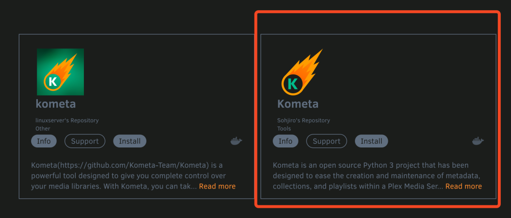
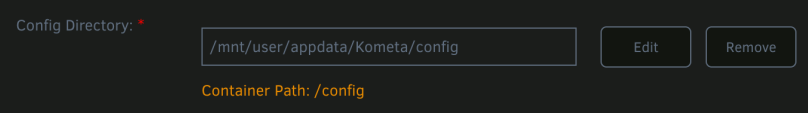
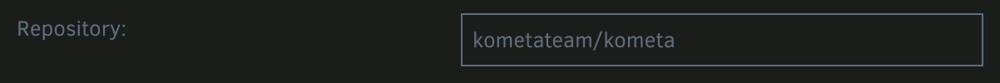

# unRAID Walkthrough

This article will walk you through getting Kometa set up and running via Docker.  It will cover:

1. Installing Kometa unRAID app
2. Retrieving the image
3. Setting up the initial config file
4. Setting up a collection file and creating a couple sample collections
5. Creating a docker container that will keep running in the background

The specific steps you will be taking:

1. Verify that Kometa unRAID app is installed and install it if not
2. Use `unRAID APPS` to retrieve the Kometa Docker image
3. Create a directory for your config files and learn how to tell app to use it
4. Gather two things that the script requires:

    1. TMDb API Key
    2.  Plex URL and Token

5. Then, iteratively:

    1. use `unRAID >_Console` to run the commands
    2. use a text editor to modify a couple of text files until you have a working config file and a single working collection file.

If the idea of editing YAML files by hand is daunting, this may not be the tool for you.  All the configuration of Kometa is done via YAML text files, so if you are unable or unwilling to learn how those work, you should stop here.

Finally, this walkthrough is intended to give you a basic grounding in how to get the script running.  It doesn't cover how to create your own collections, or how to add overlays, or any of the myriad other things Kometa is capable of.  It provides a simple "Getting Started" guide for those for whom the standard install instructions make no sense; presumably because you've never run a unRAID app (Docker container) before.

## Prerequisites.

Anywhere you see

```
something like this
```

That’s a command you’re going to type or paste into your unRAID Kometa `>_Console` terminal (Linux).

**IMPORTANT NOTES:**

* The unRAID app store leverages Docker containers. As such, we are tweaking the existing Docker container walkthrough to make it work on unRAID. This walkthrough is going to be pretty pedantic.  I’m assuming you’re reading it because you have no idea how to get this going on unRAID, so I’m proceeding from the assumption that you want to be walked through every little detail.  You’re going to deliberately cause errors and then fix them as you go through it.  This is to help you understand what exactly is going on behind the scenes so that when you see these sorts of problems in the wild you will have some background to understand what’s happening.  If I only give you the happy path walkthrough, then when you make a typo later on you’ll have no idea where that typo might be or why it’s breaking things.

* You may want to take an hour to get familiar with Docker fundamentals with the [official tutorial](https://www.docker.com/101-tutorial/).

  * DO NOT MAKE ANY CHANGES BELOW if you want this to just work.  Don't change the docker image. `linuxserver.io` will not work for this, so don't change the paths, etc.

### Prepare a small test library [optional]



### Installing Community Applications in unRAID

Thankfully, getting Kometa working on unRAID is a fairly simple task. unRAID works mostly with docker containers, so the pre-built container available on docker hub works perfectly with a little configuration.
To install a container from docker hub, you will need community applications - a very popular plugin for unRAID servers. If you don't already have this installed, you can install it [here](https://forums.unraid.net/topic/38582-plug-in-community-applications/)

### Installing Kometa in unRAID

1. Head to the `Apps` tab of unRAID (Community Applications), and search `kometa` in the upper left search box. There will be a couple of results shown, but you should ignore them ([Why?](images.md)) and use the official image.

   

2. Click the `Install` button on the Template from Sohjiro's Repository Tools.

3. Choose which branch you want to run `latest`, `develop`, or `nightly`. 

4. Set the `Console shell command:` to `Bash`

5. Verify that the `Container Path: /config` path for the unRAID app is `/mnt/user/appdata/Kometa/config`

   

6. Hit `Apply`, and allow unRAID to download the image and build the container.

#### Important note on Docker images

This tutorial uses the official image, and you should, too.  Don't change `kometateam/kometa` to the `linuxserver.io` image or any other. Other images may have [idiosyncrasies](images.md) that will prevent this walkthrough from working.  The official image *will* behave exactly as documented below.  Others very possibly won't.

The great thing about Docker is that all the setup you'd have to do to run Kometa is already done inside the docker image.

First let's start the container. Oops! The container won't start? 
This is going to fail with an error. That's expected.

You should see something like this in the unRAID logs for the container:

```
Config Error: config not found at //config
```
We need to have a file called `config.yml` in the correct directory for Kometa to start. Open up an unRAID terminal session by clicking on the terminal icon `>_` in the top right of unRAID.

=== ":fontawesome-brands-linux: Linux"

    [type this into your terminal]
    ```
    mkdir /mnt/user/appdata/Kometa/config
    touch /mnt/user/appdata/Kometa/config/config.yml
    ```

You can now close the unRAID terminal and start the Kometa container.

**_From this point forward, you can Console `>_Console` into the running container as it will stay running_**

Open a Console by left-clicking on the running Kometa Container and selecting `>_Console`. This will open up an interactive session within the container to be able to run the commands we want.

### Create a directory to quiet an error later

The default config file contains a reference to a directory that will show an error in the output later.  That error can safely be ignored, but it causes some confusion with new users from time to time.

We'll create it here so the error doesn't show up later.

=== ":fontawesome-brands-linux: Linux"

    [type this into your terminal]
    ```
    mkdir config/assets
    ```

### Setting up the initial config file



#### Editing the config template

First, make a copy of the template:

=== ":fontawesome-brands-linux: Linux"

    Get a copy of the template to edit [type this into your terminal]:
    ```
    curl -fLvo config/config.yml https://raw.githubusercontent.com/Kometa-Team/Kometa/master/config/config.yml.template
    ```

Now open the copy in an editor on the machine of your choice (Use Linux tab below for the Unraid Kometa `_>Console`):





#### Testing the config file

Save the file (Use Linux tab below for the Unraid Kometa `_>Console`):



Then run the script again:






### Creating a few sample collections.



So let's run the script and see this happen:






### Setting up a collection file and creating a sample collection.

(Use Linux tab below for the Unraid Kometa `_>Console`):



Save the file (Use Linux tab below for the Unraid Kometa `_>Console`):



Then run the script again:





### Adding Overlays to movies.



Save the file (Use Linux tab below for the Unraid Kometa `_>Console`):



Then run the script again:







## Other Topics

### Scheduling


### I want to use the develop branch

Add the `develop` tag to the image name in your `Repository:` setting for the Kometa unRAID app: [kometateam/kometa:develop]

```
kometateam/kometa:develop
                  ^^^^^^^
```

Enter that here in the template:



### I want to use the nightly branch

Add the `nightly` tag to the image name in your `Repository:` setting for the Kometa unRAID app: [kometateam/kometa:nightly]

```
kometateam/kometa:nightly
                  ^^^^^^^
```

Enter that here in the template:


### I want to ensure I am using the master branch

Add the `latest` tag to the image name in your `Repository:` setting for the Kometa unRAID app: [kometateam/kometa:latest]

```
kometateam/kometa:latest
                  ^^^^^^
```
Enter that here in the template:


