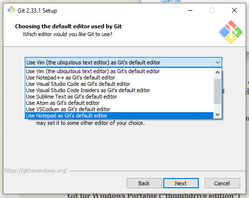

---
hide:
  - toc
---


### Installing Python

In order to run a Python script. the first thing you'll need is a Python interpreter. 
This is typically already present on Linux and Mac, but will probably have to be installed on Windows.

Let's check if Python is already installed [type this into your terminal]

```shell
python3 --version
```

If this doesn't return a version between `3.9` and `3.13`, you'll need to installed a supported version of Python.

=== ":fontawesome-brands-linux: Linux"

    Describing a python install for any arbitrary linux is out of scope here, but if you're using Ubuntu, 
    [this](https://techviewleo.com/how-to-install-python-on-ubuntu-linux/) might be useful.

=== ":fontawesome-brands-apple: macOS"

    Follow the instructions here: [Installing Python 3 on Mac OS X](https://docs.python-guide.org/starting/install3/osx/)

=== ":fontawesome-brands-windows: Windows"

    Before installing Python, try again without the `3` [type this into your terminal]

    ```shell
    python --version
    ```

    Depending on the version of Python, you may need to use one or the other. 
    If this works, you're ready to go, just substitute `python` for `python3` in the couple places it appears below.
    
    Go to http://www.python.org/download and download Python 3.13. **Kometa has not been tested and may be non-functional on any version of Python beyond 3.13**
    
    Once downloaded, run the installer. Tick “Add to path” checkbox at the bottom and click “Install Now”.
    
    For Windows 10, you will need to enable scripts in PowerShell.Follow the instructions [here](https://windowsloop.com/enable-powershell-scripts-execution-windows-10) to do so. 
    If you skip this step you're going to hit a hard stop in a moment.

---

### Installing git

To copy the Kometa code to your machine, we'll be using git. This may be installed on Mac or Linux, and probably isn't in Windows.

Let's check if Git is already installed [type this into your terminal]

```shell
git --version
```

If this doesn't return a version number, you'll need to get git installed.

=== ":fontawesome-brands-linux: Linux"

    The git install is discussed here: [Download for Linux and Unix](https://git-scm.com/download/linux)

=== ":fontawesome-brands-apple: macOS"

    The git install is discussed here: [Git - Downloading Package](https://git-scm.com/download/mac)

=== ":fontawesome-brands-windows: Windows"

    Download the installer from [here](https://git-scm.com/download/windows)

    Run the install; you can probably just accept the defaults and click through except for the step that asks you to choose an editor; 
    you probably want to choose something other than the default there:
    
    
    
    This install comes with its own command line interface. **Do not use this interface in this walkthrough**. Continue to do everything here in Powershell.


---

### Retrieving the Kometa code

Now we're going to use `git` to make a copy of the code on your local computer in the home directory [type this into your terminal]

```shell
cd ~
git clone https://github.com/Kometa-Team/Kometa
cd Kometa
```

Now `git checkout` to the branch reflecting the version of the wiki you are reading, as some functionality may be dependent on this. 
**If you are reading the latest version of the wiki, no `git checkout` is required.**

=== ":fontawesome-brands-github: latest"

    If you are reading the latest version of the wiki, no `git checkout` is required.

=== ":fontawesome-brands-github: develop"
    
    ```shell
    git checkout develop
    ```

=== ":fontawesome-brands-github: nightly"
    
    ```shell
    git checkout nightly
    ```

???+ tip "Important Information"

    The rest of this walkthrough assumes you are staying in this directory in this terminal/Powershell window.

    **In the future, when you want to run Kometa at the command line, you have to be in this directory.**

#### Navigating to the Kometa Code

When you open a command window to run Kometa, the first step will always be:

```shell
cd ~
cd Kometa
```

There are parts of the code that are assuming and expecting that you will be in this directory when you run Kometa [the fonts used in overlays are one example]. 
Be sure that you are always in this directory when you run Kometa.

??? question "What did that do?"

    ```shell
    cd ~
    ```

    This changes to your home directory, which will be something like `/home/yourname` or `/Users/yourname` or `C:\Users\YourName` depending on the platform.

    ```shell
    git clone https://github.com/Kometa-Team/Kometa
    ```

    This uses `git` to make a copy of (`clone`) the Kometa code from where it is stored on `github`.

    ```shell
    cd Kometa
    ```

    This moves into the directory that was created by the `clone` command.


Later on you can move it elsewhere if you want, but for now put it there. This will ensure that everything to follow works just like it says here. 
Presumably you’re reading this because the other docs are unclear to you. Don’t make unilateral changes to my assumptions while doing this.

??? question "Why use git instead of downloading the release ZIP?"

    Retrieving the code with `git` makes updating simpler. When you want to update to the newest version, you can go into this directory and type:

    ```shell
    git pull
    ```

    No need to download a new ZIP, decompress it, etc.

    Also, if you are asked to [or want to] switch to the latest develop or nightly code, you can do so with:

    ```shell
    git checkout develop
    ```

    ```shell
    git checkout nightly
    ```

---

### Setting up a virtual environment

This walkthrough is going to use a "virtual environment", since that provides a simple way to keep the requirements for a given thing self-contained; 
think of it as a "sandbox" for this script. It also provides a clean way to recover from mistakes, and keeps the host system clean.

=== ":fontawesome-brands-linux: Linux"

    [type this into your terminal]

    ```shell
    python3 -m venv kometa-venv
    ```

    If you see an error like:

    ```shell { .no-copy }
    Error: Command '['/home/mroche/Kometa/kometa-venv/bin/python3', '-Im', 'ensurepip', '--upgrade', '--default-pip']' returned non-zero exit status 1.
    ```
    
    You probably need to make sure the Python 3.9-specific virtualenv support library is installed:

    [type this into your terminal]

    ```shell
    sudo apt-get install python3.9-venv
    ```

    Then try the original venv command above again.

=== ":fontawesome-brands-apple: macOS"

    [type this into your terminal]

    ```shell
    python3 -m venv kometa-venv
    ```

=== ":fontawesome-brands-windows: Windows"

    [type this into your terminal]

    ```shell
    python -m venv kometa-venv
    ```

    If you see:

    ```shell { .no-copy }
    Python was not found; run without arguments to install from the Microsoft Store, or disable this shortcut from Settings > Manage App Execution Aliases.
    ```

    You apparently didn't check the “Add to path” checkbox above under [installing Python](#installing-python).
    "Repair" your Python install and check"add python to environment variables".


??? question "What did that do?"

    ```shell
    python3 -m venv kometa-venv
    ```

    This tells Python3 to use the `venv` module to create a virtual environment called `kometa-venv`. The only visible effect will be the creation of a `kometa-venv` directory.


That command will not produce any output if it works; it will display an error if a problem occurs. If everything is fine, you will be looking at something like this:

```shell { .no-copy }
> python -m venv kometa-venv
>
```

If you aren't looking at an error, you're ready to move on.

That will create the virtual environment, and then you need to activate it:

=== ":fontawesome-brands-linux: Linux"

    [type this into your terminal]

    ```shell
    source kometa-venv/bin/activate
    ```

=== ":fontawesome-brands-apple: macOS"

    [type this into your terminal]

    ```shell
    source kometa-venv/bin/activate
    ```

=== ":fontawesome-brands-windows: Windows"

    [type this into your terminal]

    ```
    .\kometa-venv\Scripts\activate
    ```

    If you see something like this:

    ```powershell
    .\kometa-venv\Scripts\activate : File C:\Users\mroche\Kometa\kometa-venv\Scripts\Activate.ps1 cannot be loaded because running scripts is disabled on this system. For more information, see about_Execution_Policies at https:/go.microsoft.com/fwlink LinkID=135170.
    At line:1 char:1
    + .\kometa-venv\Scripts\activate
    + ~~~~~~~~~~~~~~~~~~~~~~~~~~~
        + CategoryInfo          : SecurityError: (:) [], PSSecurityException
        + FullyQualifiedErrorId : UnauthorizedAccess
    ```

    You apparently skipped the "enable scripts in Powershell" step above under [installing Python](#installing-python) for Windows.
    
    You will need to take care of that before moving on. Follow the instructions [here](https://windowsloop.com/enable-powershell-scripts-execution-windows-10).
    
    Once you have done that, try the activation step again.

That command will not produce any output if it works; it will display an error if a problem occurs.

You may see a change in your prompt, something like this:

```shell
➜  Kometa git:(master) ✗ source kometa-venv/bin/activate
(kometa-venv) ➜  Kometa git:(master) ✗
```

Note that the prompt now shows the name of the virtual environment. You may not see this; it's dependent on *your* terminal configuration, not anything to do with Python or Kometa.

??? question "What did that do?"

    This tells Python to make the virtual environment "active", which means to use the copy of python that is available there, install all support libraries there, etc. 
    This keeps the Kometa code and its runtime environment totally separate from your host machine's environment.

An advantage of doing this in a virtual environment is that in the event something goes wrong with this part of the setup, 
you can delete that kometa-venv directory and do the setup again.

**IMPORTANT: In the future, when you want to run the script, you will need to do this "activation" step every time. Not the venv creation, just the activation**:

=== ":fontawesome-brands-linux: Linux"

    [type this into your terminal]

    ```shell
    source kometa-venv/bin/activate
    ```

=== ":fontawesome-brands-apple: macOS"

    [type this into your terminal]

    ```shell
    source kometa-venv/bin/activate
    ```

=== ":fontawesome-brands-windows: Windows"

    [type this into your terminal]

    ```
    .\kometa-venv\Scripts\activate
    ```

### Installing requirements

Kometa, like every other Python script, depends on support libraries that manage things like connections to Plex, or getting things from the internet, or writing files and so on.

These support libraries are called “requirements”, and they are defined in that file called `requirements.txt`. 
To install them, type the following command [type this into your terminal]:

```shell
python -m pip install -r requirements.txt
```

You should see something like this [I’ve removed a few lines for space, and the specific versions may have changed since this was captured]:

```shell { .no-copy }
Collecting PlexAPI==4.7.0
  Downloading PlexAPI-4.7.0-py3-none-any.whl (133 kB)
     |████████████████████████████████| 133 kB 821 kB/s
Collecting tmdbv3api==1.7.6
  Downloading tmdbv3api-1.7.6-py2.py3-none-any.whl (17 kB)
...
Installing collected packages: urllib3, idna, charset-normalizer, certifi, six, ruamel.yaml.clib, requests, tmdbv3api, tenacity, ruamel.yaml, tenacity, PlexAPI, pillow, pathvalidate, lxml, arrapi
    Running setup.py install for tenacity ... done
    Running setup.py install for arrapi ... done
Successfully installed PlexAPI-4.7.0 arrapi-1.1.3 certifi-2021.10.8 charset-normalizer-2.0.7 idna-3.3 lxml-4.6.3 pathvalidate-2.4.1 pillow-8.3.2 requests-2.26.0 tenacity-8.3.0 ruamel.yaml-0.17.10 ruamel.yaml.clib-0.2.6 tenacity-8.3.0 six-1.16.0 tmdbv3api-1.7.6 urllib3-1.26.7
WARNING: You are using pip version 21.1.3; however, version 21.3 is available.
You should consider upgrading via the '/Users/mroche/Kometa/kometa-venv/bin/python -m pip install --upgrade pip' command.
```

Don't worry about the WARNING about `pip version thus-and-such` if it comes up.

??? warning "Encountered error while trying to install package."

    If you see an error that ends in something like this:
    
    ```shell { .no-copy }
    ...
    building 'lxml.etree' extension
    error: Microsoft Visual C++ 14.0 or greater is required. Get it with "Microsoft C++ Build Tools": https://visualstudio.microsoft.com/visual-cpp-build-tools/
    [end of output]
    
    note: This error originates from a subprocess, and is likely not a problem with pip.
    error: legacy-install-failure
    
    × Encountered error while trying to install package.
    ╰─> lxml
    ```

    You've hit the error we were referring to above with the Python version being too recent. Probably you are running Python 3.11 in late 2022 or Python 3.12 shortly after its 
    release. Deactivate and delete the virtual environment and create one based on the previous Python release [which may involve removing Python and reinstalling the older 
    version depending on platform], then try this step again.


??? question "What did that do?"

    This told Python to use the `pip` module to install some libraries that Kometa needs.

### Verify install and create config template

Running the script at this point will verify that all is well and will create a template config for you to start with.



You should see something like this:

```shell { .no-copy }
Configuration file (config.yml) created at /SOME/PATH/TO/Kometa/config/config.yml. Please open this file and update it with your API keys and other required settings.
```

If, instead, you see something like:

```shell { .no-copy }
Traceback (most recent call last):
  File "/some/path/to/Kometa/kometa.py", line 1, in <module>
    import argparse, os, platform, re, sys, time, uuid, requests
ModuleNotFoundError: No module named 'requests'
```

You either haven't activated the virtual environment OR you haven't installed the requirements 
[OR you've done both these things but you installed the requirements outside the virtual environment]. Review the previous two steps.

