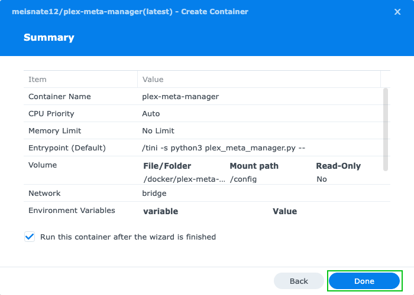

---
hide:
  - toc
---


=== "DiskStation Manager v. 7.2"

    ## Container Manager

    1. Open the Package Center app from the Synology Web GUI.

        

    2. Type `docker` in the search bar and once it comes up, click "Install" next to Container Manager if it isn't already installed. 
       Then click "Open" to bring up the Container Manager.

        

    3. Click "Open" to bring up the Container Manager.

        

    ## Creating the Kometa container

    1. Click the registry tab, type "Kometa" in the search bar, and select the `kometateam/kometa` image.

        

    2. When you click the image, a popup will appear where you can choose the tag [version of the image] you want to use. Most likely, this is `latest`. 
       If you need to use one of these other tags, you would choose it here. Once you choose a tag, click 'Apply'.

        

    3. The image will be downloaded, which shouldn't take long.

        

    3. Once the download completes, click on the "Container" tab. Click "create" to create a new container.

        

    4. This will bring up the container creation wizard.

        

    5. Click the top UI element and choose the image you downloaded.

        

    6. Enter a name, and check the "auto-start" box.

        

        NOTE: The name you enter here is the name of the container, not the name of the image. You can name it whatever you want.

        IMPORTANT: If you are creating an image that you will be configuring to run immediately, you should NOT check the "auto-start" box. 
        That will cause the container to loop endlessly. If you don't know what this means yet, check the box.

        Click Next.

    7. On this screen, you'll create the one volume map that Kometa requires.

        

        Click "Add Folder" under "Volume Settings".

    8. Click "docker".

        

    9. Click "Create Folder" and enter a name.

        

        Click "OK".

    10. Make sure the folder you just created is selected, and click "Select".

        

    11. Enter `/config` in the box in the middle of the pane. Enter *exactly that*, no more, no less.

        

    12. There is one setting here that you *may* need to change, and only you know if you do. Scroll down to the network settings. 
        Depending on where Plex is running, you may need to change this from "bridge" to "host". If you don't know what this means, you probably don't need to change it.

        

          Click "Next".

    13. You're presented with a summary of the things you've done so far. Click "Done"

        

    14. You will probably be presented with a bunch of errors; these are expected. Kometa cannot find the config file it needs, so it will fail to start. 
        The auto-start setting you checked earlier is making it try over and over. This is normal.

        

    15. If you click on the container, then on the log tab, you will see this specific error.

        

    ## Adding the Kometa config file.

    This is where you need the `config.yml` that you created with the walkthrough earlier.

    1. Open File Station. In the sidebar, expand the "docker" item and click on the folder you created earlier.

        

    2. At the top of hte window, click "Upload" and choose "Upload -> Overwrite".

        

    3. Navigate to the `config.yml` file you created earlier and click "Upload". The file will appear in the list.

        

    4. You will note that the errors have stopped. If you go back to Container Manager, you will see that the container is running.

        
    
    At this point, Kometa is waiting until 5AM to wake up and process the config file.

=== "Some unidentified older version"

    ## Prerequisite: Installing Docker

    1. Open the Package Center app from the Synology Web GUI.

        

    2. Type `docker` in the search bar and once it comes up, click "Install" to add Docker. Then click "Open" to bring it up.

        

    ## Installing Kometa

    1. Open the Docker app.

        

    2. Search and Download the Image.

        1. Click Registry.
        2. Search for `kometateam/kometa`.
        3. Select the Repository.
        4. Click Download.

        

    3. Select the tag you want to run from the dropdown and click "Select."

        The options are:

        - `latest` - most recent official release; typically the most stable.
        - `develop` - development release, contains new features that haven't made it to latest yet, but may have minor problems.
        - `nightly` - bleeding-edge development version; latest fixes go here, but breakage should be expected.

        

    4. Select the Image and Create a Container.

        1. Click Image.
        2. Select the `kometateam/kometa` Image.
        3. Click Launch.

        

    **From this point on the setup looks a little different depending on if the Synology is running DiskStation Manager 7 or DiskStation Manager 6.**

    === "DiskStation Manager 7"

        5. Specify your docker network type. Then click "Next".

            

        6. You can name the Container whatever you want using the "Container Name" text Box.

            

        7. To add Environment Variables and Command Line Arguments click "Advanced Settings". (Optional)

            Information on available Command Line Arguments and Environment Variables can be found [here](../environmental.md)

            To add an Environment Variable click "Environment" then click Add" and then fill in the Variable and Value.

            

            To use Command Line Arguments click "Execution Command" put the arguments in the "Command" text field.

            

            Click "Save" to save the settings and go back to the General Settings Screen.

        8. Click "Next" from the General Settings Screen to get to the Port Settings Screen where you just want to click "Next" as Kometa has no Ports.

            

        9. Next we need to add your config folder to the container. From the Volume Settings Screen click "Add Folder".

            

        10. Select from your Synology File System where you want to store your Kometa config files and then enter `/config` as the "Mount path". 
            Then click "Next" to go to the Summary Page.

            

        11. From the Summary Page select "Done" to finish and creating the container.

            

    === "DiskStation Manager 6"

        5. You can name the Container whatever you want using the "Container Name" text Box. Then click "Advanced Settings".

            

        6. Next we need to add your config folder to the container. Select the "Volume" Tab, click "Add Folder," 
           and select from your Synology File System where you want to store your Kometa config files.

            

        7. Enter `/config` as the "Mount Point."

            

        8. Select the "Environment" Tab. (Optional)
    
            Environment Variables and Command Line Arguments can be added here.

            - To add an Environment Variable Click "Add" and then fill in the Variable and Value.
            - To use Command Line Arguments put the arguments in the "Command" text field.

            Information on available Command Line Arguments and Environment Variables can be found [here](../environmental.md)

            

        9. Select "Apply" to save the "Advanced Settings," select "Next" to go to the Summary, and select "Done" to finish and create the container.

            
