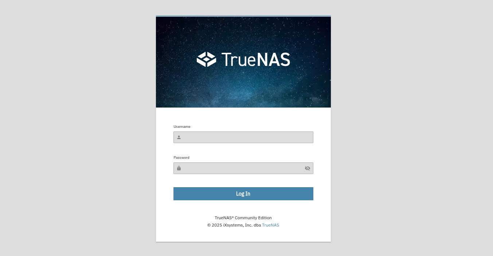

---
hide:
  - toc
---


### Kometa Installation Walkthrough for TrueNAS Scale

Thanks to i.am.stonecutter on Discord.

This guide provides step-by-step instructions to install Kometa on TrueNAS Scale (Community Edition, version 25.04.0 or later) using a Docker container.

#### Prerequisites:

1. TrueNAS Scale (version 25.04.0 or later) with internet access
2. Administrative access to TrueNAS Scale
3. 'sudo' privileges for terminal access
4. Plex Media Server installed
5. Basic understanding of Docker and YAML

### Setup

#### Step 1: Sign into TrueNAS Web Interface

1. Log in to the TrueNAS Scale web interface.

    

#### Step 2: Create Kometa Dataset

1. Navigate to Datasets.

    

2. Create a dataset named kometa using the Apps preset.

    

    

3. Edit the ACL for the kometa dataset to ensure proper permissions for your user setup. Default settings are usually sufficient, but adjust if issues arise.

#### Step 3: Set Up Config Directory

1. Connect to TrueNAS Scale via SSH.
2. Run `sudo mc` to launch Midnight Commander.
3. Navigate to the kometa dataset root.
4. Create a folder named `config`.
5. Copy your `config.yml` file to the config directory using Midnight Commander.

    

#### Step 4: Deploy Kometa Docker Container

1. In the TrueNAS web interface, go to Apps > Discover Apps.
2. Click the three-dot menu and select **Install via YAML**.
3. In the YAML window, set the container name to `kometa` and use the following template, editing the timezone, volume mapping, and UID/GID as needed:

    ```yaml
    services:
      kometa:
        image: kometateam/kometa:latest
        environment:
          - TZ=America/New York
          - KOMETA_CONFIG=/config/config.yml
        network
          mode: host
        restart: unless-stopped
        user: "568:568"
        volumes:
          - /mnt/YOUR-STORAGE-POOL/YOUR-DATASET/kometa/config:/config:rw
    ```

    

4. Deploy the YAML and verify the `kometa` status shows RUNNING in green.

    

#### Step 5: Run Kometa

1. Return to the TrueNAS Scale SSH session.
2. Execute the following command to force an immediate library refresh based on your `config.yml`:

    ```
    sudo docker run --rm -it -v "/mnt/YOUR-STORAGE-POOL/YOUR-DATASET/kometa/config:/config:rw" kometateam/kometa --run
    ```

#### Step 6: Verify and Expand

1. Check your Plex library for updated collections.
2. Explore Kometa’s Defaults for pre-made collections.
3. Refer to the Kometa Wiki for advanced configurations.

### Troubleshooting

Container not running: Check Docker logs in TrueNAS for errors.

Config issues: Verify `config.yml` syntax and permissions.

Plex not updating: Confirm Plex URL, token, and network settings.

### Notes

The `config.yml` is portable; adjust paths if moving.

Regularly update the Kometa image via Apps > Update.
