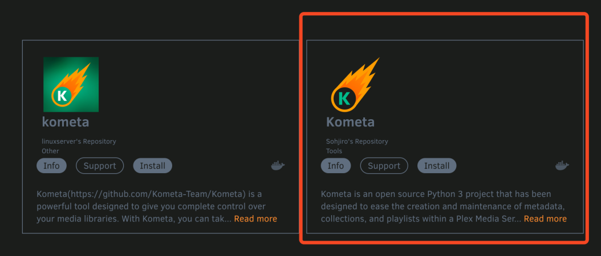
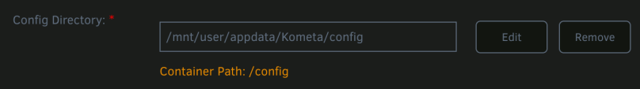

---
hide:
  - toc
---


### Installing Community Applications in unRAID

Thankfully, getting Kometa working on unRAID is a fairly simple task. unRAID works mostly with docker containers, so the pre-built container available on docker hub works 
perfectly with a little configuration. To install a container from docker hub, you will need community applications - a very popular plugin for unRAID servers. 
If you don't already have this installed, you can install it [here](https://forums.unraid.net/topic/38582-plug-in-community-applications/)

### Installing Kometa in unRAID

1. Head to the `Apps` tab of unRAID (Community Applications), and search `kometa` in the upper left search box. There will be a couple of results shown, 
   but you should ignore them ([Why?](../images.md)) and use the official image.

   

2. Click the `Install` button on the Template from Sohjiro's Repository Tools.

3. Choose which branch you want to run `latest`, `develop`, or `nightly`. 

4. Set the `Console shell command:` to `Bash`

5. Verify that the `Container Path: /config` path for the unRAID app is `/mnt/user/appdata/Kometa/config`

   



Hit `Apply`, and allow unRAID to download the image and build the container.

First let's start the container. Oops! The container won't start? This is going to fail with an error. That's expected.

You should see something like this in the unRAID logs for the container:

```shell { .no-copy }
Config Error: config not found at //config
```
We need to have a file called `config.yml` in the correct directory for Kometa to start. 
Open up an unRAID terminal session by clicking on the terminal icon `>_` in the top right of unRAID.

=== ":fontawesome-brands-linux: unRAID"

    [type this into your unRAID terminal]
    ```shell
    mkdir /mnt/user/appdata/Kometa/config
    touch /mnt/user/appdata/Kometa/config/config.yml
    ```

You can now close the unRAID terminal and start the Kometa container.

**_From this point forward, you can Console `>_Console` into the running container as it will stay running_**

Open a Console by left-clicking on the running Kometa Container and selecting `>_Console`. 
This will open up an interactive session within the container to be able to run the commands we want.

