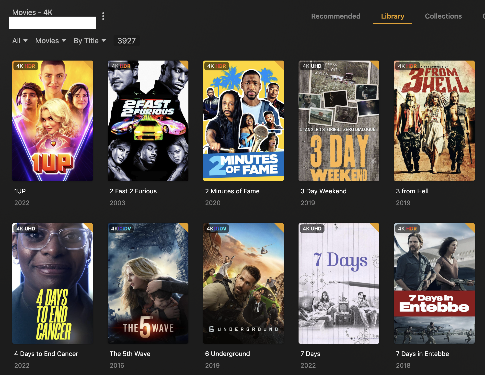

While it runs this time you should see the previous collections go by pretty quickly, since they aren't changing, and then a lot of logging as Kometa decides which overlays apply to which movies.

This may take quite a while depending on the size of this library.

Eventually, you'll see it start applying overlays to all your movies:

```
|=========================================================|
|    Applying Overlays for the All The Movies Library     |
|=========================================================|
|                                                         |
| 10 Cloverfield Lane         | Overlays Applied: 4K-HDR  |
| 10 Minutes Gone             | Overlays Applied: 4K-HDR  |
| 10 Things I Hate About You  | Overlays Applied: 4K-HDR  |
| 12 Mighty Orphans           | Overlays Applied: 4K-HDR  |
| 12 Monkeys                  | Overlays Applied: 4K-DV   |
| 12 Strong                   | Overlays Applied: 4K-HDR  |
...
```

When it finishes, go to the Library tab in this library in Plex:


