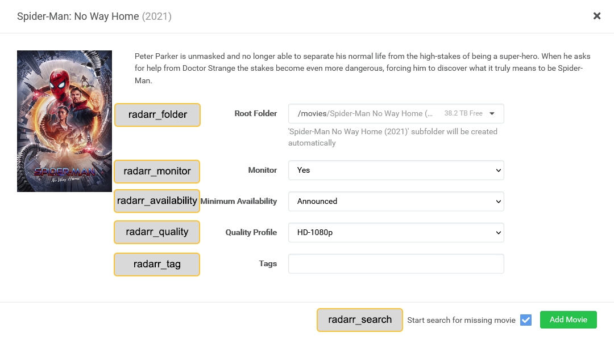

# Radarr/Sonarr Details

## Radarr Details

All the following attributes can override the global/library [Radarr](../../config/radarr) attributes which are the default unless otherwise specified.

| Attribute                | Description & Values                                                                                                                                                            |
|:-------------------------|:--------------------------------------------------------------------------------------------------------------------------------------------------------------------------------|
| `radarr_add_missing`     | **Description:** Override Radarr `add_missing` attribute
**Values:** `true` or `false`                                                                                       |
| `radarr_add_existing`    | **Description:** Override Radarr `add_existing` attribute
**Values:** `true` or `false`                                                                                      |
| `radarr_folder`          | **Description:** Override Radarr `root_folder_path` attribute
**Values:** Folder Path                                                                                        |
| `radarr_monitor`         | **Description:** Override Radarr `monitor` attribute
**Values:** `true` or `false`                                                                                           |
| `radarr_availability`    | **Description:** Override Radarr `availability` attribute
**Values:** `announced`, `cinemas`, `released`, `db`                                                               |
| `radarr_quality`         | **Description:** Override Radarr `quality_profile` attribute
**Values:** Radarr Quality Profile                                                                              |
| `radarr_tag`             | **Description:** Override Radarr `tag` attribute
**Values:** List or comma-separated string of tags                                                                          |
| `radarr_search`          | **Description:** Override Radarr `search` attribute
**Values:** `true` or `false`                                                                                            |
| `item_radarr_tag`        | **Description:** Used to append a tag in Radarr for every movie found by the builders that's in Radarr
**Values:** List or comma-separated string of tags                    |
| `item_radarr_tag.remove` | **Description:** Used to remove existing tags in Radarr for every movie found by the builders that's in Radarr
**Values:** List or comma-separated string of tags            |
| `item_radarr_tag.sync`   | **Description:** Matches the tags in Radarr for every movie found by the builders that's in Radarr with the provided tags
**Values:** List or comma-separated string of tags |

## Sonarr Details

All the following attributes can override the global/library [Sonarr](../../config/sonarr) attributes which are the default unless otherwise specified.

| Attribute                | Description & Values                                                                                                                                                             |
|:-------------------------|:---------------------------------------------------------------------------------------------------------------------------------------------------------------------------------|
| `sonarr_add_missing`     | **Description:** Override Sonarr `add_missing` attribute
**Values:** `true` or `false`                                                                                        |
| `sonarr_add_existing`    | **Description:** Override Sonarr `add_existing` attribute
**Values:** `true` or `false`                                                                                       |
| `sonarr_folder`          | **Description:** Override Sonarr `root_folder_path` attribute
**Values:** Folder Path                                                                                         |
| `sonarr_monitor`         | **Description:** Override Sonarr `monitor` attribute
**Values:** `all`, `future`, `missing`, `existing`, `pilot`, `first`, `latest`, `none`                                   |
| `sonarr_quality`         | **Description:** Override Sonarr `quality_profile` attribute
**Values:** Sonarr Quality Profile                                                                               |
| `sonarr_language`        | **Description:** Override Sonarr `language_profile` attribute
**Values:** Sonarr Language Profile                                                                             |
| `sonarr_series`          | **Description:** Override Sonarr `series_type` attribute
**Values:** `standard`, `daily`, `anime`                                                                             |
| `sonarr_season`          | **Description:** Override Sonarr `season_folder` attribute
**Values:** `true` or `false`                                                                                      |
| `sonarr_tag`             | **Description:** Override Sonarr `tag` attribute
**Values:** List or comma-separated string of tags                                                                           |
| `sonarr_search`          | **Description:** Override Sonarr `search` attribute
**Values:** `true` or `false`                                                                                             |
| `sonarr_cutoff_search`   | **Description:** Override Sonarr `cutoff_search` attribute
**Values:** `true` or `false`                                                                                      |
| `item_sonarr_tag`        | **Description:** Used to append a tag in Sonarr for every series found by the builders that's in Sonarr
**Values:** List or comma-separated string of tags                    |
| `item_sonarr_tag.remove` | **Description:** Used to remove existing tags in Sonarr for every series found by the builders that's in Sonarr
**Values:** List or comma-separated string of tags            |
| `item_sonarr_tag.sync`   | **Description:** Matches the tags in Sonarr for every series found by the builders that's in Sonarr with the provided tags
**Values:** List or comma-separated string of tags |

## Adding to Arr
You can add items to Radarr/Sonarr in two different ways.
  1. Items found by PMM that are missing from your collections/playlists.
  2. Items found by PMM that already exist in Plex but are not in Radarr/Sonarr.

### Arr Add Missing

When `radarr_add_missing`/`sonarr_add_missing` are true the items missing from the collection/playlist will be added to Radarr/Sonarr.

### Arr Add Existing

When `radarr_add_existing`/`sonarr_add_existing` are true the items that exist in the collection/playlist will be added to Radarr/Sonarr. 

If your Radarr/Sonarr has different file system mappings from your plex use `radarr_path`/`sonarr_path` along with `plex_path` from your [Radarr](../../config/radarr)/[Sonarr](../../config/sonarr) global config settings.

### Radarr Add Details

When adding a movie in Radarr you get the screen below to set these options use `radarr_folder`, `radarr_monitor`, `radarr_availability`, `radarr_quality`, `radarr_tag`, and `radarr_search`.

### Sonarr Add Details

When adding a movie in Sonarr you get the screen below to set these options use `sonarr_folder`, `sonarr_monitor`, `sonarr_quality`, `sonarr_language`, `sonarr_series`, `sonarr_season`, `sonarr_tag`, `sonarr_search`, and `sonarr_cutoff_search`.

## Arr Edit Details

When editing the details of items that exist in the collection/playlist and in Radarr/Sonarr use `item_radarr_tag` and `item_sonarr_tag`