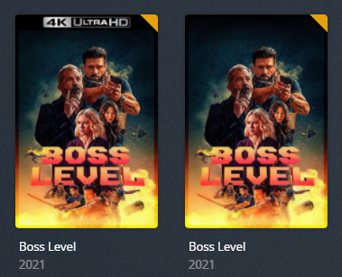
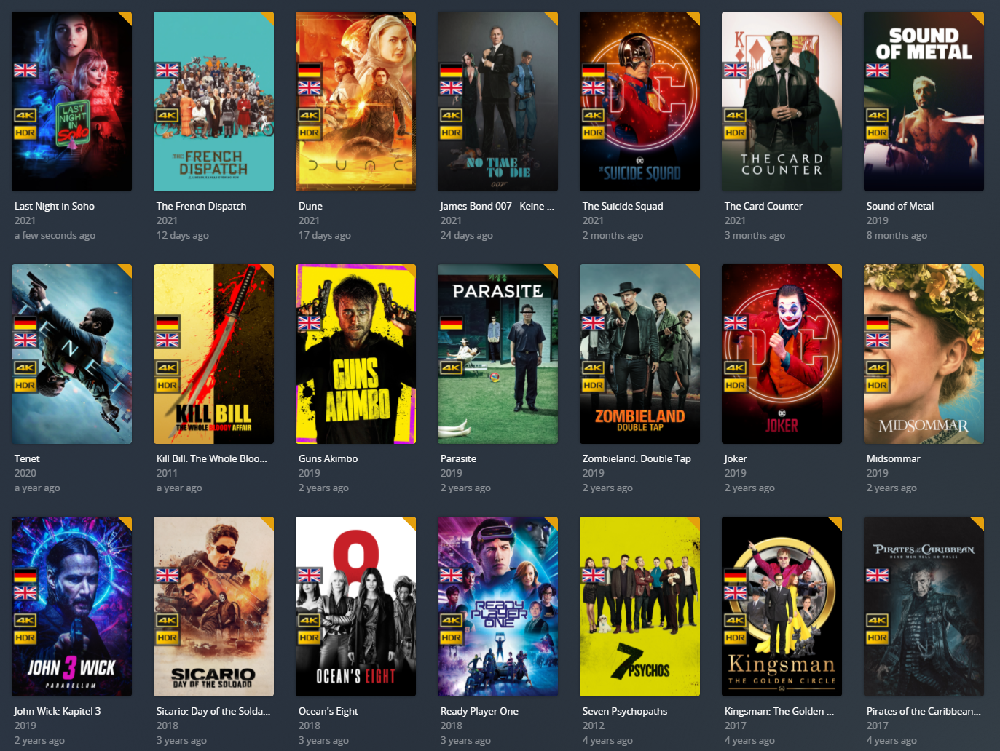

# Image Overlay Detail

In order to add an overlay to a set of items you must add `item_overlay: OVERLAY_NAME` to the collection config, where `OVERLAY_NAME` matches the exact name of a folder in your `overlays` directory.

Your `overlays` directory must be inside your config folder structured like below:

```
config
├── overlays
│   ├── OVERLAY_NAME
│       ├── overlay.png
```

* `OVERLAY_NAME` is the folder contacting your `overlay.png` and its name is what you give `item_overlay` to refer to this specific overlay.
* `overlay.png` is the overlay file with the banner. You can create you're own with this [PSD](https://github.com/meisnate12/Plex-Meta-Manager/blob/master/overlays.psd). The font can be found [here](https://www.dafontfree.net/freefonts-eurostile-extended-f123859.htm).
* An item can only be in one overlay search so make sure you exclude other searches when using multiple overlays.
* Posters will be backed up in the overlay director and if an item is removed from the search the original poster should be added back.
* `revert_overlay` can be added to an overlay collection configuration to revert all movies changed by that overlay back to their original posters. 

## Examples

### Example Folder Structure

This is an example of the default set found [here](https://github.com/meisnate12/Plex-Meta-Manager/tree/master/config/overlays) which would have 5 overlay options `4K`, `4K-Dolby`, `4K-HDR`, `Dolby`, and `HDR` and have a directory structured like below:

```
config
├── config.yml
├── Movies.yml
├── TV Shows.yml
├── overlays
│   ├── 4K
│       ├── overlay.png
│   ├── 4K-Dolby
│       ├── overlay.png
│   ├── 4K-HDR
│       ├── overlay.png
│   ├── Dolby
│       ├── overlay.png
│   ├── HDR
│       ├── overlay.png
```

### Alternative URL Images

The alternative way to specify your overlay image is do use the `name` and either `url` or `git` attributes like so.

```yaml
collections:
  4K Overlay:
    plex_search:
      all:
        resolution: 4K
    item_overlay: 
      name: 4K
      url: https://raw.githubusercontent.com/wiki/meisnate12/Plex-Meta-Manager/overlay.png
    build_collection: false
```

```yaml
collections:
  4K Overlay:
    plex_search:
      all:
        resolution: 4K
    item_overlay: 
      name: 4K
      git: yozora/Overlays/4K/overlay
    build_collection: false
```

### Examples Collection Configs

#### 4K Overlay Only 



Add a 4K overlay to all 4K Movies

```yaml
collections:
  4K Overlay:
    plex_search:
      all:
        resolution: 4K
    item_overlay: 4K
    build_collection: false
```

#### 4K and HDR Overlays 

Here's an example of how you could add `4K`, `4K-HDR`, and `HDR` overlays

```yaml
collections:
  4K Overlay:
    plex_search:
      all:
        resolution: 4K
        hdr: false
    item_overlay: 4K
    build_collection: false
  4K-HDR Overlay:
    plex_search:
      all:
        resolution: 4K
        hdr: true
    item_overlay: 4K-HDR
    build_collection: false
  HDR Overlay:
    plex_search:
      all:
        hdr: true
    filters:
      resolution.not: 4K
    item_overlay: HDR
    build_collection: false
```

#### 4K, HDR, Dolby Overlays

Here's an example of how you could add `4K`, `4K-HDR`, `4K-Dolby`, `Dolby`, and `HDR` overlays

**Note: This only works is your filenames have a tag in them for Dolby files as Plex cannot detect dolby yet**


```yaml
collections:
  4K:
    plex_search:
      all:
        resolution: 4K
        hdr: false
    filters:
      filepath.not: DoVi
    item_overlay: 4K
    build_collection: false
  4K-HDR:
    plex_search:
      all:
        resolution: 4K
        hdr: true
    filters:
      filepath.not: DoVi
    item_overlay: 4K-HDR
    build_collection: false
  4K-Dolby:
    plex_search:
      all:
        resolution: 4K
    filters:
      filepath: DoVi
    item_overlay: 4K-Dolby
    build_collection: false
  HDR:
    plex_search:
      all:
        hdr: true
    filters:
      filepath.not: DoVi
      resolution.not: 4K
    item_overlay: HDR
    build_collection: false
  Dolby:
    plex_all: true
    filters:
      filepath: DoVi
      resolution.not: 4K
    item_overlay: Dolby
    build_collection: false
```

## User Generated Overlays

