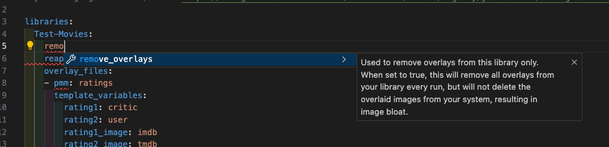
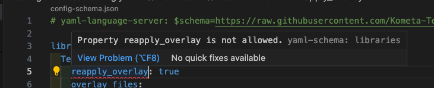

JSON schemas for Kometa YAML files

How to:

Add this as the first line in your `config.yml`:
```
# yaml-language-server: $schema=https://raw.githubusercontent.com/Kometa-Team/Kometa/nightly/json-schema/config-schema.json
```
[change `nightly` to `develop`, or `master` if you wish]

Then open your config file in an editor that supports the use of JSON schema.

For example, VS Code with the Red Hat YAML extension.

This will give you context-sensitive hints and auto-complete for much of the Kometa `config.yml`





limitations:

- template variables not cased for specific default file
- template variables with keys are wildcarded
- "position" attribute has no validation
- "streaming" default has no validation
- search has no validation; just accepts string
- schedule has no validation; just accepts string

TODO:
"list of coordinates"

- schema for collection yaml
- schema for metadata yaml
- schema for overlay yaml
- schema for template yaml

Notes:
