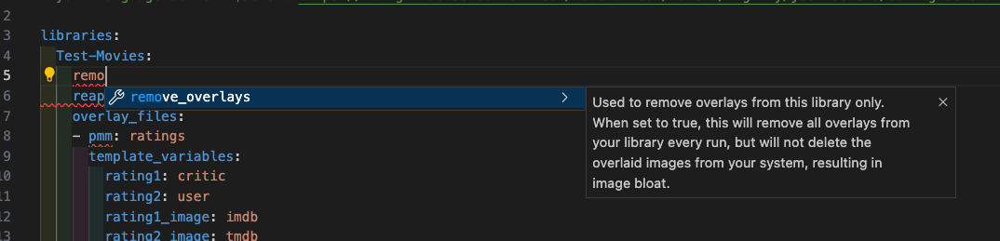
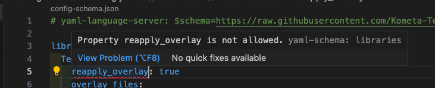

# JSON schemas for Kometa YAML files

## Available Schemas

| Schema File | Use With |
| ----------- | -------- |
| `config-schema.json` | `config.yml` |
| `collection-schema.json` | Collection files |
| `metadata-schema.json` | Metadata files |
| `overlay-schema.json` | Overlay files |
| `playlist-schema.json` | Playlist files |

## How to Use

Add the appropriate schema declaration as the first line of your YAML file:

```yaml
# yaml-language-server: $schema=https://raw.githubusercontent.com/Kometa-Team/Kometa/nightly/json-schema/config-schema.json
```

Change `nightly` to `develop` or `master` as appropriate for your branch.

Then open the file in an editor that supports JSON Schema — for example, VS Code with the [Red Hat YAML extension](https://marketplace.visualstudio.com/items?itemName=redhat.vscode-yaml).

This gives you context-sensitive hints, auto-complete, and inline error highlighting.





## Known Limitations

- Template variables are not validated against specific default files
- Template variables with keys are wildcarded
- `position` attribute has no validation
- `streaming` default has no validation
- `search` and `schedule` accept any string (no structural validation)
